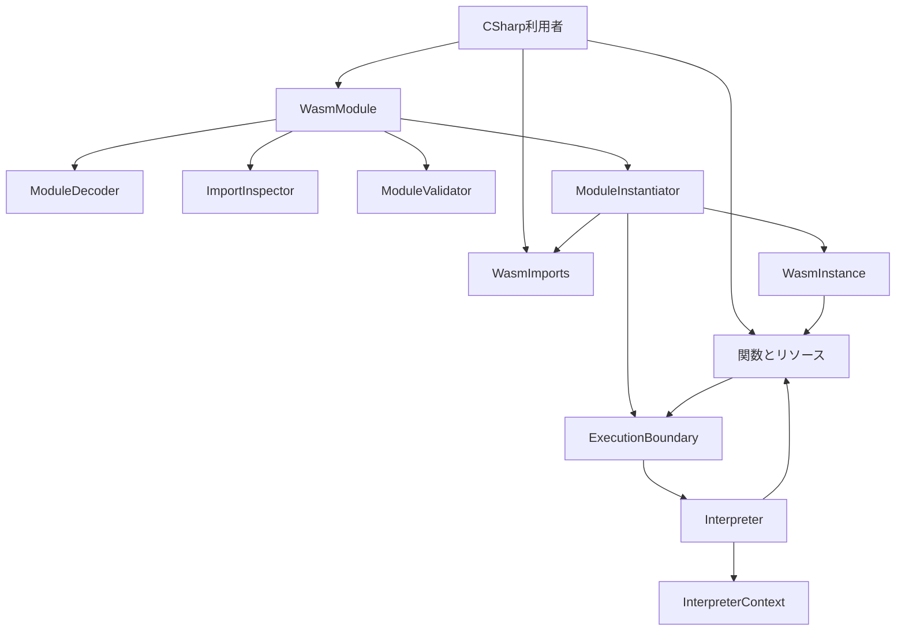
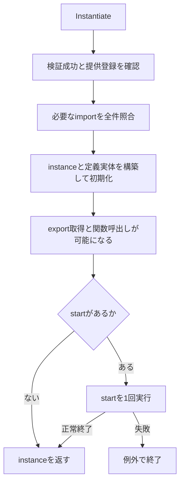
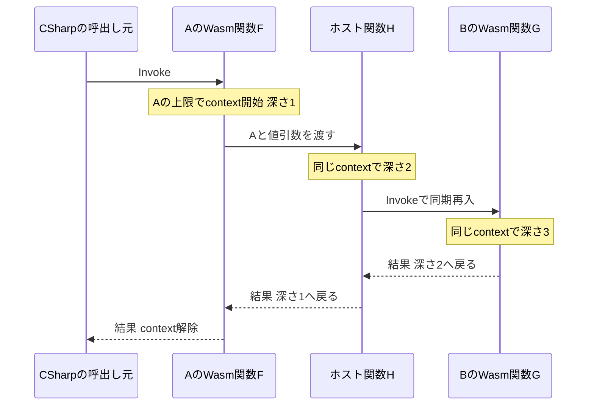

# 技術設計: host-linking

## 概要

C#の埋め込み利用者が、引数・複数結果を持つWasm関数、明示型のホストcallback、共有global・memory・tableを通常の公開操作で接続できる実行・リンク基盤を提供する。既存の `Decode → Validate → Instantiate → Invoke` と単一の線形実行ループを拡張する。

本書は設計であり、実装済みの範囲を示さない。受入は公開APIの正負バイナリテストで行い、公式ランナーの初回統合確認は後続のconformance-runnerが担当する。

### 目標

- 関数型・値・実体の同一性を保ったまま、4種のimport/exportと同期ホスト連携を成立させる。
- 構築・接続・リソース初期化後にstartを実行し、失敗の分類と保存済み参照の扱いを確定する。
- module全体の実行対応と独立して、完全なimport情報または取得失敗を公開する。
- 99件の受入基準を具体的な契約・配置・検証に対応付ける。

### 対象外

構造化制御・数値演算の拡充、guest memory/table命令、data/element初期化、call_indirect・ref.*・SIMD命令、WAT/WAST解析、spectest/registerの実装は隣接仕様の範囲とする。並行実行、非同期コンテキスト伝播、WASI、Core 2.0外の機能は含めない。

## 責務境界（Boundary Commitments）

### 本仕様の所有範囲（This Spec Owns）

- 関数引数・locals・結果、local.get/set/tee、call、return、drop、unreachable、global.get/setのdecode・型検証・実行。
- globalの生成・初期化、memory/tableのlimits・生成・ホスト操作、外部要素の型照合・名前解決・実体共有。
- callbackの両形式、呼び出し時instance、値の寿命、同期再入、startを含む実行コンテキストの入口と復元。
- import情報取得の検査範囲・成功データ・失敗診断と、公開操作による受入確認。

### 境界外（Out of Boundary）

- runtime-foundationの完成済み受入範囲・承認状態を変更しない。コードは拡張するが基盤仕様の完了を取り消さない。
- numeric-controlは構造化制御と演算、linear-memoryとtables-referencesはguest命令・segmentを同じ実体・Instantiate経路へ追加する。
- conformance-runnerの入力形式、結果分類、固定素材・baselineをランタイムへ持ち込まない。
- 後続用の未使用plugin、初期化hook、汎用resolverインターフェースを追加しない。

### 許可する依存関係（Allowed Dependencies）

公開値・型・診断 ← 静的module情報／リソース実体 ← 検証・線形化／リンク構築 ← 実行ループ ← 公開入口、の方向を守る。公開ファサードは内部処理を呼ぶが、内部処理はファサードの公開操作で再入せず内部契約を使う。例外は、ホスト自身が同期再入のために公開Invokeを呼ぶ場合である。

`WasmModule`は静的定義と検証成功後のコードを所有し、`WasmInstance`はその定義と実行時の関数・リソース表を参照する。公開の`WasmFunction`は共通の抽象型とし、定義関数と2形式のホスト関数を別の内部具体型で表す。`ExecutionFrame`は`DefinedFunction`だけを保持して所属instanceへ到達する。定義関数実体が所属instanceを参照するオブジェクト上の相互参照は許すが、moduleの静的定義にinstanceを保持しない。ライブラリからテスト・ランナー・WABT・生成器の実行時コードへの依存は禁止する。

### 再検証の契機（Revalidation Triggers）

- Invoke/callbackの署名、import情報形式、失敗分類、名前解決を変えた場合はconformance-runnerと公開APIの受入を再検証する。
- フレームのスタック基準・即値・結果受渡しを変えた場合はnumeric-controlと命令生成の統合を再検証する。
- リソース同一性、limits、増大、Instantiate順序を変えた場合はlinear-memory・tables-referencesを再検証する。
- context寿命・start失敗後参照の扱いを変えた場合は全呼出し経路を再検証する。

## アーキテクチャ

### 現行実装との接続

設計時点の実装はimportなしのスカラー定数返却である。`WasmModule`は関数exportだけを持ち、`WasmFunction`は所属instanceと関数添字からコードへ到達する。`WasmHostModule`、`WasmMemory`、`WasmTable`は骨組みで、`GetGlobal`は値を返す署名を持つ。

既存の`InterpreterContext`にはThreadStatic、frame/value配列、深さ、入口時の保存・復元があり、生成`RunLoop(context, entryFrameCount)`を利用できる。現在の`ExecutionBoundary`は常に定義関数所属instanceでcontextを開くため、ホスト関数とstartの入口を本仕様で区別する。

### 構成と境界



図の矢印は処理の呼出し・利用を示す。`Resources → Boundary`はWasmFunctionのInvokeだけであり、global/memory/tableのホスト操作はcontextを開かない。実行ループは関数の公開Invokeを呼ばず、内部の呼出し処理を使う。

### 技術選択

| 対象 | 技術・版 | 用途 |
| --- | --- | --- |
| ランタイム | C# / net10.0 | 既存プロジェクトを拡張。追加NuGet依存なし |
| 所有する値 | ReadOnlySpan、ImmutableArray、通常の配列 | 入力・callback内の参照と、保持する値のコピーを分離 |
| 命令生成 | netstandard2.0 / C# 13.0 / Microsoft.CodeAnalysis.CSharp 5.9.0 | 既存InstructionSetとhandlerから通常ビルドで生成 |
| テスト | net10.0 / TUnit 1.66.16 | 公開経路と内部の型スタック・生成契約を検証 |
| 意味論 | Core 2.0、spec commit `05ca4182176763112561ae20153975c12bd689e4` | 型・limits・実行規則の固定根拠 |

実行エンジンの外部採用はプロジェクトの目的と対象外条件に合わない。文字列比較、所有コピー、CLRスタック余裕の確認には.NET標準機能を使う。

## ファイル構成計画（File Structure Plan）

パスはリポジトリルートからの相対パス。公開型は`WasmSharp`、内部型は既存のModules/Execution/Instructionsへ配置する。新たな技術レイヤーフォルダは作らない。

### 新規ファイル

| パス | 責務・対応構成要素 |
| --- | --- |
| `src/WasmSharp/WasmGlobal.cs` | globalの型・可変性・現在値を持つ共有実体 |
| `src/WasmSharp/WasmGlobalType.cs` | 値型と可変性の不変な型記述 |
| `src/WasmSharp/WasmLimits.cs` | uint最小値とnullable uint最大値の型記述 |
| `src/WasmSharp/WasmImports.cs` | 提供登録集合を所有し、重複を登録時に拒否 |
| `src/WasmSharp/Modules/ExternalValues/ExternalValue.cs` | 外部実体の提供を表す内部基底型 |
| `src/WasmSharp/Modules/ExternalValues/FunctionExternalValue.cs` | 関数実体の提供 |
| `src/WasmSharp/Modules/ExternalValues/GlobalExternalValue.cs` | global実体の提供 |
| `src/WasmSharp/Modules/ExternalValues/MemoryExternalValue.cs` | memory実体の提供 |
| `src/WasmSharp/Modules/ExternalValues/TableExternalValue.cs` | table実体の提供 |
| `src/WasmSharp/WasmExternalKind.cs` | Function/Table/Memory/Globalの識別 |
| `src/WasmSharp/WasmImportInfo.cs` | 名前・種類・要求型の型付きimport情報 |
| `src/WasmSharp/WasmImportInspection.cs` | 完全取得したimport一覧と未確認範囲 |
| `src/WasmSharp/Execution/DefinedFunction.cs` | 元instanceと両添字を保持し、定義・実行コードへ到達する関数実体 |
| `src/WasmSharp/Execution/HostFunction.cs` | 明示型とinstance不要のcallbackを保持する関数実体 |
| `src/WasmSharp/Execution/InstanceHostFunction.cs` | 明示型とinstance必須のcallbackを保持する関数実体 |
| `src/WasmSharp/Modules/ImportInspector.cs` | 実行に依存しないimport情報取得 |
| `src/WasmSharp/Modules/ModuleBinaryFormat.cs` | ヘッダー、section順序、型・import記述の共有読み取り |
| `src/WasmSharp/Modules/Imports/ModuleImport.cs` | import名・種類・宣言の元位置の基底 |
| `src/WasmSharp/Modules/Imports/FunctionImport.cs` | 関数importの生の型添字 |
| `src/WasmSharp/Modules/Imports/GlobalImport.cs` | global importの要求型 |
| `src/WasmSharp/Modules/Imports/MemoryImport.cs` | memory importのlimitsと型記述の元位置 |
| `src/WasmSharp/Modules/Imports/TableImport.cs` | table importの参照型・limitsと型記述の元位置 |
| `src/WasmSharp/Modules/ModuleExport.cs` | 4種のexport名・添字・元位置 |
| `src/WasmSharp/Modules/Definitions/GlobalDefinition.cs` | global型と初期化式の静的定義 |
| `src/WasmSharp/Modules/Definitions/TableDefinition.cs` | table参照型・limits・元位置 |
| `src/WasmSharp/Modules/Definitions/MemoryDefinition.cs` | memory limits・元位置 |
| `src/WasmSharp/Modules/ModuleInstantiator.cs` | import照合、実体構築、初期化、startの順序 |
| `src/WasmSharp/Exceptions/WasmImportInspectionException.cs` | 取得全体の失敗理由・未確認範囲。理由enumも同居 |

### 変更するファイル

| パス | 変更責務 |
| --- | --- |
| `src/WasmSharp/WasmModule.cs` | 静的定義、4種export対応、InspectImports入口と登録集合overload |
| `src/WasmSharp/WasmInstance.cs` | 4種のindex表、名前による実体取得 |
| `src/WasmSharp/WasmFunction.cs` | 関数の公開抽象型、Type、型明示生成、共通の引数検証とInvoke入口 |
| `src/WasmSharp/WasmHostModule.cs` | 名前付き提供元とDefine、両callback delegate |
| `src/WasmSharp/WasmMemory.cs` | ページ単位の記憶領域と範囲コピー・増大 |
| `src/WasmSharp/WasmTable.cs` | 参照配列と要素操作・増大 |
| `src/WasmSharp/Modules/ModuleDecoder.cs` | 対象section・命令のdecode、共通読取への委譲 |
| `src/WasmSharp/Modules/ModuleValidator.cs` | 全index空間、limits、global式、型多相性、startの検証 |
| `src/WasmSharp/Modules/DecodedInstruction.cs` | 値即値とuint添字を区別して保持 |
| `src/WasmSharp/Modules/FunctionExport.cs` | ModuleExportへの置換に伴う廃止 |
| `src/WasmSharp/Instructions/InstructionSet.cs` | 対象命令の宣言とhandler接続 |
| `src/WasmSharp/Instructions/ImmediateKind.cs`、`src/WasmSharp/Instructions/ValidationRule.cs`、`src/WasmSharp/Instructions/StackEffectKind.cs` | 添字即値と関数・local・globalの型規則 |
| `src/WasmSharp/Execution/FunctionCode.cs` | 追加local型と必要スタック量 |
| `src/WasmSharp/Execution/Instruction.cs` | 実行命令のuint添字 |
| `src/WasmSharp/Execution/ExecutionFrame.cs` | 引数・locals・operandの基準とDefinedFunctionの保持 |
| `src/WasmSharp/Execution/InterpreterContext.cs` | 共有stack操作、型別locals初期化、深さ復元 |
| `src/WasmSharp/Execution/Interpreter.cs` | call/return/local/global/drop/unreachableとhost内部呼出し |
| `src/WasmSharp/Execution/ExecutionBoundary.cs` | 定義・host・startの入口、共通失敗変換 |
| `src/WasmSharp/Execution/ExecutionResult.cs` | CLR stack余裕不足を含むexhaustion情報 |
| `src/WasmSharp/Exceptions/WasmInstantiateException.cs` | importを識別する構造化リンク診断 |
| `src/WasmSharp/Exceptions/WasmExhaustionException.cs` | CallDepthLimitとHostStackLimit、上限未計測の表現 |
| `src/WasmSharp/Exceptions/WasmImplementationLimitException.cs`、`src/WasmSharp/Exceptions/WasmException.cs` | 処理段階外のホスト資源生成ではLocation=nullを許容 |

既存の`src/WasmSharp/WasmValue.cs`、`src/WasmSharp/WasmFunctionType.cs`、`src/WasmSharp/WasmResults.cs`、`src/WasmSharp/WasmExecutionOptions.cs`、`src/WasmSharp/Modules/ModuleBinaryReader.cs`、`src/WasmSharp/Exceptions/WasmUnverifiedRange.cs`の成立済み契約を再利用する。生成器のhandler署名は維持し、生成器本体の変更は現時点では不要。生成ソースを直接編集しない。

### テスト配置と実装の依存順

- 既存`tests/WasmSharp.Tests/WasmModule_DecodeTests.cs`、`WasmModule_ValidateTests.cs`、`WasmModule_InstantiateTests.cs`、`WasmFunction_InvokeTests.cs`、4種Get操作のテストを拡張する。
- 新規`tests/WasmSharp.Tests/WasmModule_InspectImportsTests.cs`、`WasmFunction_CreateHostTests.cs`、`WasmInstance_GetGlobalResourceTests.cs`、`WasmImports_AddTests.cs`、`WasmHostModule_DefineTests.cs`を置く。
- 定義関数の添字・元instanceの検証は`tests/WasmSharp.Tests/WasmFunction_ConstructorTests.cs`から`tests/WasmSharp.Tests/Execution/DefinedFunction_ConstructorTests.cs`へ移す。内部実行用`tests/WasmSharp.Tests/Fixtures/FunctionFixture.cs`・`ExecutionFunctionFixture.cs`はDefinedFunctionを返す。`tests/WasmSharp.Tests/Execution/Interpreter_ReturnTests.cs`・`Interpreter_PushConstantTests.cs`・`InterpreterContext_StackTests.cs`のframe入力と`ExecutionBoundary_InvokeTests.cs`の定義情報参照も同型に合わせる。公開生成・登録・参照値のテストは共通のWasmFunctionを通す。
- 定義元の型取得とinstanceごとの独立性を確認する`tests/WasmSharp.Tests/WasmFunction_TypeTests.cs`は`tests/WasmSharp.Tests/Execution/DefinedFunction_TypeTests.cs`へ移し、定義関数固有の情報を参照する。
- global/memory/tableは`tests/WasmSharp.Tests/WasmGlobal_ConstructorTests.cs`・`WasmGlobal_ValueTests.cs`、`WasmMemory_ConstructorTests.cs`・`WasmMemory_ReadTests.cs`・`WasmMemory_WriteTests.cs`・`WasmMemory_TryGrowTests.cs`、`WasmTable_ConstructorTests.cs`・`WasmTable_GetTests.cs`・`WasmTable_SetTests.cs`・`WasmTable_TryGrowTests.cs`へ分ける。
- 内部規則は既存`tests/WasmSharp.Tests/Modules/ModuleValidator_ValidateTests.cs`、`Execution/ExecutionBoundary_InvokeTests.cs`、`Execution/Interpreter_RunTests.cs`、`Execution/InterpreterContextTests.cs`を拡張する。start入口は`tests/WasmSharp.Tests/Execution/ExecutionBoundary_RunStartTests.cs`へ置く。
- 入力生成は新規`tests/WasmSharp.Tests/Fixtures/HostLinkingModuleBinary.cs`へまとめる。生成器の実ソース取り込みが必要なら`tests/WasmSharp.Generators.Tests/WasmSharp.Generators.Tests.csproj`と`GeneratorTestSource.cs`、既存`InstructionGenerator_InitializeTests.cs`を更新する。

実装順は型・リソース／提供登録 → section・静的定義 → 検証・線形化 → 呼出し・callback → Instantiate/start → 公開統合受入とする。import情報取得は共有reader契約の確定後に独立して進められる。ModuleDecoder、ModuleValidator、Interpreterへの並行編集は避ける。各実装タスクで対象の正負テスト、レビュー、検証を行う。

## 処理フロー

通常の利用は、`Decode → Validate → Instantiate → GetFunction → Invoke`の順になる。Decode/Validateで静的なmodule定義を用意し、Instantiateで実行に必要な実体を作る。その後、名前で取得した関数をInvokeする。startがある場合だけは、Instantiateの途中でも関数を実行する。

まず、以下の3つを区別する。

| 型 | 保持するもの | 利用する期間 |
| --- | --- | --- |
| WasmModule | 関数型・命令・import/export等の静的定義 | 複数のinstance生成に繰り返し使う |
| WasmInstance | 生成した関数・global・memory・tableと、実行上限の設定 | Instantiate後の各呼び出しでも同じ実体を使う |
| InterpreterContext | 現在実行中の関数のフレーム・値・呼び出し深さ・適用する上限 | Wasmの実行を開始してから、その実行が終了するまで |

### 1. Instantiateでinstanceを作る

利用者が検証済みmoduleに対して`Instantiate(imports, options)`を呼ぶと、次の順に処理する。

1. **前提を確認する。** moduleがValidateに成功していることを確認し、渡された提供登録を確定する。
2. **importを解決する。** 必要な関数・リソースを名前で探し、種類と型を全件照合する。この段階ではstartを実行しない。
3. **実体を構築する。** instanceを作り、importした実体を接続する。そのmoduleで定義された関数・リソースを割り当て、global等を初期化する。
4. **exportを利用できる状態にする。** 名前から関数・リソースを取得でき、定義関数も呼び出せる状態まで構築を完了する。
5. **startがあれば1回実行する。** startの実行方法は後述の関数呼出しと共通で、ホスト関数をstartに指定した場合も実行する。
6. **instanceを利用者へ返す。** startがある場合は、その正常終了を待ってから返す。startがなければ構築完了後に返す。



図は前提確認・リンク・割当が成功した経路を示す。これらの途中で失敗した場合は、その時点で例外終了し、startへ進まない。未対応data/element/data_countを含むmoduleはDecodeで停止するため、Instantiateへ到達しない。

start中にホストcallbackが呼ばれた場合、手順4までが終わっているので、callbackへ渡されたinstanceから定義memory等を取得できる。ただし、startの成功はまだ確定していない。

startが失敗するとInstantiateはinstanceを返さず、trap・exhaustionまたは元のホスト例外を伝える。それまでに変更した共有状態や、callbackが保存したinstance・関数・リソースの参照は保持する。保存した参照を使い続けても、startの完了が保証されるわけではない。

### 2. InvokeでWasmの定義関数を実行する

以下では、A・Bをinstance、FをAに定義されたWasm関数、GをBに定義されたWasm関数、Hをホスト関数とする。

C#から`A.GetFunction("F").Invoke(arguments)`を呼び、ほかのWasm実行が進行していない場合は、次の順になる。

1. 引数の個数と型を検査する。不一致なら関数を実行しない。
2. Aの実行上限を使ってInterpreterContextを作る。
3. Fのフレームを追加し、引数・localsを用意して命令を実行する。
4. Fが別のWasm関数をcallしたら、同じcontextへその関数のフレームを追加する。戻るときは結果を呼び出し元へ渡し、そのフレームと深さを解放する。
5. Fの実行が終わったら結果をC#へ返し、この呼び出しで作ったcontextを解除する。失敗時も実行状態を片付けてから例外を伝える。

たとえばAの上限が100、Bの上限が10でも、Fの実行途中でGを呼ぶ場合は、最後までAの上限100を使う。一方、Gが読むglobal等はGの定義元であるBのものを使う。**実行上限は一連の呼び出しで共有し、関数が参照するリソースは各関数の定義元に従う。**

### 3. Wasmからホスト関数を呼び、Wasmへ再入する

Fがホスト関数Hを呼び、HのC#処理がGをInvokeする例を示す。Hはinstanceを受け取る形式とする。



Hへ渡すAは、HがAのmemory等へアクセスするための引数である。HからGへ再入しても、進行中のcontextを使うため、Bの上限へ切り替えない。Hがinstanceを受け取らない形式でも、深さの数え方とcontextの共有は同じである。

再入先が終了したときは、その再入で追加したフレーム・値・深さを片付け、停止していたHへ戻る。外側のFの状態とcontextは保持する。最初にcontextを作ったFへのInvokeが終わるときに、context全体を解除する。

### 4. C#からホスト関数だけを呼ぶ場合

ほかのWasm実行が進行していない状態で`H.Invoke(A, arguments)`を呼ぶ場合、Hの開始時点ではcontextを作らない。第1引数のAはcallbackのアクセス対象を指定している。HがWasmの定義関数やstartを実行し始めた時点で、その入口に対応するcontextを作る。

| Hの中で行う処理 | contextの扱い |
| --- | --- |
| Aのmemoryを読み書きするだけ | 作らない |
| GをInvokeする | Bの上限で開始し、GからHへ戻ると解除する |
| FをInvokeし、そのFがGをcallする | Aの上限で開始し、Gでも共有する。FからHへ戻ると解除する |
| FをInvokeしてHへ戻り、その後GをInvokeする | FはAの上限、GはBの上限で、それぞれ別のcontextを使う |

instanceを受け取らない形式のHを`H.Invoke(arguments)`で呼ぶ場合も、contextの扱いは同じである。

### 5. startの実行上限とcallbackへ渡すinstance

startは、そのstartを宣言したinstanceの設定でcontextを開始する。すでにWasm実行が進行している場合は、そのcontextを共有する。startという処理自体で深さを余分に増やさず、実行する対象関数を1段として数える。

Aのstartがホスト関数Hなら、HへAを渡し、新しいcontextにはAの上限を使う。AのstartがBからimportした定義関数Gなら、新しいcontextにはAの上限を使うが、Gのリソース参照はBのままである。

callbackへ渡すinstanceは、実行上限を決めるinstanceとは別に、次の規則で選ぶ。

| Hの呼び出し方 | instanceを受け取るHへ渡す対象 |
| --- | --- |
| GがFを呼び、FがHをcallする | Fの定義元であるA |
| Gが、Aから再exportされたHを直接callする | HをcallしたGの定義元であるB |
| AのstartとしてHを実行する | startを持つA |
| C#から`H.Invoke(A, arguments)`を呼ぶ | C#が明示したA |

instanceを受け取らない形式では、この追加引数をcallbackへ渡さない。C#からの呼び出しでinstanceを省略した場合、取得元や進行中のWasm実行から暗黙に補うことはない。

## 要件との対応（Requirements Traceability）

| 要件 | 内容 | 構成要素 | 契約 | フロー・検証 |
| --- | --- | --- | --- | --- |
| 1.1, 1.2, 1.3 | 4段階・実行前の成功状態 | WasmModule、ModuleDecoder、ModuleValidator | Decode/Validate/Instantiate | sectionと検証前拒否 |
| 1.4, 1.5, 1.6 | 構文・未対応・基盤維持 | ModuleDecoder、公開診断 | 既存失敗分類 | 破損、segment、定数回帰 |
| 2.1, 2.2, 2.3, 2.4 | 引数・結果・locals | WasmFunction、Interpreter | Invoke、frame配置 | 0/複数値・型別初期値 |
| 2.5, 2.6, 2.7, 2.8, 2.9, 2.10 | call・return・drop・同一性 | Interpreter、InterpreterContext | frame追加と結果回収 | 再帰・再入・定義元環境 |
| 3.1, 3.2, 3.3, 3.4, 3.5, 3.6 | 検証と多相性 | ModuleValidator | 型stackと全体反映 | 到達不能の正負入力 |
| 4.1, 4.2, 4.3, 4.4, 4.5, 4.6, 4.7 | globalの型・初期化・共有 | WasmGlobal、ModuleValidator、ModuleInstantiator | Value、GetGlobalResource | 初期化式・可変性・相互更新 |
| 5.1, 5.2, 5.3, 5.4, 5.5, 5.6 | memoryの生成・操作 | WasmMemory | Read/Write/TryGrow | コピー・範囲・失敗時不変 |
| 6.1, 6.2, 6.3, 6.4, 6.5, 6.6, 6.7 | tableの生成・操作 | WasmTable | Get/Set/TryGrow | null・参照同一性・失敗時不変 |
| 7.1, 7.2, 7.3, 7.4, 7.5, 7.6, 7.7 | 名前解決・型・index | WasmImports、ModuleInstantiator | 宣言ごとの照合 | 不在・型・limits・重複宣言 |
| 7.8, 7.9, 7.10, 7.11, 7.12, 7.13 | export・独立性・提供登録 | ModuleValidator、WasmInstance、WasmImports | Get操作・Add | 同一性・登録重複・余分な提供 |
| 8.1, 8.2, 8.3, 8.4, 8.5, 8.6, 8.7 | callback形式・寿命・例外 | WasmFunction、Interpreter、ExecutionBoundary | CreateHost、所有コピー | 結果不正・元例外・同期再入 |
| 8.8, 8.9, 8.10, 8.11 | callbackのinstance | WasmFunction、ExecutionBoundary | instance付きInvoke | 4経路・省略/null拒否 |
| 9.1, 9.2, 9.3, 9.4, 9.5, 9.6, 9.7, 9.8 | start・失敗後参照 | ModuleValidator、ModuleInstantiator、ExecutionBoundary | RunStart | 構築順・副作用保持・保存参照 |
| 10.1, 10.2, 10.3, 10.4, 10.5, 10.6, 10.7, 10.8 | trap・深さ・失敗分類 | Interpreter、ExecutionBoundary、InterpreterContext | ExecutionResultとfinally復元 | 上限・中断・独立再実行 |
| 10.9, 10.10, 10.11 | 単独hostからの入口 | ExecutionBoundary | context生成条件 | 資源のみ・A/Bの4経路 |
| 11.1, 11.2, 11.3, 11.4, 11.5, 11.6 | import情報 | ImportInspector、WasmImportInspection | InspectImports | 全件/空/失敗・未確認範囲 |
| 12.1, 12.2, 12.3, 12.4, 12.5, 12.6, 12.7, 12.8 | 公開受入と報告 | テスト配置の各構成要素 | 以下のテスト戦略 | 実施と対象外を区別 |

## 構成要素とインターフェース

| 構成要素 | 責務 | 主要な要件 | 依存 | 契約 |
| --- | --- | --- | --- | --- |
| ModuleDecoder / ModuleBinaryFormat | 構文と静的定義 | 1.1, 1.4, 1.5 | 入: WasmModule P0、出: ModuleBinaryReader P0 | Service |
| ModuleValidator | 型・構造と線形化 | 3.1, 3.4, 7.8, 9.1 | 入: WasmModule P0、出: InstructionSet P0 | Service |
| WasmImports / WasmHostModule | 提供登録 | 7.1, 7.13 | 入: 利用者 P0、出: 外部実体 P0 | Service / State |
| ModuleInstantiator / WasmInstance | リンク・構築・名前取得 | 7.2, 7.9, 9.2 | 入: WasmModule P0、出: 資源・ExecutionBoundary P0 | Service / State |
| WasmFunction / ExecutionBoundary | 公開呼出しとhost契約 | 8.1, 8.9, 10.9 | 入: 利用者・ModuleInstantiator P0、出: Interpreter P0 | Service |
| DefinedFunction / HostFunction / InstanceHostFunction | 種類ごとの必須情報と関数の同一性 | 2.10, 7.9, 8.1 | 入: WasmInstance・WasmFunction・ExecutionBoundary P0、出: 元instanceまたはcallback P0 | State |
| Interpreter / InterpreterContext | frameと単一実行ループ | 2.5, 3.4, 10.3 | 入: ExecutionBoundary P0、出: 関数・資源 P0、外: .NET stack検査 P1 | Service / State |
| WasmGlobal / WasmMemory / WasmTable | 共有実体とホスト操作 | 4.1, 5.1, 6.1 | 入: 利用者・実行・構築 P0、出: WasmValueと型 P0 | Service / State |
| ImportInspector | 限定した依存調査 | 11.1, 11.4 | 入: WasmModule P0、出: ModuleBinaryFormat P0 | Service |

### 公開型とリソース

`WasmLimits`は`uint Minimum`と`uint? Maximum`を保持する不変record、`WasmGlobalType`は`WasmValueKind ValueKind`と`bool IsMutable`を保持する不変recordとする。limits記述自体はmin/maxの意味論的な検証をしない。バイナリ由来のmin > maxはDecodeで保持してValidateで拒否し、ホストのリソース生成ではコンストラクターで拒否する。

```csharp
public WasmGlobal(WasmGlobalType type, WasmValue initialValue);
public WasmGlobalType Type { get; }
public WasmValue Value { get; set; }

public WasmMemory(WasmLimits limits);
public uint PageCount { get; }
public uint? MaximumPages { get; }
public ulong ByteLength { get; }
public void Read(ulong offset, Span<byte> destination);
public void Write(ulong offset, ReadOnlySpan<byte> source);
public bool TryGrow(uint deltaPages, out uint previousPageCount);

public WasmTable(WasmValueKind elementType, WasmLimits limits);
public WasmValueKind ElementType { get; }
public uint Count { get; }
public uint? MaximumElements { get; }
public WasmValue Get(uint index);
public void Set(uint index, WasmValue value);
public bool TryGrow(uint delta, WasmValue initialValue, out uint previousCount);
```

上記は各クラスの署名一覧であり、同じクラスへ配置するコードではない。

- globalはCore 2.0の7種の値型を許可し、初期値と更新値の型を完全一致させる。型違いはArgumentException、immutableへの設定はInvalidOperationExceptionとし、失敗時に値を変えない。`GetGlobal(name)`は従来どおり現在値のコピーを返す。
- memoryの1ページは65,536バイト。内部はページ単位の`byte[]`を束ね、Core 2.0の65,536ページと4GiBのアドレス範囲をint長の単一配列へ切り詰めない。Read/Writeは全範囲を先に検査し、ページ境界をまたいでコピーする。長さ0では末尾offsetを許す。内部配列や借用Spanは返さない。
- tableはFuncRef/ExternRefに限り、型別nullで初期化する。内部は`WasmValue[]`とし、`Array.MaxLength`を超える初期要素数は実装上限として拒否する。仕様上のuint上限と実装上限を区別する。
- TryGrowは加算をulongで検査する。成功時は増大前サイズをoutへ返し、追加領域をゼロ／指定参照で初期化する。delta=0も成功し現在サイズを返す。falseを返す場合はoutに現在サイズを返し、内容・サイズを維持する。例外終了時のout値は契約に含めない。
- 宣言最大値・仕様最大値・Array.MaxLength等の実装上限による増大不能は、割当前に検出してfalseを返す。tableの型違いはdelta=0でもArgumentExceptionとする。実際の割当時のOutOfMemoryExceptionは捕捉・変換せず伝播し、trapやリンク不成立と区別する。新領域を別に準備し、必要な割当・コピー・初期化がすべて成功した後、追加割当を伴わない確定処理で参照表とサイズを更新する。割当失敗時も既存内容・サイズを維持する。
- 初期生成の不正limits・型・範囲はArgumentException系、tableの配列保持上限はWasmImplementationLimitException、実割当不能はOutOfMemoryExceptionとする。module定義からの割当失敗もリンク不成立へ変換せず、startを実行しない。

### 提供登録と名前解決

```csharp
public WasmHostModule(string name);
public string Name { get; }
public void Define(string name, WasmFunction function);
public void Define(string name, WasmGlobal global);
public void Define(string name, WasmMemory memory);
public void Define(string name, WasmTable table);

public WasmImports();
public void Add(WasmHostModule module);

public WasmInstance Instantiate(
    WasmImports imports, WasmExecutionOptions? options = null);
public WasmInstance Instantiate(
    ReadOnlySpan<WasmHostModule> hostModules,
    WasmExecutionOptions? options = null);
```

`WasmHostModule`は同一module名のitem集合、`WasmImports`はInstantiateへ渡す提供登録集合を所有する。Defineは種類をまたいで同名itemを拒否する。Addは提供元をスナップショット登録し、既存の(module名,item名)との重複が1件でもあればArgumentExceptionで全件を追加せず終了する。実体はコピーしない。同じmodule名の別提供元でもitemが重ならなければ追加できる。追加後のDefineは登録済み集合へ影響しない。

名前は`StringComparer.Ordinal`で比較し、空文字列も有効、名前・提供元・実体のnullはArgumentNullExceptionとする。登録済みの対応付けを上書きする操作は設けない。Instantiate開始時に登録集合をスナップショットし、start中に登録元を変更しても既存instanceの接続先は変わらない。

内部の辞書値は`ExternalValue`基底型と、4種の実体を保持するinternal sealedの派生型で表す。`Modules/ExternalValues/`に基底型を含めて1型1ファイルで配置し、入れ子クラスにしない。種類ごとの型付きケースから照合・index表を構築し、objectへの格納やuncheckedなcastを接続契約にしない。

既存span overloadは入力を一時的なWasmImportsへAddしてから同じ構築経路へ渡す。集合間の重複はこの登録処理でArgumentExceptionとなり、リンク照合・割当・startへ進まない。既存の空`Instantiate([])`を維持する。WasmImportsはIEnumerableやcollection builderを実装せずcollection expressionの対象にしないため、この呼出しは曖昧にならない。既存のWasmHostModuleの引数なし構築も維持し、Nameが空文字列の空の提供元として扱う。

リンクではmoduleの宣言順に次を行う。未参照itemは照合・実行しない。

| 種類 | 必須の型適合 |
| --- | --- |
| 関数 | Parameters/Resultsが順序を含め完全一致 |
| global | ValueKind/IsMutableが完全一致 |
| memory | current PageCount >= required min。required maxありならprovided maxもあり、provided max <= required max |
| table | ElementType一致と、current Count/MaximumElementsによるmemoryと同じlimits照合 |

生成時のminを増大後のimport照合へ使わない。不一致を変換・複製・自動増大で補わない。同名import宣言が複数あればそれぞれを照合し、適合したものは同じ実体をindex表の複数位置へ置く。

### デコード・検証・静的情報

ModuleBinaryFormatへ既存reader上のヘッダー、section順序、型、import記述の読取を集め、完全DecodeとImportInspectorで共有する。第二のバイナリパーサーは作らない。

- Decodeはtype/import/function/table/memory/global/export/start/codeを処理する。data/element/data_countは本仕様では従来どおりUnsupportedとし、feature、位置、Decode未完了範囲と全体Validate未実施を返す。既に判明した構文違反をUnsupportedへ置き換えない。
- 4種のindex空間はimportを先頭に置き、その後へ定義を並べる。関数の定義配列添字は`functionIndex - importedFunctionCount`であり、外部の関数添字と同一視しない。
- Decodeでは生のuint添字・limitsと位置を保持する。Validateは添字範囲、全種類をまたぐexport名重複、memory合計 <= 1、limits min <= max、memory <= 65,536ページを検証する。tableの複数定義・importは許す。
- global初期化式はスカラー定数またはimported immutable global.getとendに限定する。結果1個が宣言型に一致することを検証し、importしたv128・参照値もglobal.getでコピーできる。定義global・mutable globalの参照はValidate失敗。ref.*とv128.const自体は後続対象。
- startは関数index範囲内かつ[] → []であることを検証する。importした関数も対象に含む。
- local型列は引数型列に追加localsを連結する。型別ゼロ/nullをFunctionCodeの初期値情報に持ち、`default(WasmValue)`を全型へ流用しない。
- 型スタックは関数底・到達不能フラグ・unknown型を扱う。returnは宣言結果をpopした後に関数底へ戻して到達不能にし、unreachableも関数底へ戻す。到達不能かつ底でのpopだけがunknownを供給する。
- 到達不能でも添字・global可変性は検査する。明示的にpushされた値は具体型を保ち、既知型の不一致やendの余剰値は拒否する。endは結果をpopして関数底と一致させる。
- 型検査と線形化は同一パス。全部の検証・コード・export索引が揃ったときだけmoduleへ反映する。

InstructionSetの対象命令は定数/endに加え、unreachable、call、return、drop、local.get/set/tee、global.get/set。添字即値は新しい`ImmediateKind.Index`と`uint Index`で表し、WasmValueへ詰めない。生成handler契約`ExecutionResult Handler(InterpreterContext, in Instruction)`を維持する。

### インスタンス化とexport取得

```csharp
public WasmFunction GetFunction(string name);
public WasmValue GetGlobal(string name);
public WasmGlobal GetGlobalResource(string name);
public WasmMemory GetMemory(string name);
public WasmTable GetTable(string name);
```

ModuleInstantiatorは全import照合後、instanceを構築してimport表を接続し、定義関数・memory/table・globalを各instanceへ割り当てる。定義globalの式を評価し、4種の参照表を完成してからstartへ進む。内部の構築途中instanceはcallbackへ渡さない。

GetGlobalResourceはglobalの同一性を取得する操作であり、既存GetGlobalの戻り型を変更しない。名前不在・種類違いはArgumentException。別名export、繰返し取得、再exportは同じ関数／リソース参照を返す。定義実体だけをinstanceごとに新しく作る。`WasmInstance.Exports`は追加しない。

startはInstantiateごとに1回だけ実行する。成功時だけinstanceを返すが、失敗しても保存済み参照を無効化せず、共有状態の更新を戻さない。保存された関数のInvokeや資源操作は可能であり、startの完了・再実行を暗黙に要求しない。

### 関数とホストcallback

```csharp
public delegate WasmResults WasmHostCallback(ReadOnlySpan<WasmValue> arguments);
public delegate WasmResults WasmHostInstanceCallback(
    WasmInstance instance, ReadOnlySpan<WasmValue> arguments);

public static WasmFunction CreateHost(WasmFunctionType type, WasmHostCallback callback);
public static WasmFunction CreateHost(WasmFunctionType type, WasmHostInstanceCallback callback);
public WasmFunctionType Type { get; }
public WasmResults Invoke(ReadOnlySpan<WasmValue> arguments);
public WasmResults Invoke(WasmInstance instance, ReadOnlySpan<WasmValue> arguments);
```

既存WasmHostCallbackのSpan戻り値の骨組みを、所有済みのWasmResultsへ変更する。ホスト連携は未実装であり、基盤で成立したInvoke/WasmResults契約は維持する。delegateから型を推論しない。

instanceを明示するoverloadの第1引数は非nullableとする。instanceを渡さない呼び出しは`Invoke(arguments)`で表す。非nullable注釈とは別に、実行時にnullが渡された場合の扱いは以下の契約に従う。

- WasmFunctionはpublic abstract classとし、Typeは公開の抽象プロパティ、CreateHostとInvokeは共通の公開操作とする。基底コンストラクターはprivate protectedとし、ライブラリ外からの継承・任意の関数実装を許さない。3つの具体型はExecution名前空間のinternal sealed classとする。
- DefinedFunctionだけが非nullableの元Instance、module全体のFunctionIndex、定義配列の添字を保持し、DefinitionとCodeを提供する。構築時は両添字を明示し、import先で元instanceや添字を差し替えない。
- HostFunctionは明示型と非nullableのWasmHostCallback、InstanceHostFunctionは明示型と非nullableのWasmHostInstanceCallbackをそれぞれ保持する。CreateHostの各overloadはtype/callbackのnullを拒否して対応する具体型を返す。取得元instance、定義コード、別形式のnullable callbackは持たない。
- 基底型にInstance・FunctionIndex・Definition・Code・callback・IsHostを置かず、nullの組合せや別の種類フラグで判別しない。名前取得・提供登録・funcref・import/reexportは同じWasmFunction参照を共有し、取得元ごとのラッパーを生成しない。
- 全Invokeは引数個数・型を実行前に確認する。instance必須hostへの省略/nullはArgumentNullExceptionでcallback前に拒否する。instanceなしhostは指定の有無にかかわらずinstanceをcallbackへ渡さない。
- 定義関数への`Invoke(instance, arguments)`は、instanceがnull・定義元・別instanceのいずれでも、instance引数を検証せず無視する。値引数の個数・型は通常どおり検証し、実行環境と新しいcontextの上限は定義元instanceから選ぶ。既存contextがあればその上限を維持する。
- WasmからHをcallする場合は直前の定義frame所属instanceを渡す。B → AのF → HはA、B → Aから再exportしたHはB、Aのstart=HはA。C#のInvokeは指定instanceだけを使う。
- callback引数は呼出しごとの専用配列へコピーし、同期callbackの間だけReadOnlySpanとして渡す。再入時の共有stack拡張や書換えに影響されない。callback外へ保持する利用者はToArray等でコピーする。
- callback結果はWasmResultsを要求し、null・個数・型を確認してから呼出し元を続行する。不正な結果はInvalidOperationException。WasmResults自身が入力をコピーするため、返却元配列や後続Invokeで結果は変わらない。
- callbackの例外は捕捉して再分類しない。ランタイムと同じ例外型でも元の実体をそのまま伝播する。

### フレーム・実行コンテキスト・失敗境界

`ExecutionFrame.Function`と定義関数を実行する`Interpreter.Run`のfunction引数はDefinedFunctionとする。ExecutionBoundaryは共通のWasmFunctionを受けて具体型で呼出し先を選び、定義関数だけをInterpreter.Runへ渡す。guestのcallも具体型で分岐し、hostをWasmコードのframeへ入れない。公開Invokeの引数検証は基底型へ集約し、具体型ごとの仮想Invokeや公開Invokeへの内部再入を増やさない。

`StackBase`は引数先頭、`OperandBase`は引数と追加locals直後。定義関数への直接callはcallerの引数領域をcalleeの引数として使い、戻り先pcを保持したframeを追加する。同じRunLoopを続け、handlerから公開Invokeや再帰Interpreter.Runを呼ばない。end/returnは末尾の宣言結果を順序どおりStackBaseへ移し、localsと他の一時値を除いてframeを終了する。

host callはframeを追加せずcontextの深さを1段消費し、finallyで解放する。C#へ出る前に引数を所有コピーし、callbackが再入する場合は既存context上で新たな入口snapshotを設ける。内側のRunLoopは入口frame数まで戻った時点で終了し、外側を勝手に再開しない。

ExecutionBoundaryの内部入口を`Invoke(function, explicitInstance, arguments)`と`RunStart(startInstance, function)`に分ける。contextの開始・共有・解除は「処理フロー」の2〜5で示す呼び出し方に従う。各入口はframe/value/depthをfinallyで復元し、contextを新規作成した入口だけがThreadStaticを解除する。

- 初回の関数深さは1。上限到達後の次の入場をCallDepthLimitで拒否する。定義、host、別instance、同期再入のいずれも既存contextの上限を使う。
- hostとの同期往復ではCLR stackが増えるため、再入入口とcallback直前で`RuntimeHelpers.TryEnsureSufficientExecutionStack()`を確認する。falseはHostStackLimitのExecutionResultとして返す。ホスト自身の任意再帰はこの保証に含めない。
- `WasmExhaustionException.Limit`と内部結果の上限を`int?`とし、CallDepthLimitは設定値、HostStackLimitはnullとする。未計測のCLR容量を設定MaxCallDepthとして偽って返さない。
- unreachableは`ExecutionResult.Trap(Unreachable, 元関数index, byte位置)`を返す。通常のguest間呼出しはこの結果を公開境界まで伝播し、後続命令を実行しない。
- ExecutionBoundaryの共通変換だけがruntime結果を公開例外化する。直接InvokeはStage.Invoke、start実行はStage.Instantiate。host callback中の公開Invokeが既に例外化したものを外へ投げた場合は、Stage.Invokeを含め元の例外を維持する。
- 再入先の例外をホストが捕捉して処理を続ける場合も、内側snapshotまでの復元が済んでおり、外側の引数・locals・pc・深さは維持される。

### import情報取得

```csharp
public static WasmImportInspection InspectImports(ReadOnlySpan<byte> bytes);
public static WasmImportInspection InspectImports(Stream stream);
```

`WasmImportInspection`は`ImmutableArray<WasmImportInfo> Imports`と`ImmutableArray<WasmUnverifiedRange> UnverifiedRanges`を所有する成功結果とする。部分結果を返す型や成功フラグは設けず、失敗は例外にする。空Importsはimportなしを確定した成功である。

WasmImportInfoはModuleName、Name、Kindを持つ閉じた型階層とし、同じファイルのFunction/Global/Memory/Table派生recordがそれぞれWasmFunctionType、WasmGlobalType、WasmLimits、ElementTypeとWasmLimitsを保持する。汎用objectや、4型のnullableプロパティを組み合わせた不正状態は作らない。

検査範囲を次のとおり固定する。

1. magic/version、全sectionのID・順序・重複・長さと入力終端までの到達可能性を確認する。custom sectionの名前はUTF-8検査する。
2. type/import sectionのpayloadを末尾まで読み、全importの名前・種類・要求型を得る。関数型indexを解決できなければ取得失敗。limitsの意味論やmodule全体の型検証は行わない。
3. 他のsectionは外枠を確認してpayloadをスキップする。関数本体のopcodeやlocal、global初期化式、export、start、data/elementの内容は解釈しない。無関係な未実装命令・segmentは情報取得を妨げない。
4. import sectionより後も最後まで走査し、重複importや壊れた長さを見逃さない。全走査成功まで内部builderの一覧を公開しない。
5. 成功時もスキップしたpayloadのDecode未確認範囲と入力全体のValidate未実施範囲を返す。成功はmoduleを生成せず、検証済み状態も作らない。

失敗は`WasmImportInspectionException`（WasmException派生）とし、`Reason`（MalformedBinary / UnresolvedType / UnsupportedFeature / ImplementationLimit）、`Feature`（該当時のみ）、`Location`、`UnverifiedRanges`、`InnerException`を保持する。失敗地点以降の未読範囲、先にスキップしたpayload、全体Validate未実施を示す。取得済み一覧は含めない。元のreader診断はInnerExceptionに保持し、通常Decodeの例外契約は変えない。

Streamは現在位置から最後まで読み、seek/Lengthを要求せず、閉じない。非readable/nullはArgumentException系、I/O例外・実OOMは元の例外を伝播する。これらも一覧を返さない。バイナリ解析中断の未確認範囲は入力長が確定した場合に上記取得例外へ含める。

## データモデル

### 静的定義と実体の関係

| 所有者 | 保持情報 | 不変条件 |
| --- | --- | --- |
| WasmModule | types、imports、定義関数、global/memory/table定義、exports、optional start、検証後FunctionCode | 外部から変更不可、検証全体成功時だけコードを公開 |
| WasmInstance | module、ExecutionOptions、4種のimport先行index表 | index表の参照先は構築後固定。実体の可変状態は共有 |
| DefinedFunction | 所属instance、module全体のfunction index、定義配列index | Type・Definition・Codeは元instanceから取得し、import/reexportで所属を変更しない |
| HostFunction / InstanceHostFunction | 型、それぞれの非nullable callback | instanceに所属せず、同じ実体を共有 |
| WasmGlobal/Memory/Table | 型・最大値・現在値または現在領域 | mutable状態の所有者はこの実体だけ |
| WasmImports | 名前の組から外部実体への対応 | 同名の差替え不可、コピーするのは対応表のみ |

ModuleImportはDecode時の生の型indexを保持する内部表現、WasmImportInfoは型を解決済みの公開情報であり、用途を分ける。検証専用の第二moduleモデルは保持しない。永続化、ネットワークpayload、データベースは存在しない。

## エラー処理

| 場面 | 公開結果 | 診断・状態 |
| --- | --- | --- |
| 構文違反 | WasmDecodeException | 元のsection/byte位置 |
| 型・index・limits・start不正 | WasmValidateException | Validate位置、moduleは未検証のまま |
| 未対応命令・segment | WasmUnsupportedFeatureException | feature、段階、未確認範囲 |
| import不在・種類不一致・型不一致 | WasmInstantiateException | Reason、ImportOrdinal、ModuleName、ImportName、ExpectedKind、Location |
| runtime unreachable | WasmTrapException / Unreachable | InvokeまたはInstantiateと元位置 |
| 深さ／host境界のstack不足 | WasmExhaustionException | CallDepthLimit＋数値、またはHostStackLimit＋null |
| Invoke引数、名前・型・範囲、登録重複 | ArgumentException系 | 対象を変更せず、callback/start前に拒否 |
| 未検証Instantiate、immutable更新、callback結果不正 | InvalidOperationException | 不正結果でguestを継続しない |
| 初期割当の保持上限／割当不能 | WasmImplementationLimitException / OutOfMemoryException | リンク不成立・trapへ変換しない |
| リソース増大の最大値・実装上限 | false | 割当前に判定し、現在内容・サイズ維持 |
| リソース増大の実割当不能 | 元のOutOfMemoryException | 捕捉・変換せず、現在内容・サイズ維持 |
| callback例外 | 元の例外実体 | 再分類しない、finally復元 |
| import調査不成立 | WasmImportInspectionException | 理由と未確認範囲、部分一覧なし |

WasmInstantiateExceptionの`Reason`はMissingImport / KindMismatch / TypeMismatchとする。従来コンストラクターを維持し、構造化情報はnullableとして新しいリンク診断用コンストラクターで設定する。LocationはInstantiateとimport宣言の位置を指す。要求型・実際型の補足はmessageに含めるが、message全文に依存した判定は要求しない。

ホスト単独のリソース生成には4段階の位置がないため、保持上限例外のLocationはnullを許す。moduleからの生成ではInstantiate位置を付ける。ログ基盤や監視サービスは追加しない。

## テスト戦略

### 型・構文・検証

- 全対象section、4種のimport/export、start、対象命令を正負バイナリでDecode/Validateし、破損と型不正を分離する。既存定数のbits、Stream契約、検証前拒否、全体成功の一括反映を回帰確認する（1.1, 1.2, 1.3, 1.4, 1.6, 3.6）。
- 引数と追加locals、call/return、0/複数結果、endの余剰値を検査する。`return; local.get 不正index`、`unreachable; global.set immutable`、到達不能後の既知型不一致を拒否し、多相popが有効な列を受理する（2.1, 2.3, 3.1, 3.2, 3.3, 3.4, 3.5）。
- global式の型、imported immutable限定、memory合計、table複数、limits、種類をまたぐexport名重複、startの型とindexを検査する（4.2, 4.3, 7.7, 7.8, 9.1）。

### 公開操作の統合

- 定義関数とhostの0/1/複数引数結果、local.get/set/tee、call/drop/returnと後続未実行、入れ子localsの独立性を確認する。7種の値、NaN bits、v128 bits、参照同一性を往復する（2.1–2.10の全項目、12.1）。
- 4種を提供登録し、別名export・再exportのReferenceEquals、定義のinstance間独立、同名importの個別型照合、引数型・mutable・current limits不一致、未参照itemの無影響を確認する。Define/Addの重複は登録済み対応と集合全体を変えない（7.1–7.13の全項目、12.2）。
- globalのホスト↔guest、memory/tableの複数instanceでの双方向更新と増大を確認する。memoryはページ境界、読み出しコピーの保持、再入後の新しい領域への書込み、範囲外での未変更を確認する。tableは型違い・null・非nullと増大失敗時の未変更を確認する（4.1–4.7、5.1–5.6、6.1–6.7、12.2）。
- 両callback形式、instance指定の4経路、省略/null拒否、instanceなしhost単独実行を確認する。定義関数へnull・定義元・別instanceを明示した場合はいずれも定義元のglobal等と入口上限を使い、instance引数を理由に拒否しないことも確認する。nullの実行時挙動のテストでは`null!`を使い、公開署名の非nullable契約と区別する。再入先がstackを拡張しても外側引数が変わらず、返却元配列を再利用してもWasmResultsが変わらないこと、不正結果で後続global.setが走らないこと、同じ例外実体が伝播することを確認する（2.10, 8.1–8.11、12.6）。
- startなし、定義start、importした定義start、host startを確認する。start内callbackが定義memoryとexport関数を取得し、参照を保存してからtrap/host例外となるケースで、保存参照の後続利用と副作用保持を確認する。再Instantiateごとのstart実行も確認する（9.1–9.8、12.8）。

### 実行上限と中断回復

- 小さなMaxCallDepthで直接再帰・相互再帰・両形式のhost再入をexhaustionにし、上限内での結果と終了後の深さ解放を確認する。A/Bで異なる上限を設定し、最外側固定と、A終了後のBの新規contextを区別する（10.3–10.7、10.9–10.11、12.3, 12.7）。
- context外のHから、資源操作だけ、B直接、AからBネスト、A終了後Bの4経路を確認する。host startはstart所有instanceの上限、import定義startは上限の所有者と関数環境が別になることを確認する（10.4, 10.9, 10.10, 10.11, 12.7）。
- Invoke/startそれぞれのunreachable、同期再入先のtrapをホストで捕捉した後の外側継続、host例外・exhaustion後の独立Invoke/Instantiateを公開経路で確認する（10.1, 10.2, 10.6, 10.7, 12.3）。
- HostStackLimitの診断とfinally復元を内部の結果境界で検証する。実CLR stackの枯渇を狙う確認は独立プロセスで実行し、親テストプロセスを終了させない。任意ホストコードの再帰を保証するテストは作らない（10.5, 10.8）。

### import情報と未対応境界

- 完全取得・importなし・同名宣言の順序保持、未対応opcode/segment payloadをスキップして取得できる場合、型index不在、途中破損、後続の重複import・壊れたsection長を確認する。失敗には一覧がなく、成功にも未確認範囲が残る（11.1–11.6、12.4）。
- 同じ入力のInspectImports成功とDecode Unsupportedを並べ、情報取得をmoduleの有効性や実行成功と混同しない。data/element/data_countを含む完全処理はUnsupportedで止まり、startが一度も呼ばれないことを確認する（1.5, 11.2, 11.5, 12.1）。

### 検証手順と完了条件

実装時はReleaseビルドの警告・エラー0を確認してから、両TUnitプロジェクトをコマンドで実行する。focused runは`--treenode-filter`、最終受入は全suiteと公開経路を使用する。テストfixtureはバイト列の構築だけを担い、WAT/WASTパーサーや内部hookで公開能力を代替しない。

検証記録は生成後のtasks.mdへ、対象・コマンド・終了コード・passed/failed/skipped・未実施範囲を記録する。スキップを成功件数に含めない。本仕様の直接テストを公式全件合格と呼ばない（12.5）。この設計作業ではコードのbuild/testや公式適合確認は実施しない。

## 移行と実装上の注意

- 既存Instantiate span overload、GetGlobalの値取得、Invokeの値引数、WasmResultsの所有コピーを維持する。
- 未実装callbackの戻り型をWasmResultsへ確定し、WasmExhaustionException.Limitをnullableへ広げる。利用者はReasonとnullを区別する。基盤テストのCallDepthLimitでは引き続き設定値を検証する。
- byte数・要素数・添字の加算は拡張した整数で検査し、配列長への縮小変換は検査後に行う。必要性のある境界検査に限り、検証済みguest命令へ同じ型チェックを重複させない。
- limitsの全域を検査できることと、実機で最大サイズを割り当てられることを区別する。巨大な実割当を通常テストの成立条件にしない。
- 後続segmentは同じModuleInstantiatorのstart前へ実処理を追加し、現時点では未使用の抽象hookを作らない。

## 参照

- [要件](requirements.md)、[調査と設計判断](research.md)、[型・実行方針](../../steering/tech.md)。
- [Core 2.0保存版](https://webassembly.github.io/spec/versions/core/WebAssembly-2.0.pdf): 型・検証・実体照合・host・start。
- [TryEnsureSufficientExecutionStack](https://learn.microsoft.com/en-us/dotnet/api/system.runtime.compilerservices.runtimehelpers.tryensuresufficientexecutionstack?view=net-10.0): CLR境界のstack余裕確認。
- [ADR 0008](../../../docs/adr/0008-instance-options-and-execution-context.md)、[ADR 0009](../../../docs/adr/0009-range-based-host-memory-access.md)、[ADR 0010](../../../docs/adr/0010-host-function-instance-context.md)、[ADR 0011](../../../docs/adr/0011-retain-references-after-start-failure.md)。
