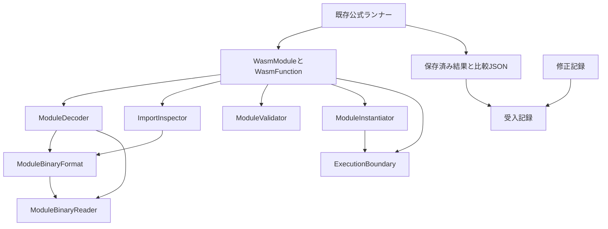
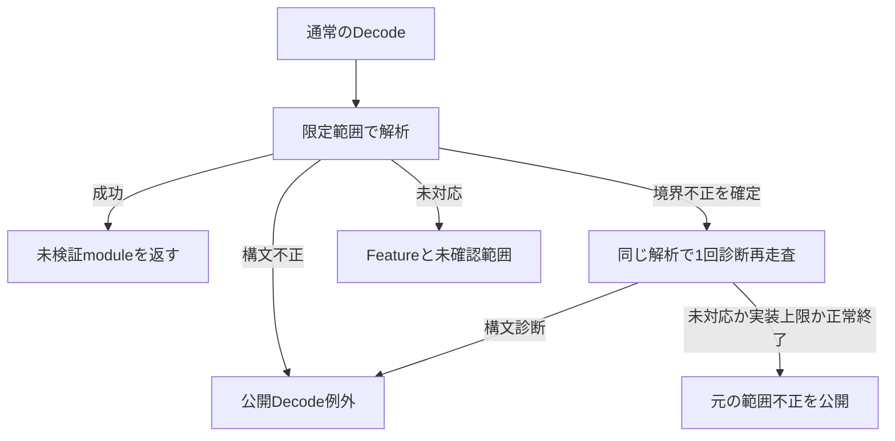
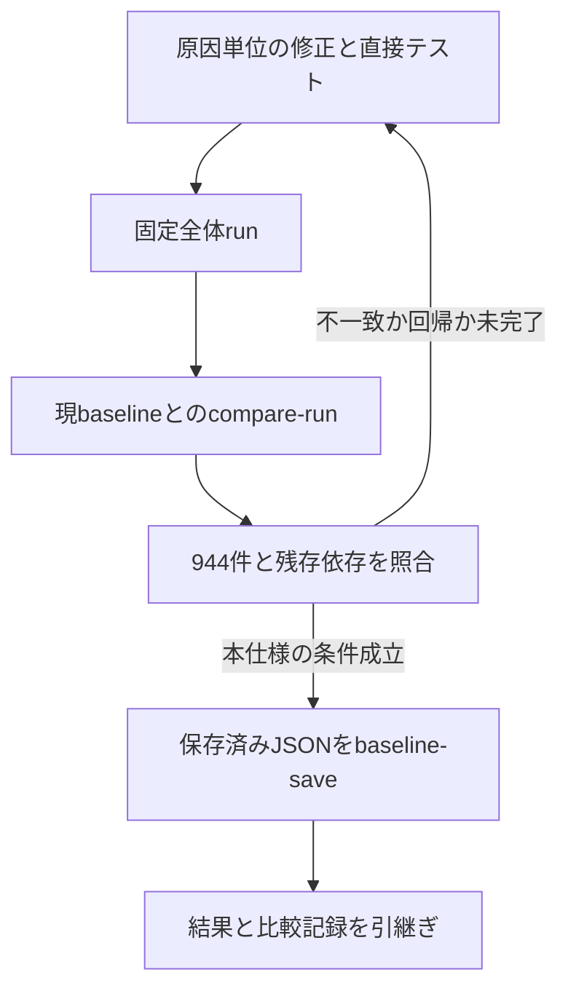

# test-suite-conformanceの技術設計

## 概要（Overview）

通常の公開APIから観測する先行ランタイムの動作と診断を、固定Core 2.0公式スイートの期待に合わせる。Decode・Validate・Instantiate・Invokeの既存責務を拡張し、入力・状態から原因を選んで公開例外を生成する。公式ランナーの比較規則と結果schemaは変更しない。

2026-10-01の保存済み結果には診断不一致944件がある。本仕様はこの全件と、修正後の全体実行で新たに判明する先行機能の不一致を扱う。102組の観測診断を修正タスク数とはせず、ケースから規則・原因・修正・確認結果を追跡する。本書は設計であり、修正後の受入結果ではない。

### 目標（Goals）

- 公式期待診断へのOrdinal前方一致と、固定参照実装から確認した原因選択規則を通常入力に適用する。
- 段階・例外型・Reason・Location、値・共有実体・状態、未対応とホスト例外の契約を維持する。
- 全147入力・53,907commandで944件のpassed化と既存合格の維持を確認し、受入後にbaselineを明示更新する。

### 対象外（Non-Goals）

後続命令・segmentの新規実装、WAT/WAST解析、別版の診断互換性、任意の複合不正についての完全互換、診断全文の一致、一般ホスト例外とAPI誤用のメッセージ統一を含めない。

## 責務境界（Boundary Commitments）

### 本仕様が所有するもの（This Spec Owns）

- 先行機能で判明した不具合の原因調査とランタイム修正。初期必須の実行経路を妨げないランタイム由来runner_errorも、原因確認後に追加する。
- 読取り条件、検証・リンクの原因選択、ランタイム生成診断の先頭と構造化情報の整合。
- 原因の追跡記録、944件の個別照合、残存未対応の所有先確認、baseline更新の受入手順。

### 境界外（Out of Boundary）

- 素材生成・固定profile・spectest・register・期待値比較・分類・結果記録・終了コード・baseline比較保存はtest-suite-runnerが所有する。本仕様から変更しない。
- numeric-control、linear-memory、tables-references、simdの新規機能は各仕様へ引き継ぐ。診断用再走査にも後続命令の解析・意味論を先行実装しない。
- 公開例外constructorに渡された任意Message、ホストcallbackの例外、固定公式入力・期待値、過去の要件・受入記録を変更しない。

### 許可する依存関係（Allowed Dependencies）

依存方向は`WasmModule → Modules内の解析・検証・インスタンス化`、`ModuleInstantiator → ExecutionBoundary → 既存実行機構`とする。診断生成は責務ごとのprivateな補助処理へ置き、既存の定義・公開例外・Locationを使う。限定読取りと診断再走査で構文解析を共有する。

公式ランナーはWasmSharpの公開APIへ一方向に依存する。ランタイムから公式JSON・期待文字列・ケースID・修正記録・WABTへの参照、ランナー向けInternalsVisibleTo、診断差替えhookを追加しない。固定参照ソースは調査・検証の根拠として使う。

### 再検証の契機（Revalidation Triggers）

- reader・formatの変更時はDecodeとInspectImports、範囲安全性、診断再走査を再確認する。
- 検査順・診断・例外情報の変更時は、変更規則の境界条件・複合不正と固定スイート全体を再検証する。
- リンク・実行境界の変更時は共有、start、同期再入、ホスト例外、必須66ケースを確認する。
- 後続仕様の機能追加時は未対応だった公式ケースと共通診断経路を再検証する。profile・入力集合・生成物の変更は本仕様内の修正として吸収しない。

## アーキテクチャ（Architecture）

### 既存構成の分析（Existing Architecture Analysis）

WasmModuleはValidate全体の成功時だけコードと検証成功状態を確定する。ModuleValidatorは関数の型検査と線形化を同じパスで行う。リンク失敗はModuleInstantiator.LinkFailure、内部実行結果の例外化はExecutionBoundary.ThrowIfFailedへ集約済みであり、これらを維持する。

ModuleBinaryReaderはsection・bodyに限定した子readerを作る。固定参照decoderは物理入力上で構文を読み、後から宣言サイズとの一致を調べる。この差はENDだけでなく境界をまたぐLEB128にも影響するため、文言置換や1byteの先読みだけでは解消できない。

### 採用構成と境界（Architecture Pattern & Boundary Map）

既存責務の拡張と必要箇所の分離を組み合わせる。検査の分割と共有primitiveの抽出を先に行い、その後で原因選択・診断を変更する。全段階共通の診断frameworkや差替えinterfaceは設けない。



新設するランタイム型は読取りモードと内部の境界失敗通知だけとする。診断再走査はModuleDecoder内に閉じ、別parser、全不正の収集、Validateや実行への進行を行わない。reader・format・decoder・inspectorは同じ担当で変更する。validatorとリンク・実行境界は契約確定後に並行して扱える。

### 技術スタック（Technology Stack）

| 対象 | 技術・版 | 用途 |
| --- | --- | --- |
| ランタイム | C#・.NET 10、ReadOnlySpan、ImmutableArray | 現在の型・値・読取りを再利用。新規packageなし |
| テスト | .NET 10・TUnit 1.66.16 | 現在のWasmSharp.Tests.csprojの版を継続 |
| 公式受入 | 既存WasmSharp.TestSuiteRunner | 公開API実行、Ordinal前方一致、6分類、保存・比較 |
| 参照資料 | spec `05ca4182176763112561ae20153975c12bd689e4`、WABT `03a00a1334e6121fb0cce4fccbd6bb109b68acaa` | 固定版を継続。生成済み素材のrunにWABTは不要 |
| 調査記録 | JSON・Markdown、PowerShellでの保存済みJSON照合 | ケースの結合・集計。新しい実行・判定エンジンは作らない |

## ファイル構成計画（File Structure Plan）

以下は実装段階の計画である。設計生成ではランタイムとテストを編集しない。

### 作成するファイル（Directory Structure）

| パス | 責務 |
| --- | --- |
| `src/WasmSharp/Modules/ModuleReadMode.cs` | BoundedとDiagnosticの内部モード |
| `src/WasmSharp/Modules/ModuleReadBoundaryException.cs` | 確定した範囲不正のWasmDecodeExceptionを運ぶ内部通知 |
| `.kiro/specs/test-suite-conformance/remediation.json` | 観測ケースと原因・修正・確認結果の対応 |
| `.kiro/specs/test-suite-conformance/acceptance.md` | コマンド、revision・差分識別、通常テスト、公式run・比較・監査・保存の記録 |
| `artifacts/test-suite-conformance/<検証識別>/acceptance-audit.json` | ケース別照合と未対応・依存の監査出力。Git管理外 |

### 変更・再利用するファイル（Modified Files）

| パス | 担当する変更・扱い |
| --- | --- |
| `src/WasmSharp/Modules/ModuleBinaryReader.cs` | 物理範囲・宣言範囲、整数・長さ・名前、境界通知、元位置 |
| `src/WasmSharp/Modules/ModuleBinaryFormat.cs` | header、型・limits符号化、section順、長さと完了検査 |
| `src/WasmSharp/Modules/ModuleDecoder.cs` | DecodeCoreの共有、診断再走査、式・locals・function/code診断 |
| `src/WasmSharp/Modules/ImportInspector.cs` | 内部境界通知の変換、完全一覧と未確認範囲の保持 |
| `src/WasmSharp/Modules/ModuleValidator.cs` | 検査の分離・順序、型・添字・limits・定数式診断 |
| `src/WasmSharp/Modules/ModuleInstantiator.cs` | 名前解決と種類・型照合の分離、LinkFailureのprefix |
| `src/WasmSharp/Execution/ExecutionBoundary.cs` | 現在の実行経路が生成するtrap/exhaustionのprefix |
| `src/WasmSharp/WasmModule.cs`、`src/WasmSharp/WasmFunction.cs`、`src/WasmSharp/Execution/ExecutionResult.cs` | 既存契約を再利用。既知944件への予定変更なし。新規不一致の原因と確認した場合だけ修正記録を追加して変更 |
| `src/WasmSharp/Exceptions/WasmDecodeException.cs`等の既存公開例外 | 再利用のみ。constructor、型階層、公開Reasonを変更しない |
| `tests/WasmSharp.Tests/Modules/ModuleBinaryReaderTests.cs`、`tests/WasmSharp.Tests/Modules/ModuleBinaryFormat_ReadImportsTests.cs` | 対象メソッド別の既存クラスへ整数・長さ・UTF-8の境界確認を追加 |
| `tests/WasmSharp.Tests/Modules/ModuleDecoder_DecodeFailureTests.cs`、`tests/WasmSharp.Tests/Modules/ModuleDecoder_DecodeFunctionTests.cs`、`tests/WasmSharp.Tests/Modules/ModuleDecoder_DecodeInstructionTests.cs` | 診断・境界・複合不正、内部通知が公開されないことの確認 |
| `tests/WasmSharp.Tests/Modules/ModuleDecoder_DecodeTests.cs` | 長さ・要素数の検査変更で原因が変わる既存ケースのLocation期待値を更新。例外型・位置の検査は維持 |
| `tests/WasmSharp.Tests/Modules/ModuleValidator_ValidateExternalsTests.cs`、`tests/WasmSharp.Tests/Modules/ModuleValidator_ValidateFunctionTests.cs` | 検査順、添字・型・limits診断 |
| `tests/WasmSharp.Tests/WasmModule_ValidateTests.cs`、`tests/WasmSharp.Tests/WasmModule_ValidateInitializersTests.cs`、`tests/WasmSharp.Tests/WasmModule_ValidateStartTests.cs` | 後段失敗時の状態、定数式・startの複合不正 |
| `tests/WasmSharp.Tests/WasmModule_InstantiateLinkingContractTests.cs`、`tests/WasmSharp.Tests/WasmModule_InstantiateLinkingTests.cs` | 原因選択、import情報、共有と独立性 |
| `tests/WasmSharp.Tests/Execution/ExecutionBoundary_ThrowIfFailedTests.cs`、`tests/WasmSharp.Tests/WasmModule_InstantiateStartTests.cs`、`tests/WasmSharp.Tests/WasmFunction_InvokeExhaustionTests.cs` | prefixとReason・段階、保存参照・副作用・ホスト例外 |
| `tests/WasmSharp.Tests/WasmModule_InspectImportsTests.cs`、`tests/WasmSharp.Tests/Exceptions/WasmException_ConstructorTests.cs` | 共通readerの影響と既存公開契約 |
| `tests/WasmSharp.Tests/Fixtures/HostLinkingModuleBinary.cs`、`tests/WasmSharp.Tests/Fixtures/ConstantModuleBinary.cs` | 必要な場合だけ既存fixtureを拡張 |
| `tools/WasmSharp.TestSuiteRunner/Execution/AssertionJudge.cs`、`tools/WasmSharp.TestSuiteRunner/Reports/ReportStore.cs`、`tools/WasmSharp.TestSuiteRunner/Reports/CompletionPolicy.cs`、`tools/WasmSharp.TestSuiteRunner/Baselines/BaselineComparer.cs`、`tools/WasmSharp.TestSuiteRunner/Baselines/BaselineStore.cs` | 再利用のみ。判定・完全性検査・比較・保存を変更しない |
| `tools/WasmSharp.TestSuiteRunner/Reports/CaseId.cs`、`tools/WasmSharp.TestSuiteRunner/Reports/CaseResult.cs`、`tools/WasmSharp.TestSuiteRunner/Reports/CaseDiagnostic.cs`、`tools/WasmSharp.TestSuiteRunner/Reports/CaseCause.cs`、`tools/WasmSharp.TestSuiteRunner/Reports/RunReport.cs` | 既存の保存schemaを参照。独自baselineへ変換しない |
| `.kiro/specs/test-suite-conformance/diagnostic-groups.json`、`.kiro/specs/test-suite-conformance/handoff.md` | 初回観測と比較元の証拠として保持 |

## 処理フロー（System Flows）



通常の未対応を捕捉して再走査へ入らない。一般的な資源不足や予期しない.NET例外をWasmの構文不正へ包み直さない。



## 要件対応（Requirements Traceability）

| 要件 | 対応内容 | 担当 | 契約 | フロー・検証 |
| --- | --- | --- | --- | --- |
| 1.1 | ケースと期待・実際・段階・診断 | remediation、CaseResult | 保存済み観測参照 | 原因調査 |
| 1.2 | 規則から原因・修正・確認を追跡 | remediation | 原因記録 | 原因別回帰 |
| 1.3 | 新規の先行不一致を追加 | remediation | 対象追加 | 全体再実行 |
| 1.4 | 境界外の原因と引継ぎ先 | remediation | 引継ぎ状態 | 受入監査 |
| 1.5 | 観測群と原因を別管理 | remediation | CaseIdとの対応 | 944件照合 |
| 2.1 | 値・個数・bits・参照・状態 | 公開API、Validator、Instantiator | 公開動作 | 全体run・既存直接テスト |
| 2.2 | 共有と定義実体の独立性 | ModuleInstantiator | 同一実体の接続 | リンク回帰 |
| 2.3 | 段階・例外型 | 各処理段階の既存モジュール | 段階別失敗 | 公開API回帰 |
| 2.4 | 未対応・資源不足を読み替えない | ModuleDecoder、ExecutionBoundary | 失敗分類 | 再走査・実行境界 |
| 2.5 | ホスト例外の実体保持 | ExecutionBoundary | 非加工伝播 | 呼出し回帰 |
| 2.6 | 全Validate成功時だけ確定 | ModuleValidator、WasmModule | 状態確定 | 後段失敗 |
| 2.7 | import調査の独立性 | ImportInspector | 完全一覧・未確認範囲 | 調査回帰 |
| 3.1 | 公式prefix | 各診断生成箇所 | Ordinal前方一致 | 否定assertion |
| 3.2 | 大文字小文字・空白・数値 | reader、validator、LinkFailure | 文字列と数値書式 | 境界テスト |
| 3.3 | 補助説明を後置 | 各診断生成箇所 | prefixを先頭に置く | Message検査 |
| 3.4 | 原因選択の一般規則 | Decoder、Validator、Instantiator | 検査順序 | 複合不正 |
| 3.5 | 原因と構造化情報の一致 | Location、LinkFailure、ExecutionBoundary | 同一原因から構築 | Reason・位置・上限 |
| 3.6 | 入力・状態だけで診断 | ランタイム全体 | 一方向依存 | 依存・参照確認 |
| 4.1 | UTF-8不正 | ModuleBinaryReader | 厳格デコード | 名前の境界 |
| 4.2 | 整数幅とpayload | ModuleBinaryReader | LEB検査順 | signed・unsigned |
| 4.3 | magic・version・EOF | ModuleBinaryFormat | 4byte単位照合 | 0〜8byte境界 |
| 4.4 | 構造・符号化 | Format、Decoder | section・vector・locals・件数 | 固定ケース・複合不正 |
| 4.5 | ENDと境界の区別 | Decoder、Reader | 診断再走査 | binary.wast#76・#77・#78 |
| 4.6 | 範囲安全性 | ModuleBinaryReader | 物理・宣言範囲 | 長さ・EOF・停止条件 |
| 5.1 | 入出力の型・個数 | ModuleValidator | type mismatch | 型stack・初期化式 |
| 5.2 | 添字の種類と数値 | ModuleValidator | unknown診断 | 種類別境界 |
| 5.3 | 重複export | ModuleValidator | 添字確認後の重複検査 | export複合不正 |
| 5.4 | 定数式・global・start | ModuleValidator | 適格性と型 | 初期化式・start |
| 5.5 | limits・memory制約 | ModuleValidator | 上限と大小関係の分離 | 上限・複合不正 |
| 6.1 | 名前不足 | ModuleInstantiator | MissingImport | 名前解決 |
| 6.2 | 種類・型の不一致 | ModuleInstantiator | 2種類のReason | 逆順型照合 |
| 6.3 | startのunreachable | ExecutionBoundary | 段階とUnreachable | start.wast#18 |
| 6.4 | trap・exhaustion | ExecutionBoundary | Reason・段階・上限 | 直接API・境界 |
| 6.5 | 保存参照と副作用 | Instantiator、ExecutionBoundary | 取消しなし | start失敗回帰 |
| 7.1 | 全147入力・53,907command | 既存ランナー、acceptance | 固定manifestのrun | 全体受入 |
| 7.2 | 完全な記録 | ReportStore、acceptance-audit | 欠落等0 | 完全性検査 |
| 7.3 | 944件の個別passed化 | acceptance-audit | CaseId結合 | 診断一覧との照合 |
| 7.4 | failed・runner_error0 | CompletionPolicy、acceptance-audit | 全体受入 | run・比較 |
| 7.5 | 素材・判定不変 | AssertionJudge、固定profile | 再利用のみ | 条件・差分確認 |
| 7.6 | 未対応・依存の所有先 | CaseDiagnostic、CaseCause、acceptance-audit | FeatureとDirect・Origins | 全件依存監査 |
| 7.7 | 工程ごとの終了値 | CompletionPolicy、acceptance | run・比較とverifyの区別 | 受入記録 |
| 7.8 | 規則と確認結果の対応 | remediation、acceptance | 直接テスト・全体結果 | 証拠引継ぎ |
| 8.1 | 修正前の比較元 | handoff、acceptance | hashまたは旧revision | 着手前確認 |
| 8.2 | 同条件の比較 | BaselineComparer | profile・素材・全ケース | compare-run |
| 8.3 | 既存passedと必須66件 | BaselineComparer、acceptance-audit | 退行・欠落の拒否 | 回帰確認 |
| 8.4 | 修正・全体実行・再比較 | remediation、acceptance | 受入前の上書き禁止 | 修正ループ |
| 8.5 | 保存済み結果の明示保存 | BaselineStore、acceptance | 別操作のbaseline-save | 保存・引継ぎ |
| 8.6 | 保存成功と合格の区別 | CompletionPolicy、acceptance | 初回全体baseline維持 | 保存前後記録 |

## モジュールと契約（Components and Interfaces）

| モジュール・記録 | 責務 | 要件 | 主な依存 | 契約 |
| --- | --- | --- | --- | --- |
| ModuleBinaryReader・ModuleBinaryFormat | バイナリprimitiveと構造 | 3.1, 3.2, 3.3, 3.5, 4.1, 4.2, 4.3, 4.4, 4.6 | 入力span・Location（P0） | 内部サービス・状態 |
| ModuleDecoder | module構文と診断選択 | 2.3, 2.4, 3.4, 3.6, 4.4, 4.5, 4.6 | reader・format（P0） | 内部サービス |
| ImportInspector | import調査 | 2.7, 4.6 | reader・format（P0） | 内部サービス |
| ModuleValidator | 型検査・線形化と原因選択 | 2.1, 2.6, 3.4, 5.1, 5.2, 5.3, 5.4, 5.5 | module定義・命令表（P0） | 内部サービス・状態 |
| ModuleInstantiator | 実体接続と失敗情報 | 2.2, 3.4, 3.5, 6.1, 6.2, 6.5 | WasmImports・ExecutionBoundary（P0） | 内部サービス |
| ExecutionBoundary | 実行結果の例外化 | 2.3, 2.4, 2.5, 3.5, 6.3, 6.4, 6.5 | ExecutionResult（P0） | 内部サービス |
| remediation・acceptance | 原因追跡と受入 | 1.1, 1.2, 1.3, 1.4, 1.5, 7.1, 7.2, 7.3, 7.4, 7.5, 7.6, 7.7, 7.8, 8.1, 8.2, 8.3, 8.4, 8.5, 8.6 | 既存JSON・固定資料（P0） | 作業・保存 |

### バイナリ読取りと診断選択

**依存:** InboundはModuleDecoder・ImportInspector（P0）、Outboundはspan・UTF8Encoding・公開例外（P0）。固定decode.mlは設計・確認時のExternal資料（P1）。

**サービス契約:** 既存の`ModuleDecoder.Decode(ReadOnlySpan<byte>) → WasmModule`と型付き整数読取りを維持し、内部を次に分ける。新しい型はいずれもinternal、以下のDecodeCoreとResolveBoundaryFailureはprivateとする。

```csharp
enum ModuleReadMode { Bounded, Diagnostic }
// ModuleReadBoundaryExceptionはExceptionを継承し、Fallbackを保持する。
WasmModule DecodeCore(ReadOnlySpan<byte> bytes, ModuleReadMode mode);
WasmDecodeException ResolveBoundaryFailure(
    ReadOnlySpan<byte> bytes, ModuleReadBoundaryException failure);
```

readerは宣言終端`DeclaredEnd: long`、原入力の物理終端`InputEnd: long`、現在位置`Position: long`、`DeclaredRemaining: long`とsection・functionの情報を保持する。`ReadLength() → uint`、`ReadU1() → uint`、`ReadS7() → int`、`TryPeekByte(out byte) → bool`を既存primitiveへ追加する。位置・長さは縮小変換前に確認する。

- **Bounded:** ReadByte・ReadBytes・ReadRangeは宣言範囲を超える値を返さない。範囲により構文読取りを完了できない場合は、元のWasmDecodeExceptionをFallbackに持つModuleReadBoundaryExceptionを通知する。直接の符号化違反は従来の公開Decode例外を生成する。
- **Diagnostic:** 原入力EOFまでに限定したspanと、別のDeclaredEndを持つ子readerを作る。宣言範囲外のbyteは診断選択にだけ使い、通常のmodule読取りとして受理しない。すべてのbyte取得で物理範囲を検査する。
- Decode入口は境界通知だけを捕捉して、同じDecodeCoreをDiagnosticで最大1回呼ぶ。WasmDecodeExceptionが得られれば採用し、未対応・実装上限・正常終了ならFallbackを公開する。再走査結果のWasmModuleは外へ返さない。再帰的な診断や包括catchはしない。
- DiagnosticではModuleReadBoundaryExceptionを生成しない。物理EOFとRequireEndの失敗もWasmDecodeExceptionとして確定し、内部通知を外へ漏らさない。
- 子readerを作るときの親の先送りは宣言長を基準とし、Diagnosticでも物理EOFを越えて位置を進めない。RequireEndは`Position == DeclaredEnd`を必須とする。宣言サイズが大きすぎる入力は、EOFまたは不一致で失敗する。
- custom payloadの読み飛ばしはDeclaredRemainingを使い、負値の場合の診断は下表に従う。Diagnosticの物理残量全部をcustom payloadとして消費しない。
- ImportInspectorは内部境界通知のFallbackを、既存のWasmImportInspectionExceptionへ変換する。MalformedBinary、Location、FailureRanges、InnerExceptionを維持し、完全取得前の一覧を公開しない。診断のために全moduleをDecodeしない。

要件4.6の範囲外読取り禁止は、物理入力の範囲外へのアクセスを禁止する。通常解析では宣言範囲も越えず、Diagnosticでの宣言範囲外参照は診断選択にだけ限定する。いずれのモードでも、不正な宣言長のmoduleを受理しない。

**診断規則と検査順:**

| 条件 | 決定 |
| --- | --- |
| 名前 | 長さ・byte列の取得後、厳格UTF-8検査。失敗は`malformed UTF-8 encoding` |
| LEB128 | 残り幅がなければ次byte取得前に`integer representation too long`。最終payload不正は継続bitより先に`integer too large`。許容payloadで継続する場合は次反復で幅超過を通知 |
| flag・型 | limits flagはu1、function/value/reference typeはs7。mutabilityとimport/export kindは生のbyte検査。value typeの最終不正は固定参照の選択に合わせ`malformed reference type` |
| header | magicの4byteを取得してから照合、次にversionの4byteを取得して照合。途中は`unexpected end`、不一致は`magic header not detected`または`unknown binary version` |
| 長さ・vector | prefix前の位置から物理EOFまでを上限としてReadLengthを共用し、超過は`length out of bounds`。要素不足は要素の読取りで`unexpected end of section or function`。宣言数による巨大な先行確保をしない |
| section | 未知IDは`malformed section id`。既知sectionの逆順・重複は長さ・payload読取りより先に`unexpected content after last section`。customはrankを進めない |
| custom payload | 名前を読んだ後のDeclaredRemainingが負なら、payload取得時点で`unexpected end of section or function`。RequireEndの`section size mismatch`へ進めない |
| import/export kind | 呼出し文脈により`malformed import kind`と`malformed export kind`を分ける |
| 式終端 | 0x05・0x0B・EOFで命令列を止め、続けてENDを要求する。0x05なら`END opcode expected`、物理EOFなら`unexpected end of section or function`。宣言外のENDで終了したらRequireEndで`section size mismatch` |
| locals | 圧縮宣言を全件読んだ後、ulongの合計がu32を超えれば`too many locals`。後続宣言の符号化不正を上限より先に報告。個別localへ展開しない |
| function/code | `function and code section have inconsistent lengths`。既知の件数不一致を未対応へ変えないよう、宣言件数から確定する既存検査を維持する。後続命令を調べるために検査を一律にmodule末尾へ移さない |

ReadLengthは名前長・section長・body長・vector countへ適用する。長さ値の利用時には通常の限定範囲検査を続け、コレクション保持上限と一般資源不足をWasmの破損へ統合しない。

`binary.wast#76/#77/#78`ではEND欠落後が0x05、EOF、data section IDの0x0Bであり、上記3診断へ分かれる。`binary-leb128.wast#36`ではsectionをまたぐ整数の表現長不正を再走査で確認する。`binary.wast#162`では次sectionのbyteが名前長として解釈される。ケース別分岐は作らず、同じ構文・primitiveから導く。

検査順は先行機能内で確認した規則を適用する。例えば`custom.wast#8`の件数不一致を後回しにすると未実装i32.addで停止し得るため、確定済み構造不正の早期検査を残す。未対応領域まで参照decoderの全手順を移植する保証には広げない。

**位置契約:** headerは現在どおり逐次取得し、比較だけを4byte取得後へ移す。完全な不一致のLocationは最初の相違byte、途中EOFは実際の終端を示す。その他も選択した原因のoffset・section・functionを保持し、参照実装との位置数値の完全一致は要求しない。内部通知は公開APIまでに必ず既存例外へ変換する。

**統合・確認・リスク:** DecodeCoreと範囲状態を先に分離して既存成功経路を確認し、その後に再走査・診断を変更する。直接readerテストでは内部通知の変更を明示する。公開Decodeの例外型検査を弱めず、正確にWasmDecodeExceptionであることを確認する。

### ModuleValidator

**依存:** InboundはWasmModule.Validate（P0）、Outboundは定義・InstructionSet・FunctionCode（P0）、Externalは固定valid.ml（P1）。**契約:** `Validate(WasmModule) → ImmutableArray<FunctionCode>`を維持する。

ValidateReferencesを用途別のprivate検査へ分け、先に現在の振舞いを保つ責務整理を行う。その後、次の順序へ変更する。

1. importの静的な型・limitsを末尾から先頭へ検査する。添字空間・診断の宣言番号は元の順序を維持する。
2. 定義関数のtype indexを宣言順で確認し、検査済み参照から型情報を構成する。
3. global初期化式、定義table、定義memoryを宣言順で検査する。
4. 関数を宣言順で1回だけ型検査・線形化し、ローカルbuilderへ保持する。
5. start、export、最後にimportと定義を合わせたmemory個数を検査する。
6. 全成功後にだけコードを返し、WasmModuleが既存方式で状態を確定する。

定数式はend以外の命令を左から調べ、適格性を短絡判定してから結果型・個数を調べる。global.getはimportされたglobalの存在を確認し、mutableなら`constant expression required`。未知globalと禁止命令が併存すれば先に遭遇した違反を選ぶ。未対応命令を読み飛ばさない。

limitsは最小値の仕様上限、最大値の仕様上限、min≤maxの順に分ける。memory上限は`memory size must be at most 65536 pages (4GiB)`、大小違反は`size minimum must not be greater than maximum`。memory個数違反のLocationは2個目の宣言を維持する。export内は添字確認、重複名の順とする。

診断生成はModuleValidator内のprivate補助処理へ集約する。型・個数は`type mismatch`、添字は`unknown function/global/local/memory/table/type`に実際のindexをInvariantCultureの10進表記で続ける。単独診断は`duplicate export name`、`global is immutable`、`start function`、`multiple memories`を使う。Locationは検出した原因から作り、公開Reasonを新設しない。後段で失敗しても部分コードを公開しない。

### ModuleInstantiator

**依存:** InboundはWasmModule.Instantiate（P0）、OutboundはWasmImportsのsnapshot・ExternalValue・ExecutionBoundary（P0）、Externalは固定import.ml・eval.ml（P1）。**契約:** `Link(WasmModule, WasmImports) → ImmutableArray<ExternalValue>`を維持する。

名前解決と照合をprivate処理に分けてから、全importの名前を宣言順で解決し、全成功後に末尾から先頭へ種類・型を照合する。同じ宣言内では種類を先に確認する。したがって後の名前不足は前の型不一致より先、名前が揃う場合は最後の不適合宣言が先になる。

接続結果は元の宣言順と同一実体を維持する。同名の複数宣言も個別に照合する。LinkFailureはReasonからprefixを導き、MissingImportは`unknown import`、KindMismatchとTypeMismatchは`incompatible import type`とする。既存説明は後置し、Reason・ImportOrdinal・ModuleName・ImportName・ExpectedKind・Locationを同じ選択原因から生成する。

割当・初期化・export接続後のstartと、失敗時の保存参照・副作用維持は変更しない。照合順の変更で実体配列を逆転しないことを確認する。

### ExecutionBoundary

**依存:** Inboundは公開InvokeとModuleInstantiatorのstart（P0）、OutboundはExecutionResult・既存公開例外（P0）。**契約:** `ThrowIfFailed(ExecutionResult, WasmProcessingStage) → void`を維持する。

現在の経路が生成するUnreachableは`unreachable executed`、CallDepthLimitとHostStackLimitは`call stack exhausted`から始める。Reason・Limit・元位置と呼出し元段階を保ち、未計測上限のnullも維持する。他の既存Reasonの伝播を壊さず、新規命令のprefixはその機能を実装する後続仕様が追加する。

ホスト例外をcatchして加工せず、constructor全体のMessage変換をしない。finallyによるコンテキスト・stack復元とstart失敗後の保存参照・変更を維持する。

### 修正追跡と公式受入

**依存:** Inboundは開発者の調査・通常ビルド・テスト（P0）、Externalは既存run・比較JSON・固定資料（P0）。**契約:** remediation.jsonで原因を追跡し、acceptance.mdに受入を記録する。

既存run_reportとcomparison_reportを加工せず保存する。PowerShellで保存済みCaseIdを結合・集計し、補助監査JSONを残す。期待値の再判定、分類変更、ランタイムの再実行を監査に含めず、専用判定エンジンを作らない。

現行steeringとroadmapではtest-suite-runnerの仕様全体の最終実装検証が待ち状態にある。本仕様の実装着手時に上流完了を確認する。本設計の生成は上流の検証を代替せず、roadmapや過去の承認状態を変更しない。

## データモデル（Data Models）

### ランタイム内の状態（Domain Model）

- ModuleReadModeはBoundedまたはDiagnostic。後者は確定済み境界失敗からだけ選ぶ。
- ModuleReadBoundaryExceptionは`Fallback: WasmDecodeException`だけを持つ内部通知。公式期待値やrunnerの分類を持たない。
- 検証中のFunctionCodeはローカルに保持し、全成功時だけWasmModuleへ渡す。検証済みの別型や部分公開は導入しない。
- リンクの一時配列は宣言順のExternalValue参照を保持する。照合順と実体順を区別する。

### 修正記録（Logical Data Model）

remediation.jsonは本仕様の作業資料とし、`schema_version: 1`を持つ。JSON識別子は英語、説明文章は日本語とする。

| 要素 | 型・内容 | 不変条件 |
| --- | --- | --- |
| sources | path、SHA-256、run IDの一覧 | 修正前後の全体結果を区別し、CaseResultを参照 |
| findings | 原因ID、状態、対象仕様、要件ID、固定規則の出典、原因、修正箇所、テスト・結果参照 | D001等の観測群とは別ID。未調査と原因確定を区別 |
| cases | input_path:string、command_index:int、source参照、観測群ID、原因ID一覧 | 0始まりCaseIdをキーにする。同じ観測群でも原因が異なれば分ける |
| verification | revision・未コミット差分識別、テスト、公式run・比較・監査の参照 | 修正済みと受入確認済みを区別 |
| transfer | 所有仕様、原因、必要機能、根拠ケース | 引継ぎを解消やpassedとしない |

期待・実際・診断全文はsourceのCaseResultから取得し、手入力コピーを増やさない。状態は未調査、原因確定、修正済み、確認済み、境界外への引継ぎを区別する。新たな証拠で原因が変われば再調査へ戻し、以前のrun参照も保持する。既知944件外の先行不一致も追加する。

### 受入結果の契約（Data Contracts & Integration）

acceptance-audit.jsonに入力資料のpath・hash・run ID、次の照合結果、不成立のCaseId一覧を保存する。RunProvenanceにGit revisionがないため、実行したrevision・未コミット差分の識別と通常ビルド出力をacceptance.mdへ残す。

1. 固定profileと素材の同一性、147入力・53,907command、欠落・重複・未処理・未確定0。
2. 診断一覧の一意な944IDと現結果の1対1対応、全944件のpassed。初回1,547passedと必須66件も1対1でpassedを維持。
3. 全体failed、入力・commandのrunner_error、比較未完了・未比較・回帰0。runとcompare-runの終了0。
4. 全runtime_unsupportedのFeature・未確認範囲・Location・CaseIdと後続仕様の対応。曖昧なFeatureは生成moduleのopcodeと固定規則で確認し、文字列接頭辞の恒久allowlistにしない。
5. 全blockedのDirectをたどり、Originsが同じ入力内の先行runtime_unsupportedへ到達し、その所有仕様まで追跡できること。所有先不明や先行機能の不具合を残して完了としない。
6. verifyの終了値と理由、baseline保存前後hashと終了値。保存後は受入currentと同じbyte列であること。

所有先の基本はscalar数値・構造化制御がnumeric-control、scalar memory・data/data_countがlinear-memory、参照・table・element・call_indirectがtables-references、vector命令がsimdとする。typed select等はopcodeと型規則を確認する。これは最初の未実装機能の所有先であり、入力全体の有効性や、その機能だけでの合格を示さない。

## エラー処理（Error Handling）

| 原因 | 公開結果 |
| --- | --- |
| 符号化・構造破損 | WasmDecodeExceptionとDecodeのLocation。内部境界通知を漏らさない |
| 型・添字・構造の検証不成立 | WasmValidateExceptionと選択原因のLocation。成功状態を確定しない |
| importの不成立 | WasmInstantiateException、既存Reasonとimport情報 |
| start・Invokeのtrap | WasmTrapException、ReasonとInstantiateまたはInvokeのLocation |
| 管理された実行上限 | WasmExhaustionException、Reason・Limit・元位置・段階 |
| 通常解析での未実装 | WasmUnsupportedFeatureException、Featureと未確認範囲 |
| 実装上限・一般資源不足・ホスト例外 | 既存の分類・伝播を維持。期待されたWasm失敗へ一括変換しない |

prefixの後ろへ日本語説明・位置・実際値を付ける。公開constructorの任意Messageは保持する。ランタイム側にログ収集・診断保存を追加せず、公開例外と既存ランナー結果を使う。

## テスト方針（Testing Strategy）

### 原因単位の直接テスト

- **バイナリ（4.1, 4.2, 4.3, 4.4, 4.5, 4.6）:** UTF-8、LEB最終payloadと継続bitの組合せ、u1/s7、途中EOF、prefix前後で残量が変わる長さ、0〜8byteのheader、宣言境界前後のEND・LEBを確認する。binary.wast#76/#77/#78/#162、binary-leb128.wast#36、custom.wast#5の構造を最小入力で再現し、成功・未対応への変更、範囲外アクセス、繰返し再走査を防ぐ。custom名取得後の負の宣言残量に対する診断と、payloadの読み過ぎも確認する。
- **検証（2.6, 3.4, 5.1, 5.2, 5.3, 5.4, 5.5）:** importの複数違反、limits上限と大小逆転、禁止命令と余分な定数、未知globalと禁止命令の両順序、関数本体とstart/export、添字と重複の併存を確認する。後段失敗後もInstantiateできず、再Validate時に部分成果を使わない。
- **リンク（2.2, 3.5, 6.1, 6.2）:** 名前不足と型不一致の両順序、複数型不一致で、選択Reason・ordinal・名前・Location・prefixをまとめて検査する。成功時の宣言順、同一実体の共有、定義実体の独立性を維持する。
- **実行境界（2.3, 2.4, 2.5, 6.3, 6.4, 6.5）:** Unreachableと両exhaustion ReasonをInvoke/Instantiateで確認する。prefix・Reason・Limit・元位置、start失敗後の保存参照・副作用、ホストが投げたWasm例外を含む同一例外実体、コンテキスト復元を確認する。
- **共通契約（2.1, 2.7, 3.6）:** InspectImportsの完全一覧・未確認範囲・部分非公開、constructorの任意Message、値のbitsと参照同一性の既存回帰を利用する。公式ケースID等へのランタイム依存がないことを差分で確認する。

既存fixtureと対象メソッド別クラスを優先する。長さ・要素数の検査変更で原因が変わる既存ケースは、選択した原因に合わせてLocationの期待値を更新し、例外型・位置の検査を弱めない。新規クラスは`対象クラス_対象メソッドTests`、日本語の条件・期待結果名、AAA、await付きAssert.Thatを用い、テストにドキュメントコメントを付けない。944件を重複した単体テストへ展開せず、変更する規則の境界と複合不正に絞る。

### 全体受入とbaseline更新

1. handoffのrun-baseline.jsonとSHA-256 `032cc64b6c088e920331b420490617da6094454ab08a52381ab7c35b1be3c057`を照合する。取得できなければ旧revision再作成手順を用い、条件と照合限界を記録する。診断一覧や修正後結果で代用しない。
2. `dotnet build WasmSharp2.slnx -c Release --warnaserror`の警告・エラー0を確認してから、変更対象テストをコマンドで実行する。受入時はREADMEの3つのTUnitプロジェクトと整形検査を実行し、TRXに新しい出力先を使う。
3. 修正した通常ビルドのapphostで、`artifacts/test-suite-runner-acceptance-20261001/portable/corpus/manifest.json`を指定し全体runする。旧portable/runnerを使わず、MaxCallDepth=1024と環境を記録する。
4. 同じcurrent JSONを現baselineとcompare-runする。既存の完全性・条件一致・回帰判定を保存し、本仕様の監査を行う。
5. 不一致・runner_error・回帰・比較未完了・未解消原因があれば、修正記録を更新し、修正・全体run・比較・監査を繰り返す。出力名を変え、現baselineを上書きしない。
6. currentへverifyを実行する。未対応とそのblockedが残る間の終了1をCore 2.0全体未完了として記録し、run・比較の終了0と区別する。
7. 全受入条件成立後、保存済みcurrentを既存baseline-saveで現baselineへ別操作として明示的に上書きする。終了0と前後hash・currentとの一致を記録し、結果・比較・監査資料を引き継ぐ。

既知資料は1,547passed・944failed・2,987runtime_unsupported・47,352blocked・1,077out_of_scopeの過去の観測であり、修正後件数を約束しない。assert_trapとassert_exhaustionのfailed0を、その経路の公式合格とは扱わない。直接テストと保存成功は全体受入を代替しない。

## 安全性と性能（Security Considerations / Performance）

物理入力の範囲、宣言サイズの一致、整数幅・UTF-8の検査を保つ。診断再走査は同じ入力spanを使い、巨大な宣言長による先行確保をせず、命令数・locals・保持上限の既存検査を維持する。正常入力を二重解析しない。モード・境界情報の保持と分岐、失敗時の1回の追加走査・一時割当は増えるため、追加コスト0とは扱わない。数値の性能保証や新しいベンチマーク基盤は設けない。

## 実装順序と移行（Migration Strategy）

公開APIと保存schemaの移行は不要で、Message先頭と複合不正時の原因選択が意図した変更となる。比較元・原因追跡の準備、責務整理、reader一式、validator、リンク・実行境界、全体受入に区切る。reader一式内の並列編集を避け、validatorとリンク・実行境界は共通契約確定後に並行可能とする。

再実行で新しい先行不一致が見つかった場合は原因・修正先・確認方法を記録し、該当する既存責務へ戻す。後続機能の前倒しや境界外の変更を黙って追加しない。各仕様が追加する診断も同じ公式判定を満たし、直前baselineとの比較で受け入れる。
