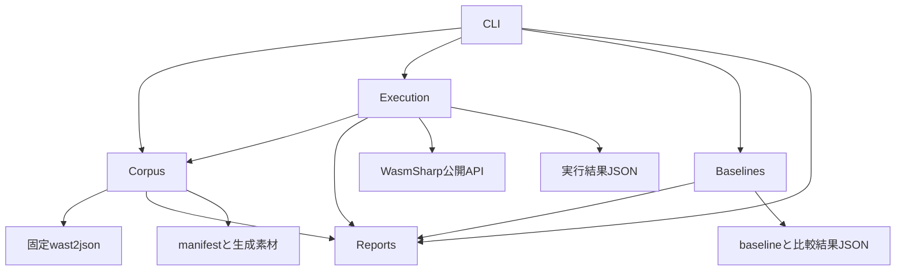
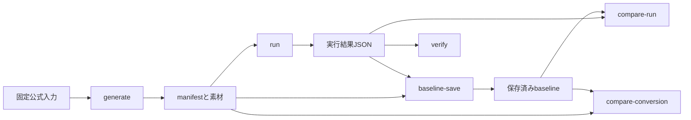
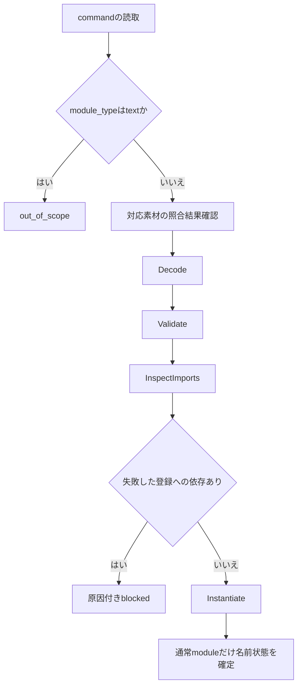

# test-suite-runnerの技術設計

## 概要（Overview）

実装者が固定Core 2.0公式スイートを生成・実行し、以前の結果との違いをcommand単位で確認する独立CLIを、`tools/WasmSharp.TestSuiteRunner/`に追加する。素材生成、実行、baseline保存、2種類の比較、最終判定を別々のコマンドとして提供する。実行は保存した素材だけで成立し、比較と最終判定は保存済みJSONだけを読む。

ランタイムの公開`Decode → Validate → Instantiate → GetFunction → Invoke`を使い、固定WABTのJSONに記録された順序・引数・期待値を評価する。初期から全7値型、spectest、register、否定assertionの診断前方一致、6分類を扱う。初回受入は全件記録と先行基盤の公式経路の成立を確認し、Core 2.0全件合格とは区別する。

### 目標（Goals）

- 配置rootに依存しない公式素材と、その出典を保持するmanifestを生成する。
- 失敗した前提への依存と、実際に評価した不一致・未実装を区別し、独立したcommandを継続する。
- 全commandの結果と入力異常を保存し、素材の再現性・実行の回帰・最終合格を用途別に判定する。

### 対象外（Non-Goals）

WAST/WAT解析、別エンジン、Wasm演算・import型照合の再実装、Core 3.0/proposal profile、複数工程の一括コマンド、並行実行、入力ごとの子プロセス・強制タイムアウト・再起動・途中再開、baseline共有サービスを追加しない。

## 責務境界（Boundary Commitments）

### 本仕様が所有するもの（This Spec Owns）

- CLI、固定profile、素材変換・照合、manifest、JSON commandの読取と入力ごとの状態、spectest、引数構築と期待値判定。
- 6分類、ケース識別と原因追跡、永続結果、baseline保存・比較、用途別終了コード。
- 通常利用にも有用なinstanceのexport名・種類の一覧取得APIと、初期必須の公式ケースを実行・判定するために必要なランタイム修正。

### 境界外（Out of Boundary）

- 関数・global・memory・tableの意味論、型照合、start、共有実体の寿命はランタイムが所有する。ツールで補完しない。
- 判定済みの動作・値・状態・失敗分類・診断の不一致は`test-suite-conformance`へ引き継ぐ。初期必須経路を妨げず、ランタイムが原因と確認できた`runner_error`も記録を保って引き継げる。
- 後続命令とdata/element初期化は各機能仕様の責務とする。初期受入のために必要な範囲の修正と、後続機能全体の実装を混同しない。
- 公式入力・固定外部ソース・LICENSE/NOTICE、完了済み仕様の過去の受入記録を変更しない。

### 許可する依存関係（Allowed Dependencies）

依存方向は`CLI → Corpus / Execution / Baselinesの処理 → ReportStore / CompletionPolicy → 保存用DTOと各機能の値型`とする。保存用DTOは処理クラスを参照しない。`Execution → Corpus`は照合済み素材の供給に限り、BaselinesはCorpusManifest等の保存用DTOだけを参照する。`Execution → WasmSharpの公開API`、`Corpus → 固定wast2jsonプロセス`を許す。ランタイムからツール・WABT・公式ケース識別子への依存は禁止する。ランナーに対するランタイムの`InternalsVisibleTo`も追加しない。

ツール内は機能ごとのinternalな具象型を直接組み合わせ、ランタイム差替え用のinterfaceや汎用pluginを設けない。ツールのテストにだけツール自身のinternal型を公開する。

### 再検証の契機（Revalidation Triggers）

- 公開export列挙、import情報、例外型・Reason・Location、リソース同一性の変更時はregister・依存判定・否定assertionを再検証する。
- 値表現、NaN判定、診断照合、状態遷移、ケース識別、保存schemaの変更時はランナーのテストと全固定スイート・baseline差分を再確認する。
- spec/WABTのcommit、全feature状態、入力集合、変換引数の変更時は全件再生成と変換baseline比較を行う。既存baselineを自動更新しない。
- 後続仕様で命令・初期化を追加した場合は同じ全体実行・回帰比較を行う。schemaを変更するときは既存結果を無言で読み替えず、明示的な非互換として拒否する。

## アーキテクチャ（Architecture）

### 既存構成と統合方針

`WasmModule`の4段階と`InspectImports`、`WasmValue`、`WasmImports`、`WasmHostModule.Define`、名前によるinstanceのGet系APIを再利用する。globalの再提供には値を返す`GetGlobal`ではなく、共有実体を返す`GetGlobalResource`を使う。現行の提供登録は重複を拒否するため、再registerはツールの登録表を置換し、Instantiateごとにその表から新しい`WasmImports`を作る。

独立CLIを1プロジェクトで構成し、素材・実行・比較・結果の責務でフォルダを分ける。CLIとは別の処理ライブラリ、DIコンテナ、汎用エンジン層は追加しない。



### 技術選択

| 対象 | 選択 | 用途・制約 |
| --- | --- | --- |
| CLI・処理 | C#、.NET 10、Nullable | 小さな固定コマンド集合を`string[]`から明示的に解析する。追加CLIパッケージは採用しない。 |
| JSON | .NET標準`System.Text.Json` | command境界の読取に`Utf8JsonReader`/`JsonDocument`、自分の結果DTOに`JsonSerializer`を使用する。 |
| hash・path・起動 | 標準`SHA256`、`Path`、`ProcessStartInfo.ArgumentList` | シェル文字列を組み立てず変換器を直接起動する。 |
| ランタイム | 既存`src/WasmSharp`へのProjectReference | 公開契約だけを使用する。 |
| 変換 | WABT`03a00a1334e6121fb0cce4fccbd6bb109b68acaa` | 外部プロセスはgenerateだけで使用する。 |
| 公式入力 | spec`05ca4182176763112561ae20153975c12bd689e4` | `test/core`の全147WAST。SIMD57件を含む。 |
| テスト | TUnit、net10.0 | 版は既存テストプロジェクトに合わせる。現行は1.66.16。 |

標準JSON読取とプロセスAPIの採用は[MicrosoftのJSON文書](https://learn.microsoft.com/dotnet/standard/serialization/system-text-json/use-dom)と[ArgumentListの契約](https://learn.microsoft.com/dotnet/api/system.diagnostics.processstartinfo.argumentlist?view=net-10.0)に基づく。Wasm/JSONの意味は最新上流ではなく固定ソースを基準とする。

## ファイル構成計画（File Structure Plan）

### 新設するファイル

ツール内の同一フォルダに関連する型を置く。下表の型名とファイル名は対応させ、結果DTO等の従属型は示したファイルへ同居させる。

| path | 責務 |
| --- | --- |
| `tools/WasmSharp.TestSuiteRunner/WasmSharp.TestSuiteRunner.csproj` | net10.0の実行可能プロジェクト、公開ランタイム参照、固定profile埋込み。 |
| `tools/WasmSharp.TestSuiteRunner/Program.cs` | CLIの起動と終了値。 |
| `tools/WasmSharp.TestSuiteRunner/RunnerCli.cs` | 引数・コマンドの解析、処理の選択、日本語の進捗と集計表示。 |
| `tools/WasmSharp.TestSuiteRunner/Corpus/Core2Profile.cs` | 固定profileと入力集合の読取・識別。 |
| `tools/WasmSharp.TestSuiteRunner/Corpus/core2-profile.json` | 取得元・commit・全21機能の設定・変換引数・147入力の相対path/hashを記録する。 |
| `tools/WasmSharp.TestSuiteRunner/Corpus/CorpusGenerator.cs` | 全入力列挙、変換器起動、入力別完了、manifest生成。 |
| `tools/WasmSharp.TestSuiteRunner/Corpus/CorpusVerifier.cs` | 生成時と実行時のpath/hash/参照照合。 |
| `tools/WasmSharp.TestSuiteRunner/Corpus/ScriptDocument.cs` | JSONのcommand境界・元バイト列・位置・素材参照・列挙完了状態。生成時の一覧取得と実行時の型変換に共用する。 |
| `tools/WasmSharp.TestSuiteRunner/Corpus/CorpusManifest.cs` | 素材・出典・入力別変換結果のDTO。 |
| `tools/WasmSharp.TestSuiteRunner/Execution/ScriptReader.cs` | JSONから順序付きcommand・action・期待値の型への変換。 |
| `tools/WasmSharp.TestSuiteRunner/Execution/ScriptCommand.cs` | 10command種別、action、入力値、期待値の型付きモデル。 |
| `tools/WasmSharp.TestSuiteRunner/Execution/SuiteExecutor.cs` | 素材照合、入力ごとの環境、全件実行と結果の統合。 |
| `tools/WasmSharp.TestSuiteRunner/Execution/ScriptExecutor.cs` | 1入力のcommand順序、公開段階呼出し、期待値判定。 |
| `tools/WasmSharp.TestSuiteRunner/Execution/ScriptState.cs` | 直近module・識別子・登録名の成功/失敗状態、参照値の対応。 |
| `tools/WasmSharp.TestSuiteRunner/Execution/SpectestFactory.cs` | 固定ホスト環境、commandに紐付くprint記録。 |
| `tools/WasmSharp.TestSuiteRunner/Execution/ValueCodec.cs` | ビット保持の引数構築と永続結果用の値表現。 |
| `tools/WasmSharp.TestSuiteRunner/Execution/ValueMatcher.cs` | 個数・順序・型・ビット・NaN・参照の期待値比較。 |
| `tools/WasmSharp.TestSuiteRunner/Execution/AssertionJudge.cs` | 公開段階・例外分類・診断前方一致と6分類の決定。 |
| `tools/WasmSharp.TestSuiteRunner/Reports/RunReport.cs` | ケース・入力状態・出典・診断・集計のDTOと識別子。 |
| `tools/WasmSharp.TestSuiteRunner/Reports/ReportStore.cs` | schemaと整合性の検証、JSON保存、既存結果の読取。 |
| `tools/WasmSharp.TestSuiteRunner/Reports/CompletionPolicy.cs` | 完了・最終判定・各終了条件の純粋な判定。 |
| `tools/WasmSharp.TestSuiteRunner/Baselines/BaselineStore.cs` | 完了した保存済みJSONの明示コピー/上書き。 |
| `tools/WasmSharp.TestSuiteRunner/Baselines/BaselineComparer.cs` | 変換条件差分と、実行ケースの差分・回帰。 |
| `tools/WasmSharp.TestSuiteRunner/Baselines/ComparisonReport.cs` | 比較成立・完了、対象差分、出典差異と回帰のDTO。 |
| `tools/WasmSharp.TestSuiteRunner/README.md` | 個別コマンド、結果、baseline更新、初回/後続/最終受入の操作例。 |
| `src/WasmSharp/WasmExportInfo.cs` | 公開するexportの名前・種類の不変記述。 |
| `tests/WasmSharp.TestSuiteRunner.Tests/WasmSharp.TestSuiteRunner.Tests.csproj` | ツールのTUnitテストとfixtureの組込み。ConverterFixtureをテスト用のビルド依存として参照する。 |
| `tests/WasmSharp.TestSuiteRunner.Tests/{Corpus,Execution,Reports,Baselines}/` | 対象フォルダに対応した`対象クラス_対象メソッドTests.cs`。 |
| `tests/WasmSharp.TestSuiteRunner.Tests/RunnerCli_RunTests.cs` | 個別コマンド・終了条件・既存baseline保護のCLI統合。 |
| `tests/WasmSharp.TestSuiteRunner.Tests/Fixtures/` | 小さなJSON・バイナリ・結果のfixture。公式全体受入の代用品にはしない。 |
| `tests/WasmSharp.TestSuiteRunner.Tests/Fixtures/ConverterFixture/{ConverterFixture.csproj,Program.cs}` | net10.0の小さなテスト専用実行ファイル。入力名に応じた成功・失敗・部分出力と終了値を返す。製品コードは参照しない。 |
| `tests/WasmSharp.Tests/WasmInstance_GetExportsTests.cs` | 一覧の順序・名前・種類とGet系APIの実体同一性。 |

### 変更する既存ファイル

- `src/WasmSharp/WasmInstance.cs`: `GetExports()`を追加する。
- `WasmSharp2.slnx`: CLIとテストを追加する。
- `.github/workflows/unit-tests.yml`: ビルド後のランナーテストを追加する。通常CIでローカルbaselineを更新しない。
- `README.md`: ツールのREADMEへの案内と3つ目のテストプロジェクトの実行方法を追加する。
- `.kiro/steering/structure.md`、`.kiro/steering/roadmap.md`: 名前による実体取得を維持しつつ、名前・種類の列挙を認める契約を追記する。実装時に公開APIと同期する。完了済みhost-linkingの「Exportsコレクションを追加しない」という要件は変更しない。

初期公式受入で特定したランタイム問題は、現象に対応する`src/WasmSharp/Modules/`、`Execution/`、`Instructions/`等の既存責務と対応テストへ限定して修正する。未特定の問題のために新しい汎用層や広範な改編を予定しない。設計生成時点では実装ファイルやsteeringを変更しない。

## 処理フロー（System Flows）

### 利用者の通常操作

最初にgenerateで素材を保存し、runで全入力を処理する。baseline-saveで初回結果を保存する。変更後は別のrun結果をcompare-runへ渡す。素材の再生成時はcompare-conversionを使い、結果確認後にbaseline-saveで基準を明示更新する。verifyは最後の1回のrun結果だけを判定する。



### moduleの処理と前提不成立



各段階は最初の失敗でそのcommandを判定し、後続段階へ進まない。`assert_malformed`はDecode、`assert_invalid`はValidateまでで止める。これらには登録依存を適用しない。Instantiate内のstart・初期化trapはリンク不成立と分ける。素材異常はランタイムへ渡す前に処理する。

## 要件トレーサビリティ（Requirements Traceability）

各IDは要件書の「要件番号.受入基準番号」を示す。表の契約名は以降の節と対応する。

| 要件 | 要旨 | モジュール | 契約 | フロー |
| --- | --- | --- | --- | --- |
| 1.1, 1.2, 1.3, 1.4, 1.5, 1.6 | 独立操作と保存済み入力 | RunnerCli、BaselineStore、BaselineComparer | CLIコマンド表 | 通常操作 |
| 1.7 | 公開APIのみ | ScriptExecutor | 公開段階 | module処理 |
| 2.1, 2.2, 2.3, 2.4, 2.5, 2.6, 2.7 | 固定条件と対象維持 | Core2Profile、CorpusGenerator | 固定profile、変換契約 | generate |
| 3.1, 3.2, 3.3, 3.4, 3.5, 3.6, 3.7 | 全件変換と再現性 | CorpusGenerator、CorpusManifest | 変換状態・相対配置 | generate |
| 4.1, 4.2, 4.3, 4.7 | path/hash/参照照合 | CorpusVerifier | 照合モード | generate/run |
| 4.4, 4.5 | JSON異常と件数未確定 | ScriptDocument、ScriptReader、RunReport | 列挙完了状態と型変換 | run |
| 4.6 | textと素材異常を分離 | ScriptExecutor、CorpusVerifier | 対象外の記録 | module処理 |
| 5.1, 5.2, 5.3, 5.4, 5.5, 5.6, 5.7 | 順序とmodule/register状態 | ScriptState、ScriptExecutor、WasmInstance | 状態遷移、GetExports | run |
| 6.1, 6.2, 6.3, 6.4, 6.5, 6.6, 6.7, 6.8 | 段階と実際の依存 | ScriptExecutor、ScriptState | InspectImportsと原因参照 | module処理 |
| 7.1, 7.2, 7.3, 7.4, 7.5 | spectest | SpectestFactory | 固定提供内容、print記録 | 入力開始/呼出し |
| 8.1, 8.2, 8.11 | invoke/getと単独action | ScriptExecutor | action実行 | run |
| 8.3, 8.4, 8.5 | ビット保持の引数 | ValueCodec、ScriptState | 入力値モデル | action |
| 8.6, 8.7, 8.8, 8.9, 8.10 | 全値型の比較 | ValueMatcher | 期待値モデルと比較表 | assert_return |
| 9.1, 9.2, 9.3, 9.4, 9.5, 9.6 | 段階別否定assertion | AssertionJudge、ScriptExecutor | assertion表 | module/action |
| 9.7, 9.8, 9.9, 9.10, 9.11 | 不一致・未対応・診断 | AssertionJudge、RunReport | 分類優先順、診断 | 結果確定 |
| 10.1, 10.2, 10.3, 10.4, 10.5, 10.6 | 6分類と異常原因 | AssertionJudge、ScriptReader、SpectestFactory | エラー分類 | 結果確定 |
| 10.7 | 中断・出力失敗 | SuiteExecutor、ReportStore | 完了状態・保存 | run/保存 |
| 11.1, 11.2, 11.3, 11.4 | 識別と詳細・出典 | RunReport、CorpusManifest | ケースキー、診断、出典 | 保存 |
| 11.5, 11.6, 11.7, 11.8 | 集計とJSON出力 | RunReport、ReportStore、RunnerCli | 入力/command別集計 | 保存/表示 |
| 12.1, 12.2, 12.3 | 完了結果だけ明示保存 | BaselineStore、ReportStore | baseline保存 | baseline-save |
| 12.4, 12.5 | 再現性比較 | BaselineComparer | 変換比較 | compare-conversion |
| 12.6, 12.7, 12.8, 12.9, 12.10 | 比較成立とケース回帰 | BaselineComparer | 実行比較 | compare-run |
| 13.1, 13.2, 13.3, 13.4, 13.5, 13.6, 13.7 | 操作別終了値 | CompletionPolicy、RunnerCli | 終了コード表 | 全コマンド |
| 14.1, 14.2, 14.3, 14.4, 14.5 | 初回公式受入 | SuiteExecutor、BaselineComparer | 公式受入表と実CLI確認 | 初回操作 |
| 14.6, 14.7 | 後続と最終確認 | BaselineStore、CompletionPolicy | baseline更新と単一run判定 | 後続/最終操作 |
| 14.8, 14.9 | 値処理・診断の初期完成 | ValueCodec、ValueMatcher、AssertionJudge | TUnit検証項目 | 初回受入 |

## モジュールとインターフェース（Components and Interfaces）

### 概要

| モジュール | 責務 | 主な依存 | 契約 |
| --- | --- | --- | --- |
| RunnerCli | 1操作の受付と報告 | 各処理・CompletionPolicy（P0） | Batch |
| Core2Profile / CorpusGenerator / CorpusVerifier / ScriptDocument | 固定素材の生成・照合とJSONの境界列挙 | 固定spec/WABT（生成時P0）、CorpusManifest（P0） | Batch、State |
| ScriptReader | 列挙済みJSONを型付きcommandへ変換 | ScriptDocument、固定WABT形式（P0） | Service |
| SuiteExecutor / ScriptExecutor / ScriptState | 入力とcommandの順次実行 | 公開ランタイム・照合結果（P0） | Service、State |
| SpectestFactory | 固定ホスト提供 | 公開ホストAPI（P0） | Service、State |
| ValueCodec / ValueMatcher / AssertionJudge | 引数・観測値・期待値・分類 | 公開値と例外（P0） | Service |
| WasmInstance.GetExports / WasmExportInfo | export名と種類の公開 | instanceの静的export（P0） | API |
| RunReport / ReportStore / CompletionPolicy | 完了・記録・集計 | BCLファイル/JSON（P0） | Service、State |
| BaselineStore / BaselineComparer / ComparisonReport | 保存済み結果の保存・比較 | ReportStore（P0） | Batch |

以下の署名は契約を示す。補助的なRequest/Result/DTO型は対応する機能ファイルに置き、永続DTOの一覧は`List<T>`、内部の不変モデルは`ImmutableArray<T>`を使う。

### CLI

`RunnerCli.Run(string[] args, TextWriter output, TextWriter error)`は1操作の終了コードを返す。未知・重複・欠落した引数は理由と使用法を表示する。各コマンドは明示pathを要求し、baselineや素材を暗黙に探索しない。全pathをCLI開始時の作業ディレクトリ基準で絶対pathへ解決し、子プロセスの作業ディレクトリに解釈を委ねない。

`RunnerCli`はinternalなコンストラクターで`Core2Profile`を受け取り、`Program`は埋込みの固定profileだけを渡す。テストは小さな固定入力集合のprofileを渡せるが、製品CLIにprofileの差替えflagは設けない。変換器は既存の`--wast2json`で明示するpathから起動するため、テストも同じ経路で成功・失敗・部分出力を再現するfixtureの実行ファイルを使う。ランタイム差替えinterfaceは追加しない。

| コマンド | 必須引数 | 読むもの | 保存するもの |
| --- | --- | --- | --- |
| `generate` | `--spec-root <path> --wabt-root <path> --wast2json <path> --output <directory>` | 固定ソースと変換器 | 出力rootの`manifest.json`と`modules/`内の素材 |
| `run` | `--manifest <path> --output <json>` | manifestと相対配置の生成素材 | RunReport |
| `baseline-save` | `--input <json> --output <json>` | manifestまたはRunReport | 同形式・同内容のbaseline |
| `compare-conversion` | `--baseline <json> --current <json> --output <json>` | 2つのmanifest | ComparisonReport |
| `compare-run` | 同上 | 2つのRunReport | ComparisonReport |
| `verify` | `--input <json>` | 1つのRunReport | 判定と理由を標準出力に表示する。再実行や、複数の実行結果の合算はしない。 |

`--help`は操作説明だけを表示する。runには選択実行・成功基準を弱めるflagを設けない。生成先は未作成または空の専用ディレクトリとし、既存素材を削除しない。生成先がspec/WABTのソースroot配下またはその祖先の場合は拒否する。JSON出力は利用者が明示したpathへ保存するが、比較元/入力JSON自身を出力先にする指定は拒否する。baseline-save以外は既存出力ファイルへの保存も拒否して終了2とし、別の入力に使っていないbaselineも保護する。baseline-saveだけが既存baselineを上書きする操作である。

stdoutには入力単位の進捗、対象/処理済み/未処理/件数未確定、セットアップ・単独action・assertion別6分類、入力異常数、保存先を表示する。stderrには操作失敗と保存失敗を出す。spectestのprintはstdoutへ流さない。

### 固定profileと素材生成

`CorpusGenerator.Generate(GenerateRequest request)`は`CorpusManifest`を返す。InboundはCLI（P0）、OutboundはCore2Profile・CorpusVerifier・ReportStore（P0）、ExternalはGitの読取操作と固定wast2json（P0）。固定ソースのclone/build/updateはコマンドの責務に含めない。

- `core2-profile.json`へ取得元、上記2commit、全147入力の相対pathとSHA-256、全21機能の既定値/実効値を記録する。入力hashは固定specのGit blobの生バイト列から確定し、改行・文字コードを正規化しない。生成時も同じ生バイト列を変換器へ渡す。改行変換を無効にした取得方法をREADMEへ示し、異なる改行の作業コピーは不一致として理由を報告する。設定内容は固定したspecとWABTから取得し、実装時に元のソースと一致することを確認する。これによりrun/verifyは元WASTなしで対象入力の欠落を検出する。
- ONは`mutable-globals, saturating-float-to-int, sign-extension, simd, multi-value, bulk-memory, reference-types`。OFFは`exceptions, threads, function-references, tail-call, annotations, code-metadata, gc, memory64, multi-memory, extended-const, relaxed-simd, custom-page-sizes, compact-imports, wide-arithmetic`。既定値と実効値はこの固定版では一致する。
- generate開始時に入力一覧/生バイトhashをprofileと照合する。spec-root自体がGitチェックアウトならHEADも照合し、Git管理外へ同じ入力をコピーした配置は全147入力の一覧/hashの一致で受け付ける。コピー先の親に無関係なGitリポジトリがあっても、そのHEADをspecの版と扱わない。WABT-rootは固定HEADを確認できるGitチェックアウトを要求する。取得元の正本はprofileに記録した上流URLとし、ミラー等の実際のoriginは参考出典として分け、URLの違いだけで拒否しない。HEAD/hash不一致や必要なGit情報の取得失敗は生成前提のrunner_errorとして記録し、変換は開始せず未処理と非0終了を明示する。ソースツリー全体のhashを取らず、変換器のビルド条件はexeのSHA-256で代表させる。実行ファイルのhash差だけで別ビルドを拒否しない。
- WABTは`WorkingDirectory=<spec-root>/test/core`、引数は`<relative.wast> -o <absolute-output>/modules/<relative.json>`。CLIで解決済みの絶対出力pathを渡し、出力がspec配下へずれないようにする。path区切りは`/`に固定する。feature変更引数、`--enable-all`、`--no-check`、`--debug-names`は渡さない。検証有効、canonical LEB有効、relocatable無効、debug names無効を変換条件に記録する。JSONを書き換えて再現性を作らない。
- manifestには配置rootを除いた論理引数、作業ディレクトリの基準、feature、出力に影響する固定option、変換器hashを記録する。OS/アーキテクチャ、実際の絶対path、日時は参考出典として分離し、素材同一性の条件へ含めない。
- 入力をOrdinal順に列挙し、各入力のプロセス終了とJSON・全参照素材の照合まで成功したときだけ`succeeded`にする。失敗は診断・終了値を持つ`runner_error`、未開始は`unprocessed`とする。独立した残りの変換を継続する。
- stdout/stderrは両方を回収してデッドロックを避ける。素材の余剰・欠落も専用`modules/`領域で検出する。入力ごとの部分生成物は失敗としてmanifestへ残し、成功へ格上げしない。
- 固定条件を変更するときはprofileの設定を変更し、再生成・比較の後にbaseline-saveで比較基準を保存する。専用の更新コマンドや、実装の進捗に応じたfeature切替は設けない。

### 素材照合

`CorpusVerifier.Verify(CorpusManifest manifest, string manifestPath, VerificationMode mode, string? sourceRoot)`は入力・素材単位の照合結果を返す。生成モードだけ元入力を照合する。実行モードは保存したJSON/wasm/watの一覧、SHA-256、参照の対応を照合する。

全pathはmanifestの親からの相対pathとする。JSONのmodule参照はJSONの親を基準に解決し、manifest内の生成物と1対1に対応させる。絶対path、root外への`..`、重複、別入力との所有衝突を境界で拒否する。素材root内のリンクを経由したroot外参照も許さない。公式入力やbaselineを出力対象に巻き込まないための制約であり、Wasm意味論の検査ではない。

`ScriptDocument`がJSONの外形とcommand境界を読み、所有する元バイト列、commandごとの範囲・index・取得できたline/type/module_type/filename、列挙完了状態を保持する。CorpusVerifierはこれを素材参照の照合とmanifestのcommand一覧に用い、実行時は照合済みの同じdocumentをScriptReaderへ渡す。Corpusはcommandの実行意味・引数・期待値を解釈せず、Executionへ依存しない。

watはこの照合段階でhash計算する。実行処理は`module_type=text`で分岐しwatを開かず`out_of_scope`にする。watが欠落・変更していた場合の入力単位`runner_error`も別に保持する。wasm異常ではその素材を使う列挙済みcommandを`runner_error`とし、無関係なcommandは継続する。JSON自身のhash不一致では不正な内容を実行せず、その入力の実際のcommand件数は未確定とする。

### JSON読取と型付きcommand

`ScriptReader.Read(ScriptDocument document, string inputPath)`は列挙済みcommandの元JSONを型付きモデルへ変換し、順序付きの読取結果を返す。10種のcommandは通常module、register、action、assert_return、assert_trap、assert_exhaustion、assert_malformed、assert_invalid、assert_unlinkable、assert_uninstantiable。actionはinvoke/getの2種とする。

`ScriptCommand`は種類別のsealed recordで表現し、通常module/否定module/assertion actionの必要項目を分ける。入力値`ArgumentValue`と期待値`ExpectedValue`を分離し、期待値だけが持つNaN patternを引数へ混入させない。値の構造を`object`や`dynamic`で流さない。

JSON全体の必須項目は`source_filename`と`commands`。通常moduleの`module_type`省略はbinaryとする。否定moduleは`module_type`と`text`を保持する。`action/assert_trap/assert_exhaustion`の`expected`は型だけの結果宣言であり、assert_returnの値付き期待値と分ける。単独actionのpassedは正常完了で決め、その宣言を追加assertionへ読み替えない。

ScriptDocumentで境界と位置を確定できた要素は、構造不正でも1件の`runner_error`を割り当てて続行する。JSON構文破損で残りを列挙できない場合は、それまで確定したcommandだけを保持して件数を未確定にする。残りを0や架空のblockedで埋めない。未知type、固定形式外の値、必須値欠落は位置・元の内容を記録する。

### 実行と状態

`SuiteExecutor.Execute(CorpusManifest manifest, string manifestPath)`は`RunReport`を返す。`ScriptExecutor.Execute(ScriptReadResult script, ScriptState state)`が1入力を順に処理する。実行は単一プロセス・単一スレッドの同期呼出しとし、各入力の開始時に新しいScriptStateとspectestを作る。

ScriptStateは`LastModule`、module識別子表、登録名表、externref番号表、現在のcommand識別子を所有する。名前比較はOrdinal。module識別子表と登録名表は別々の辞書である。module参照と登録の値は、成功実体か、失敗原因を持つ利用不能状態のいずれかとする。

| 操作 | 成功時 | 不成立時 |
| --- | --- | --- |
| 通常module | 直近moduleと指定識別子を新instanceへ更新 | 直近moduleと指定識別子を当該commandの利用不能状態へ更新する。以前の成功へ戻さない。 |
| register | 指定対象の全exportで登録名を置換 | 解決できた登録名を原因付き利用不能状態へ置換する。以前の提供元へ戻さない。 |
| 否定module assertion | 名前状態を変更しない | 同じく変更しない。 |
| action/assertion action | 名前状態を変更しない | 同じく変更しない。実行済みの副作用を保持する。 |

識別子省略は直近の通常moduleを使い、指定時はその識別子だけを解決する。存在しない識別子やmodule未指定のまま直近moduleがない場合は不正なスクリプトとして`runner_error`。既知の利用不能状態だけを`blocked`とする。構造不正のcommandでは読み取れた種類・更新対象だけに失敗状態を残し、未取得の識別子や登録名を推定しない。

Decode/Validate成功後、Instantiateを行うcommandだけ同じバイト列へ`InspectImports`を実行する。実際にimportされたmodule名が登録表の利用不能状態に一致した場合だけblockedとする。登録名が単に存在しない場合は`WasmImports`に含めず、Instantiate自身にリンク不成立を判定させる。複数の失敗依存は直接原因の一覧として保持し、それぞれの元の失敗まで追跡できるようにする。

InspectImportsの`UnsupportedFeature`は未確認範囲付き`runtime_unsupported`、`ImplementationLimit`は`runner_error`とする。Decode/Validate成功後の`MalformedBinary`/`UnresolvedType`は段階間の不整合として`runner_error`にし、元例外・Reason・未確認範囲を残す。InspectImports成功をmodule全体の有効性の証明に使わず、その失敗を期待malformed/invalidの成功にも使わない。

registerはGetExportsの名前・種類に従い、`GetFunction/GetGlobalResource/GetMemory/GetTable → WasmHostModule.Define`で同じ実体を提供する。Instantiate直前に現在の成功登録（初期spectestを含む）から`WasmImports`を再構成し、同じ登録名の再登録でも古いexportを混ぜない。start失敗後に共有リソースへ生じた変更は巻き戻さない。

### 公開export一覧

以下をランタイムへ追加する。Inboundは通常の埋込み利用者（ランナーを含む、P0）、Outboundは既存の静的export定義（P0）。内部indexや外部値wrapperは公開しない。

```csharp
public sealed record WasmExportInfo(string Name, WasmExternalKind Kind);

// WasmInstanceへ追加する操作
public ImmutableArray<WasmExportInfo> GetExports();
```

全exportをmoduleの宣言順で返す。exportなしは空配列、別名exportはそれぞれ別項目、名前は加工しない。返却一覧は不変で、同じinstanceでは内容と順序が安定する。実体の取得には既存の名前Get系APIを使い、一覧へ実体のコピー・index・値を入れない。`Exports`propertyは追加しない。

### spectest

`SpectestFactory.Create(ScriptState state)`は1入力で共有する`WasmHostModule`を作る。7関数は`print:()->()`、`print_i32:(i32)->()`、`print_i64:(i64)->()`、`print_f32:(f32)->()`、`print_f64:(f64)->()`、`print_i32_f32:(i32,f32)->()`、`print_f64_f64:(f64,f64)->()`。全て結果0個で復帰する。

immutable globalはi32/i64の666、f32の`666.6f`、f64の`666.6d`。funcref tableは10/20で全null、memoryは1/2ページで全0とする。各型とlimitsを公開APIで指定し、importの要求に応じて構成を変えない。同一入力の全moduleへ同じ実体を提供する。

callbackは現在のcommandへ、関数名・引数の型とビット列を呼出し順に記録する。callback内で例外が生じた場合はその例外実体を実行中の観測へ記録して再throwする。公開境界に伝播した例外がcallback由来と分かる場合は、Wasm例外型であっても先に`runner_error`と判定する。ランタイムの例外伝播契約を変更しない。

### 引数構築と値比較

`ValueCodec.CreateArguments(ImmutableArray<ArgumentValue> values, ScriptState state)`は所有されたWasmValue列を返す。`ValueMatcher.Match(ImmutableArray<ExpectedValue> expected, WasmResults actual, ScriptState state)`は一致の有無と相違箇所を返す。getの現在値は結果1個として同じ比較へ渡す。

| 値 | 引数・記録 | 比較 |
| --- | --- | --- |
| i32/i64 | WABTの符号なし10進文字列をuint/ulongとして読み、同じ幅のビット列でFromI32/FromI64へ渡す | 型と全ビット。範囲外の数を切り詰めない。 |
| f32/f64 | 文字列は数値ではなく生ビット。FromF32Bits/FromF64Bitsを使う | AsF32Bits/AsF64Bitsで比較し、±0と明示NaN payloadを区別する。 |
| v128 | lane_typeはi8/i16/i32/i64/f32/f64、lane数は16/8/4/2/4/2。lane0を下位へ、順に128bitへ配置してFromV128を使う | 期待lane型で実ビットを分割し、各laneの具体値またはNaN patternを照合する。CPUのendianに依存させない。 |
| funcref | 固定スイートの引数・値付き期待値はnullのみ。FromFuncRef(null)を使う | 型とnullを確認する。固定集合にない非null引数や番号から関数indexを推測しない。 |
| externref | nullまたはuint番号。入力ごとに番号→専用ホストobjectを1つ割り当てる | 同じ型のnull、または同番号に割り当てたobjectとのReferenceEquals。内容比較をしない。 |

`nan:canonical`は符号を除いたビットがf32=`0x7fc00000`、f64=`0x7ff8000000000000`に等しい場合だけ一致する。`nan:arithmetic`は指数部が全1で仮数部の最上位bitが1の場合に一致する。scalarと浮動小数点laneは同じ規則を使う。結果の個数・順序・型の比較を先に行い、不一致時も得られた値を全て保存する。

固定スイートには非nullfuncref期待値と型だけの複数expectedは出現しないことを全JSONで確認済み。型だけのexpectedは結果宣言として読める。固定形式外の非nullfuncref番号を公開indexへ変換する機能は追加しない。対応命令が未実装でもv128/参照の上記値処理は初期に完成させる。

### assertion判定

`AssertionJudge.Judge(ScriptCommand command, CommandObservation observation)`が期待と実際を比較する。CommandObservationは実際の呼出し操作・最終段階・値または例外診断・callback失敗を持ち、判定結果で書き換えない。

| command | 期待する公開段階と観測 |
| --- | --- |
| module/register/action | 必要な公開操作が正常完了する。単独actionは結果を記録する。 |
| assert_return | invoke/getが正常完了し、ValueMatcherが一致する。 |
| assert_malformed | binaryに対するDecodeでWasmDecodeException。 |
| assert_invalid | Decode成功後、ValidateでWasmValidateException。 |
| assert_unlinkable | Decode/Validate成功後、InstantiateでWasmInstantiateException、ReasonはMissingImport/KindMismatch/TypeMismatch。 |
| assert_uninstantiable | Decode/Validate成功後、Instantiate中の初期化/startでWasmTrapException。リンク不成立は含めない。 |
| assert_trap | 対象actionの呼出しでWasmTrapException。 |
| assert_exhaustion | 対象actionの呼出しでWasmExhaustionException。trap/OOMは含めない。 |

全否定assertionは上表に加えて`actualException.Message.StartsWith(expectedText, StringComparison.Ordinal)`を要求する。expectedTextはJSONのtextをそのまま使い、実際のMessageも加工しない。正規化・別名変換・Reasonのみの合格・例外ケース・照合無効化を設けない。成功すべき段階で別のWasm失敗が起きた場合や、期待失敗の段階まで正常完了した場合はfailedとする。未実装・資源上限・公開契約外例外は次のエラー方針を優先する。

## データモデル（Data Models）

### 識別と永続schema

ツールが保存するJSONはUTF-8とし、schema_version=`1`、kind=`corpus_manifest`/`run_report`/`comparison_report`で識別する。propertyはsnake_case、結果分類も要件の文字列で保存する。未知のschema・kind、JSONの構文破損、重複キー、CaseIdそのものが読めない等の構造不正は読取失敗とする。一方、構造を読めてもケースの欠落・重複・未処理・集計の不一致があれば、その問題を記録してincompleteと判定し、比較処理へ渡す。どちらも空の正常結果として扱わない。DTOのListと内部のImmutableArrayは変換時にコピーする。

| データ | 必須内容と不変条件 |
| --- | --- |
| ProfileSnapshot | profile識別、spec/WABT取得元とcommit、全featureの既定値/実効値、論理引数、固定入力一覧/hash。生成物が部分集合でも本来の対象集合を失わない。 |
| SourceInput | `path`はtest/core基準の`/`区切り相対path、SHA-256は固定Git blobと同一の生バイト列に対する小文字hex64桁。Ordinal順。 |
| Artifact | manifest基準のpath、kind=json/wasm/wat、SHA-256、所有入力。JSONにはsource_filenameと参照先一覧、列挙できたcommandのindex/line/type/module_typeを対応付ける。 |
| CorpusManifest | ProfileSnapshot、変換器hash、参考出典、全入力の変換状態・生成物・診断、集計、完了情報。manifest自身は自分のhash対象にしない。 |
| CaseId | `(input_path, command_index)`の組。indexは0始まり、lineは1始まりの補助位置。表示は`imports.wast#7`等とし、lineをキーにしない。 |
| CaseResult | CaseId、line、command_type、category=setup/action/assertion、6分類の1つ、期待・実際・最後の段階、診断、print一覧、原因参照。不正commandで取得できないline/typeはnullとし、種類不明ならcategoryもnullとする。位置と取得可能な元JSONを診断へ残す。 |
| InputRunResult | 入力照合の異常一覧、列挙状態、command_count（未確定はnull）、列挙済み数、未処理数、CaseResult列。変換失敗した入力も消さない。 |
| RunReport | ProfileSnapshotと素材一覧/hashを含むmanifest内容のスナップショット、実行ID、ランナー/ランタイム版・実行ポリシー、全InputRunResult、集計、完了情報。比較時に別ファイルのmanifestを要求しない。 |
| Diagnostic | 発生操作、呼出し段階、期待text、実際のMessage、例外の完全型名、取得可能なReason/Location/import識別/Feature/未確認範囲、callback由来の有無。元診断を加工しない。 |
| Cause | 直接原因CaseIdの一覧と元の非blocked分類に至る参照。必ず同入力の先行commandを指す。単なる未登録から生成しない。 |
| ComparisonReport | 種別、比較元/現結果の識別、比較成立と完了、条件差・出典差、入力/素材差分、ケースの前後結果と回帰、未比較理由、集計。 |

実行時の`WasmExecutionOptions`は全instanceで明示的に`MaxCallDepth=1024`とする。結果に保存し、既定値の将来変更で黙って条件が変わることを避ける。実行ID・日時・OS・実際の配置path・版は参考出典で、ケース同一性を変えない。

数値の実値は型と幅固定のhex、v128はlow64/high64、参照は型・null・入力内の参照tokenで保存する。externrefの既知objectは元番号も保存する。未知参照とfuncrefの非null実値は入力内の初出順tokenを使い、CLRアドレスやGetHashCodeを出さない。NaN patternを含む期待値はWABTの文字列を保持する。実際の参照一致判定は保存表現ではなく実行中の実体に対して行う。

### 完了・集計・保存

入力の変換状態、JSON列挙の完了、列挙済みcommandの分類、未処理command、入力異常、出力成功を分離する。6分類は実際に処理したcommandにだけ付ける。未処理は7番目の分類ではない。JSONを列挙できなければ件数nullであり、処理済み入力数だけから完了と判断しない。

既知3category別の6分類に、category=nullの「種類未確定command」のrunner_error件数を加えた合計は、処理したCaseResult数と一致させる。種類未確定は7番目の結果分類ではなく集計区分であり、未知typeをsetup等へ推測して入れない。生成するCaseIdは一意とする。入力異常は入力数と診断を別集計し、command集計へ加算しない。照合で発見したwasm異常を実際のcommandが利用しようとした場合のrunner_errorは、そのcommandの観測結果として1回だけ数える。

ReportStoreは保存済みJSONの完了flagだけを信用せず、固定入力一覧、列挙数、ケースの欠落・重複、未処理、集計との整合を確認し、読取結果と見つかった問題を返す。本来存在するcommandの一覧は、生成JSONから取得して保存した素材情報と照合する。ケースが欠落していても構造が読める結果は捨てず、CompletionPolicyでincompleteとし、CompareRunでは照合できるCaseIdの差分を残す。CaseIdが重複して対応を決められない部分は、比較できなかった理由を記録する。診断不一致を含むfailedやrunner_errorでも、全件の記録を完了していれば不完全な結果とは扱わない。

ReportStoreの構造・完了検査では、その結果内のProfileSnapshotを対象集合の基準にする。generate/run/verifyはさらにRunnerCliへ渡されたprofileとの一致を要求し、製品CLIでは必ず埋込みの固定全入力が対象になる。baseline-saveと比較は稼働中の埋込みprofileへの一致を要求せず、保存JSON内の条件を保持する。変換比較は新旧profileの差を報告でき、実行比較は両snapshotのprofileと素材同一性が一致する場合だけ成立する。

出力は同じディレクトリの一時ファイルへ最後まで書いた後に確定する。baseline-save以外は上書きを許さない移動で確定し、事前確認後に出力先が作られた場合も既存ファイルを保持して終了2とする。baseline-saveだけは指定baselineを置換できる。確定保存できたJSONだけを完了した出力として扱う。中断時に保存可能なら部分RunReportを`incomplete`として保存する。保存自体に失敗した場合はstderrへ保存先・理由を出して非0とし、既存結果を今回の成功と報告しない。部分一時ファイルはbaseline入力として受け付けない。プロセス異常終了やハング時の記録継続は保証しない。

### baseline保存と比較

`BaselineStore.Save(string inputPath, string outputPath)`は検証済みの保存JSONを同じ内容でコピーする。manifestなら全入力の変換試行・記録が完了し未処理/出力失敗がないものを受け付ける。RunReportならさらに全command列挙・結果記録が完了し件数未確定がないことを要求する。両者ともrunner_error、実行結果ではfailed/runtime_unsupported/blockedがあっても、記録が完了していれば保存できる。保存で結果分類や日時を変更しない。

`BaselineComparer.CompareConversion(CorpusManifest baseline, CorpusManifest current)`と`CompareRun(RunReport baseline, RunReport current)`は別のComparisonReportを返す。途中までの記録も比較診断のために読めるが、未完了を回帰なし・再現性一致として報告しない。

| 比較 | 比較成立・差分 |
| --- | --- |
| 変換 | 入力/生成物の一覧とhash、入力別変換状態、spec/WABT取得元・commit、profile、全feature状態、論理引数と変換影響条件を比較する。欠落・状態差・未比較を全て記録する。 |
| 実行 | profileと入力/生成物の一覧・hashの一致を成立条件とする。成立時はCaseIdで対応付け、分類だけでなく期待・実値・診断の変化も保存する。以前passedから別分類または結果欠落を回帰とする。 |
| 共通 | exe hashだけの違いは出典差異とし、比較対象不一致にはしない。日時・実際の絶対root・実行ID等も同一性から外す。比較元baselineは変更しない。 |

回帰以外の変化、追加ケース、以前からfailedのケースも隠さない。baselineでpassedだったCaseIdがcurrentから欠落していた場合は回帰と未完了を併記する。比較成立条件自体が違う場合は実行回帰判定を未成立とし、その理由と条件差を保存する。比較結果を保存できなければ完了にしない。

## エラー処理（Error Handling）

### 分類の優先順と継続

最初に処理を続けられなくなった操作を判定する。textの実行除外と照合の入力異常は別々に保持する。構造を確認したcommandについて、(1)素材/JSON異常、(2)実際の公開処理、(3)Instantiate直前の既知登録依存、という処理順を守る。全入力にわたる一律優先順位で後段の原因を先に採用しない。

| 観測 | 分類・対応 |
| --- | --- |
| 正常セットアップ/単独action、期待一致 | passed |
| 評価済みの値・段階・Wasm失敗・診断が期待と違う | failed |
| WasmUnsupportedFeatureException、import取得のUnsupportedFeature | runtime_unsupported。Feature・段階・未確認範囲を保存する。 |
| 既知の失敗module/registerが必要 | blocked。直接と元の原因を保存する。 |
| module_type=text | out_of_scope。実行用のファイルを開かない。 |
| 素材/JSON異常、未知command、実装上限、捕捉可能なOOM、platform能力不足、callback例外、API誤用、公開契約外例外 | runner_error。発生操作・実際の例外・原因を保存する。 |

`WasmInvokeException`等の引数/呼出し契約違反をtrapとして扱わない。callback由来を先に区別したうえで公開段階のWasm例外を評価する。failedやcommand単位runner_errorの後も、公開呼出しから制御が戻り処理可能な独立commandは続行する。正常終了しないプロセスを監視して復旧する仕組みは含めない。

### 終了コード

0は下表の成立、1は処理を報告できたが用途の合格条件を満たさない場合、2は引数不正・入力結果を読み取れない・中断・保存失敗・比較未成立/未完了など操作を完了できない場合とする。複数理由では2を優先する。分類のrunner_error自体は、記録を完了できていれば1の理由であり、baseline-save成功を妨げるとは限らない。

| 操作 | 0の条件 |
| --- | --- |
| generate | 全対象の変換・照合・記録・保存完了、runner_error/未処理が0。 |
| run | 全対象の記録・保存完了、failedと入力/command runner_errorが0。runtime_unsupported、out_of_scope、その未実装を原因とするblockedは許容する。 |
| compare-conversion | 全比較・記録・保存完了、比較対象一致、runner_errorが0。 |
| compare-run | 比較成立・全比較/記録/保存完了、currentのfailed・入力/command runner_error・回帰が0。既知failedが残れば回帰0でも1。 |
| verify | 固定全入力と全commandの処理・記録・保存が完了し、未処理/欠落/件数未確定/入力異常がなく、out_of_scope以外が全てpassed。 |
| baseline-save | 適格な既存結果からbaseline保存が完了。保存成功はスイート合格を意味しない。 |

verifyの条件不成立は、残る分類・未確定・未処理・欠落を表示する。baseline-saveが未完了結果を拒否した場合は2。最終判定は実行IDが1つの結果だけを受け付け、異なる実行のケースをマージする機能を設けない。

## テスト戦略（Testing Strategy）

本設計での試験変換は外部形式の調査であり、ランナー実装の受入ではない。実装時はテストを追加・変更したら、まずReleaseビルドの警告・エラー0を確認し、その後コマンドでTUnitを実行する。テスト名・AAA・ファイル配置は既存規約に合わせる。

### 単体テスト

| 対象 | 確認する振る舞い | 要件 |
| --- | --- | --- |
| ValueCodec / ValueMatcher | 全7値型、v128の6lane型、幅境界、±0、具体NaN、canonical/arithmeticの符号/quiet bit、externref番号同一性、結果0/1/複数の個数・順序・型 | 8.3, 8.4, 8.5, 8.6, 8.7, 8.8, 8.9, 8.10, 14.8 |
| AssertionJudge | 各否定assertionの正しい段階と誤った段階、診断前方一致/不一致/補助説明、未実装・exhaustion/trap/OOM・callback例外を混同しない | 9.1, 9.2, 9.3, 9.4, 9.5, 9.6, 9.7, 9.8, 9.9, 9.10, 9.11, 10.5, 14.9 |
| ScriptState / ScriptReader | module識別子と登録名、再register、失敗後に古い成功へ戻らない、未知command、型だけexpected、列挙済みcommandの構造・値の不正 | 4.4, 5.3, 5.5, 5.7, 10.4 |
| CorpusGenerator / CorpusVerifier / ScriptDocument | 入力の生バイトhashと改行差、Git管理外コピーの一致、変換1件失敗後の継続、JSONだけ/参照素材不足の部分生成を成功扱いしない、command一覧、破損JSONの確定prefixと未確定件数 | 2.2, 3.2, 3.3, 3.4, 3.5, 3.6, 4.4, 4.5 |
| CompletionPolicy / BaselineComparer | 既知failedを含むbaseline保存は成功、回帰0でもfailedがあれば比較非0、passed欠落、exe hash差のみ、条件不一致、未完了・重複・件数不整合を合格にしない | 11.5, 12.2, 12.4, 12.6, 12.7, 12.8, 12.9, 13.2, 13.4, 13.5, 13.7 |

### 統合テスト

- `WasmInstance.GetExports`と既存Get系APIで、4種・別名・再export・空一覧・宣言順・共有実体を確認する（5.4）。
- 小さなbinary/JSON fixtureでDecode/Validateをblockedより先に観測し、未登録名はInstantiateへ渡し、失敗依存だけに原因を付ける。否定moduleで直近状態を更新せず、共有副作用を保持する（5.6、6.1～6.8）。
- 入力内のspectest共有・入力間の初期化、printのcommand記録、stdout非出力、型/limits不一致をランタイムが判定することを確認する（7.1～7.5）。
- 実ファイルでmanifest移動、hash不一致、欠落参照、wat異常とout_of_scopeの併記、JSON列挙不能、保存先障害、完了結果の明示上書きを確認する（3.3、4.1～4.7、10.7、12.1～12.3）。全CLIが複数工程を暗黙実行しないことと終了値も検証する（1.1～1.6、13.1～13.7）。
- 小さなprofileと変換器fixtureで各コマンドの終了0/1/2を確認する。generateでは固定commitを持つ一時Git fixtureと成功/失敗/部分出力を用意し、独立入力の継続と非0を検証する。相対指定した出力をCLI開始位置で解決すること、baseline-save以外が入力ではない既存baselineも上書きしないことを確認する（2.7、3.4、3.5、12.1、12.3、13.1～13.7）。

ConverterFixtureはテストプロジェクトの`ProjectReference`（`ReferenceOutputAssembly=false`）でビルドし、そのソースをテスト側の既定Compile対象から除外する。`UseAppHost=true`で実行OS用のapphostを生成し、DLL・runtimeconfig等とともにテスト出力へ配置する。テストはその絶対pathを`--wast2json`へ渡す。既存の.NET 10ビルドだけでCIでも用意でき、WABTのビルド、保存済み実行ファイル、OS別シェルスクリプトは要求しない。

### 初回の実CLIによる公式受入

固定スイート全体をgenerate/runで処理する。以下は全体結果内で必ず位置を確認する経路であり、入力の抜粋実行や公式期待値の変更はしない。command indexは本設計の固定WABTによる生成JSONで確認した0始まりの番号である。

| 初期経路 | 公式ケース | 確認する内容 |
| --- | --- | --- |
| spectestホスト呼出し | `imports.wast#6, #7`、`start.wast#15, #16, #17` | 通常invoke/startからprintへ入り、引数と結果0個を記録する。 |
| 関数registerと別module利用 | `linking.wast#0`～`#6` | export列挙、登録、import、元の定義関数の呼出し。 |
| 共有mutable global | `linking.wast#11`～`#28` | 別moduleから共有globalを読み書きし、両instanceから更新後の値を観測する。 |
| spectestの数値global | `imports.wast#41`～`#45` | 全数値globalのimportとi32読出し。 |
| tableのexport/register/import | `imports.wast#0, #1, #82`～`#93` | 登録済みtableを別moduleへ接続し、型/limitsの判定を通す。 |
| memoryのexport/register/import | `imports.wast#0, #1, #127`～`#129` | 登録済みmemoryを別moduleへ接続する。 |
| spectestのtable/memory | `imports.wast#94`～`#101`、`#130`～`#135` | 固定サイズ・上限でimportを処理する。 |

1. 全入力の変換・照合、同条件再生成、入力/出力rootを変えた再生成を実CLIで行い、compare-conversionで一覧/hash一致を確認する（14.1）。
2. 全53,907commandを漏れなく記録し、上表を実行・判定する。ランナー/素材由来runner_errorを0とする。必要経路の不足はランタイムも本仕様で修正する。その他のfailedや許容されるランタイム由来runner_errorはケース・期待・実際・原因を示して引き継ぐ（14.2、14.3、14.5）。件数は固定条件変更時に再調査し、ランタイムへ埋め込まない。
3. 変換/実行baselineを保存し、元WASTとWABTを使わず移動済み素材から再実行する。compare-runが成立・完了し、前後の詳細と回帰を確認できることを確かめる。不一致が残る場合の非0も期待どおり確認する（14.4、14.9）。
4. 後続では全体実行・比較・修正を繰り返し、確認した結果だけbaseline-saveで上書きする。全8仕様統合後は同じrevisionでの単一run結果をverifyへ渡し、全体合格を確認する（14.6、14.7）。

通常CIは固定素材を必要としないランナーテストを既存2プロジェクトとともに実行する。全公式変換・実行とローカルbaseline操作は上記の明示手順で行う。初回に既知failedを隠すCI成功モードは作らない。

## 根拠と実装時の注意

- 固定JSON形式・feature・spectestの根拠は`thirdParties/wabt/docs/wast2json.md`、`src/binary-writer-spec.cc`、`include/wabt/feature.def`と`thirdParties/WebAssembly-spec/interpreter/host/spectest.ml`。出力の意味は固定ソースで確認した。
- 診断前方一致と後続修正の責務は[ADR0012](../../../docs/adr/0012-reference-diagnostic-compatibility.md)に従う。実装時に公式ケースの診断をランタイムへハードコードしない。
- 調査では147入力の2配置での変換、全JSONの読取、全5,821生成物のhash一致を確認した。WasmSharpによる公式実行、CLI実装、初回baseline、Core 2.0全件合格はまだ確認していない。詳細は[research.md](research.md)に記録する。
