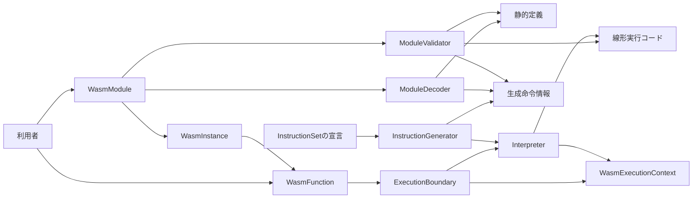
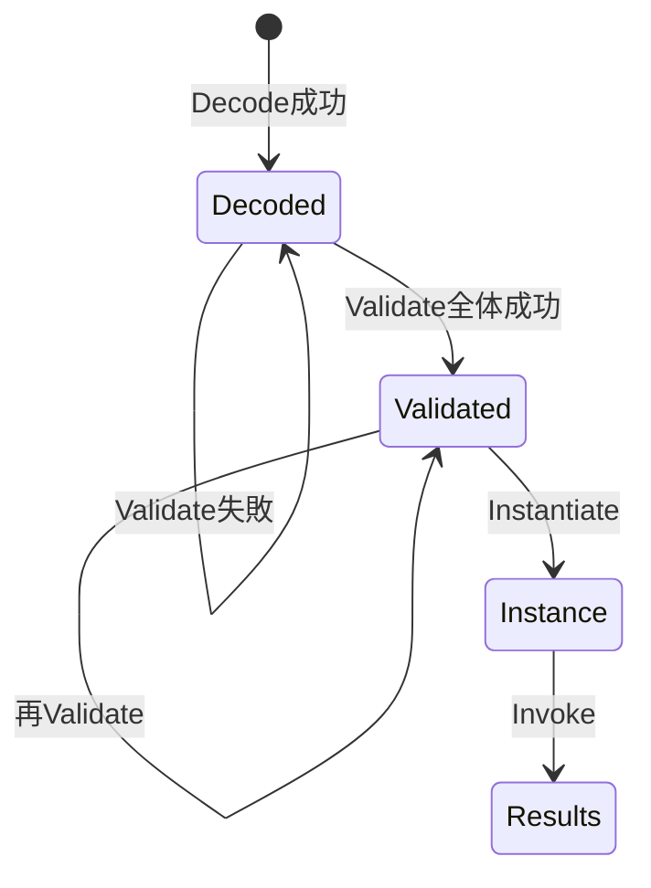
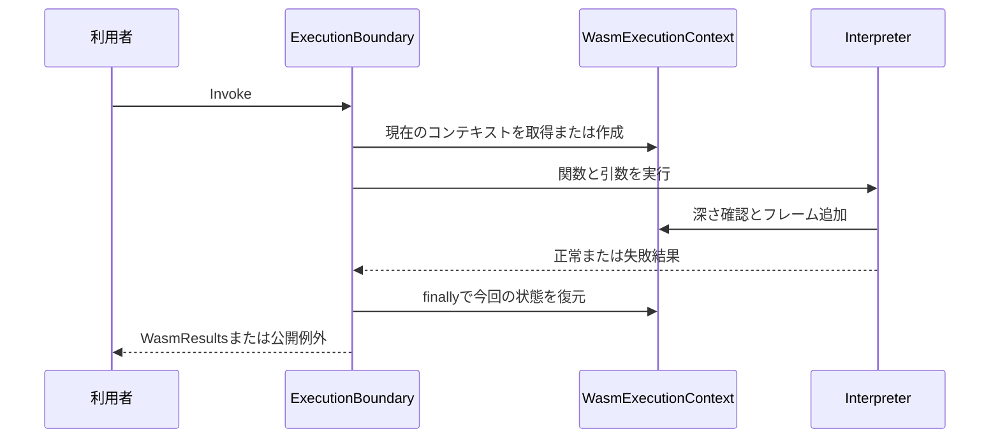

# 技術設計: wasm-runtime-foundation

## 概要

本仕様は、C#の利用者がWasmバイナリをDecode・Validate・Instantiate・Invokeの4段階で扱い、4種類のscalar定数返却を実行できる最小基盤を提供する。値のビット列、関数型、戻り値のコレクション、段階ごとの失敗を明示的に扱えることを価値とする。

現在の公開型の骨組みを完成させ、同じ`WasmModule`が静的定義と検証成功後の実行コードを所有する。検証と線形化を同一パスで行い、命令宣言から生成した単一switchループで実行する。実装対象は引数・localsなし、戻り値1個、scalar constとendだけの関数であり、Core 2.0全体の完成を意味しない。

### 目標

- 4種類の定数返却と小さな負例を公開操作で確認できる。
- 値・型・失敗・実行コンテキストの契約を、後続機能がそのまま利用できる。
- 部分的な検証成功、入力の後書き換え、未実装と仕様違反の混同を防ぐ。

### 非目標

引数/localsを用いる実行、複数戻り値の実行、数値演算、分岐、call、globals、メモリ、テーブル、ホスト連携、start、SIMD命令、公式素材の生成・全件集計は各後続仕様が所有する。WAT/WAST、WASI、Component Model、JIT/AOT、外部エンジンへの委譲、Core 2.0外の機能は追加しない。動作保証は単一スレッドの同期実行とする。

## 責務境界（Boundary Commitments）

### 本仕様が所有するもの（This Spec Owns）

- 4段階の公開契約、同じモジュール上の検証成功フラグと実行表現の所有。
- Core 2.0の7種類の値、関数型、戻り値のコレクション、および原因別の例外契約。
- boundedなバイナリ読み取り、sectionの枠組み、type/function/export/codeの構文と定数関数の検証・実行。
- 命令の唯一の定義元と通常ビルドでの生成、共通ホスト境界、実行コンテキスト・フレーム・分岐のスタック基準。

### 境界外（Out of Boundary）

| 所有する仕様 | 本基盤から引き継ぐもの | 本基盤で実装しないもの |
| --- | --- | --- |
| wasm-numeric-control | 命令表、検証/線形化、フレームと分岐基準、exhaustion | 完全な型/制御スタック、分岐解決、call、数値演算、globals |
| wasm-linear-memory / wasm-tables-references / wasm-simd | 値表現、添字規約、命令追加経路 | リソースの意味論、初期化、各命令 |
| wasm-host-linking | 空import経路、インスタンスの関数同一性、共通実行境界 | import照合、callback登録/結果の寿命、start、共有リソース |
| wasm-test-corpus / wasm-conformance-runner | 通常の公開操作と例外 | corpus固定、WABT実行、JSON/spectest、集計 |

後続で使う共通の内部契約を定めることと、後続の命令を実装することを分ける。テスト専用の公開操作は追加しない。

### 許可する依存（Allowed Dependencies）

- 仕様上の上流はCore 2.0保存版、ロードマップ、CONTEXT.md、ADR 0001〜0008。基盤の完了は他specの実装完了に依存しない。
- ランタイムは.NET 10 BCLを使う。生成器はビルド時だけRoslynに依存し、ランタイムの実行依存へ持ち込まない。
- 利用者→公開操作→デコード/検証または実行処理→値・命令情報という呼び出し方向とする。実行処理からDecode/Validateを呼ばない。生成器はランタイムのアセンブリを参照しない。
- モジュール、インスタンス、関数、値は同じランタイム内のドメインモデルである。関数参照が実体の同一性を保持する参照関係は、逆方向の段階実行や循環したプロジェクト参照を許す根拠にはしない。
- `thirdParties`、WABT、公式ランナー、外部プロセス、DIコンテナへの実行時依存を追加しない。

### 再検証の契機（Revalidation Triggers）

値/関数型/戻り値のコレクションの形、失敗型・reason・未確認範囲、検証成功の所有、opcode表と生成契約、pc/スタック基準、実行上限や同期コンテキストを変更した場合は全ランタイム下流を再検証する。公開操作と失敗分類の変更はconformance-runner、関数同一性とホスト境界の変更はhost-linkingへ通知する。SDK/Roslynの変更は通常ビルドでの生成、対象Core版の変更は否定入力の分類を再検証する。

特にnumeric-controlでは、`end`の文脈に応じた線形化と、バイナリopcodeから実行opcodeへの対応を見直す。分岐情報、br_tableのラベルの配列、メモリのmemargを追加する仕様では、DecodedInstruction/Instructionの即値表現と生成契約を変更する。現在の1属性行から1実行opcodeを生成する形やWasmValue単一の即値を、後続でも無変更で使える契約とはしない。単一定義元と単一実行ループの方針は維持する。

## アーキテクチャ

### 既存構成の分析

`src/WasmSharp`は.NET 10、`tests/WasmSharp.Tests`は.NET 10/TUnit 1.66.10で、テスト本体は存在しない。`WasmValue`の`low64_`・`high64_`・`reference_`をそのまま利用する。`WasmModule`と`WasmInstance`の日本語コメント、特に「Exportsは持たせない」を維持する。

ADR 0008に合わせ、骨組みの`WasmFunction.Invoke`からoptionsを除く。`WasmExecutionOptions`はInstantiateで渡し、インスタンスが保持する。`ExnRef`/`WasmTag`/`GetTag`等の対象外の骨組みは本仕様で削除・実装せず、Core 2.0で受理する値の種類には含めない。既存の`WasmHostCallback`もhost-linkingの設計対象として残す。

ExnRef等を残す理由は、本仕様の範囲外の既存公開型・メンバーの削除を同時に行わないためである。対応予定を保証するものではなく、公開契約を整理する変更で別途判断する。Core 2.0内のGetGlobal/GetMemory/GetTableについては、以下のインスタンス契約で名前不在時の動作を確定する。

steeringにはroadmap.mdのみがある。存在しないproduct.md・tech.md・structure.mdを補作せず、現行コードと承認済みADRを補完根拠とした。

### 構成と接点



段階ごとの処理は具体クラスにまとめ、交換予定のないinterfaceや委譲だけのサービスを追加しない。デコード結果と実行コードはモジュールの非公開データであり、別の検証済みモデルを作らない。生成はビルド時の経路である。

### 技術選択

| 対象 | 選択 | 用途・制約 |
| --- | --- | --- |
| ランタイム | net10.0 / nullable有効 | 既存を維持。確認したSDKは10.0.400 |
| 値と入力 | ImmutableArray、BinaryPrimitives、BitConverter、UTF8Encoding | 不変配列、little-endian、ビット保持、厳格な名前検査 |
| 命令生成 | netstandard2.0 / C# 13.0 / Microsoft.CodeAnalysis.CSharp 4.14.0 | IIncrementalGenerator、ビルド時Analyzer参照のみ |
| テスト | net10.0 / TUnit 1.66.10 | 既存プロジェクトを拡張。generatorテストも同じ版 |

Roslynは必要な既存APIを備えた固定版を選ぶ。最新版を必要条件にしない。生成器以外へ新しい外部パッケージを追加しない。[Roslyn公式資料](https://github.com/dotnet/roslyn/blob/main/docs/features/incremental-generators.cookbook.md)に従いC#宣言からソースを追加し、実行時reflectionや独自DSLを使わない。

生成器は利用側のランタイムではなくコンパイラのプロセスにロードされるため、[RS1041の公式規則](https://github.com/dotnet/roslyn-analyzers/blob/main/docs/rules/RS1041.md)に従ってnetstandard2.0とする。net10.0でも確認した.NET 10 SDKでは生成できたが、互換性の警告が残るため採用しない。生成器を利用するランタイムとテストはnet10.0を維持する。

## ファイル構成計画（File Structure Plan）

パスはリポジトリルートからの相対パス。公開型は現在の`WasmSharp`名前空間を維持し、新しい補助処理は扱う機能ごとに配置する。型は利用者向けの公開APIに必要なものだけpublicとし、Modules・Execution・Instructionsの内部型、命令情報と実行分岐の生成型、source generator本体はinternalとする。型内に閉じる補助型はprivateとする。命名はC#規則に従い、段階を迂回する構築・変更操作はinternal以下とする。

### 新規ファイル

| パス | 責務 |
| --- | --- |
| `src/WasmSharp/Modules/WasmBinaryReader.cs` | バイト境界、LEB、名前、固定幅即値の読み取り |
| `src/WasmSharp/Modules/ModuleDecoder.cs` | module/sectionと関数本体の構文解析 |
| `src/WasmSharp/Modules/ModuleValidator.cs` | 静的検証と同一パスの線形化 |
| `src/WasmSharp/Modules/DecodedFunction.cs` | 関数の型index、圧縮locals、入力命令の配列 |
| `src/WasmSharp/Modules/DecodedInstruction.cs` | opcode識別子、即値、元位置 |
| `src/WasmSharp/Modules/LocalDeclaration.cs` | localsの個数と型の組 |
| `src/WasmSharp/Modules/FunctionExport.cs` | export名、関数index、元位置 |
| `src/WasmSharp/Instructions/InstructionAttribute.cs` | 命令表のC#宣言形式 |
| `src/WasmSharp/Instructions/InstructionSet.cs` | Core 2.0 opcode割当と対応済み命令情報の唯一の定義元 |
| `src/WasmSharp/Instructions/OpcodeKey.cs` | prefixとu32命令番号の組 |
| `src/WasmSharp/Instructions/ImmediateKind.cs` | 即値の符号化の種類 |
| `src/WasmSharp/Instructions/StackEffectKind.cs` | 定数push、関数終端、未対応のスタック規則 |
| `src/WasmSharp/Instructions/ValidationRule.cs` | 命令検証規則の識別子 |
| `src/WasmSharp/Execution/Instruction.cs` | 線形命令、即値、元位置 |
| `src/WasmSharp/Execution/FunctionCode.cs` | 関数の不変実行コードと最大operand数 |
| `src/WasmSharp/Execution/Interpreter.cs` | 生成ループのpartial宣言と定数/終了handler |
| `src/WasmSharp/Execution/ExecutionFrame.cs` | 実行中関数、pc、値スタックの基準 |
| `src/WasmSharp/Execution/WasmExecutionContext.cs` | 現在の同期コンテキスト、フレーム/値スタック、共有深さ |
| `src/WasmSharp/Execution/ExecutionResult.cs` | 正常/trap/exhaustionと付加情報。ExecutionStatusも同居 |
| `src/WasmSharp/Execution/ExecutionBoundary.cs` | 公開呼び出しの入口、コンテキスト寿命、失敗の例外化 |
| `src/WasmSharp/Exceptions/WasmProcessingStage.cs` | Decode/Validate/Instantiate/Invokeの識別 |
| `src/WasmSharp/Exceptions/WasmFailureLocation.cs` | 段階・入力位置・関数/sectionの診断情報 |
| `src/WasmSharp/Exceptions/WasmUnverifiedRange.cs` | 未検査の段階と入力範囲 |
| `src/WasmSharp/Exceptions/WasmExhaustionException.cs` | 管理した実行上限の到達。WasmExhaustionReasonも同居 |
| `src/WasmSharp/Exceptions/WasmImplementationLimitException.cs` | 入力/コレクション保持上限。WasmImplementationLimitReasonも同居 |
| `src/WasmSharp/Exceptions/WasmTrapReason.cs` | Wasm仕様のtrap原因の識別 |
| `src/WasmSharp.Generators/WasmSharp.Generators.csproj` | ランタイム参照を持たない生成器のビルド定義 |
| `src/WasmSharp.Generators/InstructionGenerator.cs` | 属性抽出、検査、命令情報とループ生成。生成用の小さなデータ型は同居 |
| `src/WasmSharp.Generators/IsExternalInit.cs` | netstandard2.0でinit/recordを使うための内部ポリフィル |
| `tests/WasmSharp.Tests/Fixtures/ConstantModuleBinary.cs` | 最小バイナリと負例の生成。WATは解析しない |
| `tests/WasmSharp.Tests/Fixtures/ChunkedReadStream.cs` | short readと非seek入力の試験 |
| `tests/WasmSharp.Tests/WasmModule_DecodeTests.cs` | バイナリ境界と未対応分類 |
| `tests/WasmSharp.Tests/WasmModule_ValidateTests.cs` | 型、名前、検証成功状態 |
| `tests/WasmSharp.Tests/WasmModule_InstantiateTests.cs` | 検証前拒否、別インスタンス、実行ポリシー |
| `tests/WasmSharp.Tests/WasmInstance_GetFunctionTests.cs` | 名前解決と関数の同一性 |
| `tests/WasmSharp.Tests/WasmInstance_GetGlobalTests.cs`、`tests/WasmSharp.Tests/WasmInstance_GetMemoryTests.cs`、`tests/WasmSharp.Tests/WasmInstance_GetTableTests.cs` | 基盤インスタンスでの名前不在の分類 |
| `tests/WasmSharp.Tests/WasmFunction_InvokeTests.cs` | 4段階の定数返却と引数契約 |
| `tests/WasmSharp.Tests/WasmValueTests.cs` | 構築/取得メソッドごとのテストクラスを同居 |
| `tests/WasmSharp.Tests/WasmFunctionTypeTests.cs`、`tests/WasmSharp.Tests/WasmResultsTests.cs` | それぞれ構築/コレクション取得のメソッド別クラス |
| `tests/WasmSharp.Tests/Execution/WasmExecutionContextTests.cs` | 内部の入退出/深さ操作をメソッド別クラスで検証 |
| `tests/WasmSharp.Tests/Execution/ExecutionBoundary_ThrowIfFailedTests.cs` | 共通結果の例外変換 |
| `tests/WasmSharp.Tests/Execution/ExecutionResult_ValuesTests.cs` | defaultと正常/失敗時の戻り値コレクションの取得 |
| `tests/WasmSharp.Tests/Exceptions/WasmUnsupportedFeatureException_ConstructorTests.cs` | 既存コンストラクターでも未確認範囲を空のコレクションとして取得できること |
| `tests/WasmSharp.Generators.Tests/WasmSharp.Generators.Tests.csproj` | TUnitと生成器/Roslynのテスト参照 |
| `tests/WasmSharp.Generators.Tests/InstructionGenerator_InitializeTests.cs` | generator driverによる宣言更新・診断・生成ソース検証 |
| `tests/WasmSharp.Tests/README.md` | 基盤で実行した対象・コマンドと未対応/未検証範囲の記録 |

生成中間出力のルートは`src/WasmSharp/obj/<構成>/net10.0/generated/`とし、CompilerGeneratedFilesOutputPathに設定する。Roslynはその下へ生成器のアセンブリ名と型の完全名を付けるため、本設計の出力先は`generated/WasmSharp.Generators/WasmSharp.Generators.InstructionGenerator/InstructionSet.g.cs`と、同じディレクトリの`Interpreter.g.cs`になる。前者がInstructionDescriptorと実行opcode列挙も生成する。これらを手で作成・変更・Git管理しない。

### 既存ファイルの変更

| パス | 変更 |
| --- | --- |
| `src/WasmSharp/WasmModule.cs` | 静的定義と成功フラグの所有、4段階の接続 |
| `src/WasmSharp/WasmInstance.cs` | 関数実体、実行ポリシー、GetFunctionの実装とGetGlobal/GetMemory/GetTableの名前不在時の分類。既存コメントを保持 |
| `src/WasmSharp/WasmFunction.cs` | 実体と型、optionsなしのInvoke |
| `src/WasmSharp/WasmExecutionOptions.cs` | 正の上限と既定値1024の契約 |
| `src/WasmSharp/WasmValue.cs` | 既存格納領域による型付き構築/取得 |
| `src/WasmSharp/WasmFunctionType.cs`、`src/WasmSharp/WasmResults.cs` | 型と戻り値を保持する不変配列 |
| `src/WasmSharp/Exceptions/WasmException.cs` | 既存コンストラクターを保持し、任意のLocationを追加 |
| `src/WasmSharp/Exceptions/WasmDecodeException.cs`、`src/WasmSharp/Exceptions/WasmValidateException.cs` | ランタイムの発生位置を付ける構築経路 |
| `src/WasmSharp/Exceptions/WasmUnsupportedFeatureException.cs` | Featureと未確認範囲を追加 |
| `src/WasmSharp/Exceptions/WasmTrapException.cs` | trap reasonと発生位置を追加 |
| `src/WasmSharp/WasmSharp.csproj` | Analyzer参照、中間生成出力、内部契約テスト用InternalsVisibleTo |
| `WasmSharp2.slnx` | 生成器と生成器テストプロジェクトを追加 |

`WasmHostModule.cs`、`WasmValueKind.cs`、メモリ/テーブル/tag、他の既存例外は本仕様で変更を要求しない。既存テストcsprojの参照は足りており、必要のない設定変更を加えない。基盤の検証結果は`tests/WasmSharp.Tests/README.md`に対象・実行コマンド・未検証範囲を記録する。

## 処理フロー



`Validated`は別の公開型ではなく`WasmModule.isValidated_`の状態である。Instantiateは状態を消費せず、繰り返し別のインスタンスを作る。Validate途中の成果は失敗時に破棄する。



最外側だけが終了時に現在の参照を解除する。後続のstartも同じ境界にInstantiate段階を渡す。ホストが投げた.NET例外をcatchしてtrap結果へ変換する経路は設けない。

## 要件との対応

| 要件 | 概要 | 担当 | 契約 | フロー・検証 |
| --- | --- | --- | --- | --- |
| 1.1, 1.2, 1.3 | 明示4段階と静的定義 | WasmModule | Decode/Validate/Instantiate | 4段階の定数返却 |
| 1.4, 1.5, 1.6 | 状態、変更禁止、再検証省略 | WasmModule、ModuleValidator | 成功フラグと一括反映 | 状態遷移/入力変更/再Validate |
| 2.1, 2.2, 2.3 | scalar/vectorの型とビット | WasmValue | Kind、From/As | 全種類とビット境界 |
| 2.4, 2.9 | 参照種別と同一性 | WasmValue、WasmFunction | FuncRef/ExternRef | null、同じ参照、異なる参照 |
| 2.5, 2.8 | 型違い拒否と明示契約 | WasmValue、WasmFunction | 型付き操作 | 誤取得/公開シグネチャ |
| 2.6, 2.7 | 型と戻り値のコレクション | WasmFunctionType、WasmResults | ImmutableArray | 個数/順序/元配列の変更 |
| 3.1, 3.7 | bytes/Stream入力 | WasmModule、WasmBinaryReader | Decode | short read、非seek、読取不可 |
| 3.2, 3.3 | ヘッダー/長さ/LEB | WasmBinaryReader | bounded読み取り | 正負の符号化 |
| 3.4, 3.5, 3.6 | section/name | ModuleDecoder | 順序と件数、UTF-8 | custom/重複/名前破損 |
| 4.1, 4.2, 4.3 | 型と参照関係 | ModuleValidator | Validate | index、export名、戻り値のコレクション |
| 4.4, 4.5 | 未対応と部分失敗 | ModuleValidator、WasmModule | 成果一括反映 | 後半失敗とInstantiate拒否 |
| 5.1, 5.2, 5.3, 5.4 | 実体の生成と取得 | WasmModule、WasmInstance | Instantiate/GetFunction | 別実体/名前不在 |
| 5.5, 5.6, 5.7 | 定数の呼び出し | Interpreter、WasmFunction | Invoke | 4種類/引数不正/反復 |
| 5.8 | インスタンスの実行ポリシー | WasmInstance、WasmExecutionOptions | Instantiateのoptions | 保持と不正上限 |
| 5.9, 5.10, 5.11 | 共有深さと最外側の寿命 | WasmExecutionContext、ExecutionBoundary | 同期入退出 | 内部契約、後続のcall/start/host受入 |
| 6.1, 6.6 | 段階とtrap/link分類 | 例外群、ExecutionBoundary、WasmInstance | 型/Location/Reason | 共通変換、取得時の名前不在、後続の実機能 |
| 6.2, 6.3, 6.4, 6.5 | 未対応と検査の限界 | ModuleDecoder、ModuleValidator、InstructionSet | Feature/UnverifiedRanges | Core 2.0割当と違反の優先 |
| 6.7, 6.9 | 契約違反/上限/能力 | 例外群、WasmExecutionContext、WasmInstance | 標準例外と専用例外 | 名前不在、上限の到達と解除 |
| 6.8 | ホスト例外の同一性 | ExecutionBoundary | 非変換とfinally | 内部入退出、後続のhost受入 |
| 7.1, 7.2, 7.3 | 公開操作の受入証拠 | WasmSharp.Tests | 正負の小バイナリと結果記録 | 対象/未対応/未検証を明記 |

## 構成要素とインターフェース

| 担当 | 責務 | 要件 | 主な依存 | 契約 |
| --- | --- | --- | --- | --- |
| WasmValue / WasmFunctionType / WasmResults | 値とコレクション | 2.1, 2.2, 2.3, 2.4, 2.5, 2.6, 2.7, 2.8, 2.9 | BCL P0 | 公開操作、不変状態 |
| WasmModule / ModuleDecoder / ModuleValidator | 定義と検証成功 | 1.1, 1.2, 1.3, 1.4, 1.5, 1.6, 3.1, 3.2, 3.3, 3.4, 3.5, 3.6, 3.7, 4.1, 4.2, 4.3, 4.4, 4.5 | WasmBinaryReader、InstructionSet P0 | 公開操作、状態 |
| InstructionSet / InstructionGenerator | 定義と生成の同期 | 4.1, 5.5, 6.2, 6.5 | Roslyn P0 | ビルド処理 |
| WasmInstance / WasmFunction | 実体と呼び出し | 5.1, 5.2, 5.3, 5.4, 5.5, 5.6, 5.7, 5.8, 6.1, 6.7 | WasmModule、ExecutionBoundary P0 | 公開操作、状態 |
| Interpreter / WasmExecutionContext / ExecutionBoundary | 実行と寿命 | 5.5, 5.9, 5.10, 5.11, 6.6, 6.7, 6.8, 6.9 | FunctionCode、例外群 P0 | 内部操作、状態 |

### 値・型・結果の契約

**入方向**: 利用者、デコード、実行処理（P0）。**出方向**: BCL、funcrefのWasmFunction実体（P0）。暗黙変換演算子、汎用object引数のInvoke、delegate推論を設けない。

| 型 | 公開メンバー |
| --- | --- |
| WasmValue | `WasmValueKind Kind { get; }` |
| WasmValue | `static WasmValue FromI32(int value)` / `int AsI32()` |
| WasmValue | `static WasmValue FromI64(long value)` / `long AsI64()` |
| WasmValue | `static WasmValue FromF32(float value)` / `float AsF32()` |
| WasmValue | `static WasmValue FromF32Bits(uint bits)` / `uint AsF32Bits()` |
| WasmValue | `static WasmValue FromF64(double value)` / `double AsF64()` |
| WasmValue | `static WasmValue FromF64Bits(ulong bits)` / `ulong AsF64Bits()` |
| WasmValue | `static WasmValue FromV128(ulong low64, ulong high64)` / `(ulong Low64, ulong High64) AsV128()` |
| WasmValue | `static WasmValue FromFuncRef(WasmFunction? value)` / `WasmFunction? AsFuncRef()` |
| WasmValue | `static WasmValue FromExternRef(object? value)` / `object? AsExternRef()` |
| WasmFunctionType | コンストラクター`(ReadOnlySpan<WasmValueKind> parameters, ReadOnlySpan<WasmValueKind> results)`、`ImmutableArray<WasmValueKind> Parameters/Results { get; }` |
| WasmResults | コンストラクター`(ReadOnlySpan<WasmValue> values)`、`ImmutableArray<WasmValue> Values { get; }` |

入力のコレクションは構築時にコピーする。型のコレクションの各要素はCore 2.0の7種類だけを受理し、未定義enum値と既存ExnRefは`ArgumentOutOfRangeException`とする。空のコレクションと複数結果を表現できることは、その関数の実行対応を保証しない。

WasmValueのコンストラクターは非公開とする。kindを確認した取得のみ許し、誤取得は`InvalidOperationException`。既存enumのI32=0を維持するため`default(WasmValue)`はi32の0と定義する。整数は2の補数、floatはビット再解釈だけで格納し、演算やNaN正規化をしない。v128のlow64はバイト0〜7、high64は8〜15をlittle-endianで表す。参照の取得で内容をコピーせず、func/externのnullもKindで区別する。externref専用object操作は汎用変換の禁止の例外である。

### モジュールの公開契約と所有

**入方向**: 利用者（P0）。**出方向**: ModuleDecoder、ModuleValidator、WasmInstance（P0）。構築と内部データへのアクセスはinternal以下。

```csharp
public static WasmModule Decode(ReadOnlySpan<byte> bytes);
public static WasmModule Decode(Stream stream);
public WasmModule Validate();
public WasmInstance Instantiate(
    ReadOnlySpan<WasmHostModule> hostModules,
    WasmExecutionOptions? options = default
);
```

- Decodeは入力から独立した不変の型・関数・export定義を所有するモジュールを返す。バイト列やStreamの保持・後の再読み取りに依存しない。実行・インスタンス生成をしない。
- Streamは読み取り不可を`ArgumentException`とし、呼び出し元の現在位置からEOFまで同期で読む。seek/Lengthを要求せず、short readを扱い、Disposeしない。I/O例外は元のまま伝播する。
- `isValidated_`は初期false。Validateは一時領域で全関数の検証/線形化とexport名辞書を作り、全成功時のみフィールドへ反映して最後にtrueにする。失敗時のモジュールは未検証のまま。同じ入力を再Validateできるが、失敗成果を再利用しない。
- 成功済みValidateは直ちにthisを返し、再検証/再生成しない。定義・関数コード・名前辞書を外部へ変更可能な形で渡さない。
- Instantiateはfalseなら`InvalidOperationException`。成功済みなら関数index順に別インスタンスの関数実体を作る。importは存在しないため空hostModulesで成立する。余分なhostModulesは参照せず、ホストの実行やリンク照合を追加しない。

### デコードと検証の分担

**ModuleDecoderの内部操作**: `WasmModule Decode(ReadOnlySpan<byte> bytes)`。**ModuleValidatorの内部操作**: モジュール所有の不変な型・関数・exportを受け取り、`ImmutableArray<FunctionCode>`を返す。モジュールへの途中書き込みは行わない。

| 入力要素 | Decodeの責務 | Validateの責務 |
| --- | --- | --- |
| header | magic `00 61 73 6D`とversion `01 00 00 00` | なし |
| section | ID、u32長、境界、重複、順序 | 対応済み内容の整合 |
| type | `0x60`とCore 2.0 valtypeによる引数/結果vec | 関数からの型index参照 |
| function/code | 型index、件数一致、body長、locals vec、const即値、end | indexの存在、型スタック、最小実行形 |
| export | UTF-8名、external kind、index。kind 0の関数を対応 | 名の一意性、関数indexの存在 |
| custom | UTF-8名を含む形式と長さ。残る任意bytesを読み飛ばす | 実行内容へ影響しない |

WasmBinaryReaderは位置と終了位置を持つ`ref struct`とし、section/bodyごとの限定範囲を読む。`ReadByte`、`ReadU32`、`ReadS32`、`ReadS64`、`ReadName`、固定幅bits、長さ指定の部分範囲を提供する。長さは残量との比較後に扱い、加算のoverflowで境界確認を迂回させない。

u32/s32は最大5バイト、s64は10バイト。最終バイトの未使用ビットと終端bitを確認する。u32の第5バイトは0x00〜0x0F、s32は0x00〜0x07または0x78〜0x7F、s64の第10バイトは0x00または0x7Fである。合法な非最短LEBを受理する。floatはlittle-endianの4/8バイトをそのままbitsで取得する。名前は`UTF8Encoding(false, true)`で検査し、そのデコード失敗を位置付きWasmDecodeExceptionにする。

非custom sectionの許可順序は`1,2,3,4,5,6,7,8,9,12,10,11`。customは順位に含めない。ID 13以上は破損。対応外sectionでも、読めたID・長さ・順序・重複の違反は先に通知する。それ以上の内容はunsupportedとして中断し、後続sectionまで検査したとは扱わない。

localsは個数/型の圧縮宣言を読み、各u32個数をulongに累算し、加算のたびに合計が2^32以上ならDecode失敗とする。直前の合計は2^32未満なので、この累算自体もoverflowしない。引数/locals/結果が最小形の範囲外でも、対応済み構文の解析を途中で打ち切らない。平坦な本体でのelse、end欠落、end後のbody余剰は構文違反である。

Validateは最初に全型index・関数indexとexport名を確認する。その後各関数で命令を1度走査し、型スタックと線形コードを同時に作る。constを0個/複数含む場合も、end時にスタック上の値の型・個数・順序を、宣言された戻り値型のコレクションと先に比較し、不一致ならWasmValidateExceptionとする。一致した本体に対して、引数0・locals総数0・結果1・const1の実行形を確認し、範囲外ならWasmUnsupportedFeatureExceptionとする。定義関数が0個のモジュールも、対応した構文と検証規則を満たす限り個数だけで拒否しない。

### 命令の正本と生成契約

**入方向**: Decoder/Validator/Interpreter（P0）。**外部**: Roslynのビルドホスト（P0）。意味論は本体の定数と終端だけを実装する。

`InstructionSet.cs`のpartialクラスに複数の`InstructionAttribute`を付け、各行を命令表として扱う。属性の情報は以下で固定する。handler参照は`nameof`を用い、生成器は対応するstaticメソッドの存在と引数/戻り値を検査する。

| フィールド | 型・意味 |
| --- | --- |
| Prefix / Code | byte / uint。通常命令はPrefix=0と1バイトopcode、拡張命令はPrefix=0xFC/0xFDとsubopcode |
| Name | string。仕様上の命令名 |
| Immediate | ImmediateKind。None/I32/I64/F32Bits/F64Bits/Unsupported。I32はReadS32によるs32 LEB、I64はReadS64によるs64 LEB。index用のu32とは区別する |
| StackEffect | StackEffectKind。PushI32/PushI64/PushF32/PushF64/FunctionEnd/Unsupported |
| Validation | ValidationRule。Constant/FunctionEnd/Unsupported |
| ExecutionHandler | string?。対応済み行はnameofによるhandler、未対応行はnull |

| opcode | 名前 | 即値 | スタック効果 | 検証 | 実行handler |
| --- | --- | --- | --- | --- | --- |
| 0x41 | i32.const | I32 | PushI32 | Constant | PushConstant |
| 0x42 | i64.const | I64 | PushI64 | Constant | PushConstant |
| 0x43 | f32.const | F32Bits | PushF32 | Constant | PushConstant |
| 0x44 | f64.const | F64Bits | PushF64 | Constant | PushConstant |
| 0x0B | end | None | FunctionEnd | FunctionEnd | Return |

このend行は、制御構文のない基盤で受理する関数終端に限った実装である。endそのものが常に関数returnを意味するわけではない。numeric-controlでは制御スタックに従い、関数終端ではReturnへ、block/loop/if終端ではラベル解決や必要な制御処理へ線形化する。単なるblock終端で実行命令を出さない場合もあるため、その仕様で入力opcodeと実行opcodeの対応・属性/生成方式を変更する。複合即値も該当仕様で型付き表現へ拡張し、WasmValueやobjectへ無理に詰め込まない。

同じ表に、保存版で割り当てられた残りのCore 2.0 opcodeの番号・名前だけを未対応行として登録する。未対応行用コンストラクターはPrefix/Code/Nameだけを受け、残りはUnsupported/nullとする。各未対応命令の即値・型規則やhandlerを先行実装しない。割当分類の別の手管理一覧を作らない。

Decoderは通常opcodeまたはprefix後のu32を読んで表を引く。未割当ならDecode失敗、未対応行ならFeature/Location/UnverifiedRanges付きで中断する。FCは0〜17、FDは欠番を含む厳密な保存版の集合であり、範囲による一括受理をしない。文法上置けないelseのような既に確定した構文違反は未対応分類より優先する。

**ビルド契約**:

- 生成器は`TargetFramework=netstandard2.0`、`LangVersion=13.0`、`Nullable=enable`、`EnforceExtendedAnalyzerRules=true`とする。既定のC# 7.3ではnullableを有効化できないため言語版を明示する。環境によって変わる`latest`を使わず、RS1041・RS1036の抑止や警告0の完了条件の緩和は行わない。
- 言語版を上げてもnetstandard2.0のBCLにない型は補われない。`init`/`record`が要求する`System.Runtime.CompilerServices.IsExternalInit`を`internal static class`のポリフィルとして生成器プロジェクトへ置き、生成用データ型でrecordを使えるようにする。公開せず、ランタイム側のnet10.0には追加しない。`required`や`Index`/`Range`など他のランタイム依存機能は、必要になった時点で同じ方針で判断する。
- `InstructionGenerator : IIncrementalGenerator`をAnalyzerとしてProjectReferenceする（OutputItemType=Analyzer、ReferenceOutputAssembly=false）。Roslyn PackageReferenceはPrivateAssets=allとする。
- `ForAttributeWithMetadataName`で表を抽出し、軽量の生成用データへ変換する。コンパイル対象をロード・実行しない。
- `InstructionSet.g.cs`はlookup情報と対応済み実行opcodeを生成する。`Interpreter.g.cs`は単一のwhile/switch本体を生成し、caseからhandlerを直接呼ぶ。Decode/Validateに必要な即値/規則の分類も同じdescriptorから読む。
- handler共通シグネチャは`ExecutionResult Handler(WasmExecutionContext context, in Instruction instruction)`。`PushConstant`は即値を積み、`Return`は結果を保持して現在のフレームを取り除く。正常な命令処理は空の戻り値コレクションを持つSuccessを返す。Runは今回の入口より後のフレームが残る間だけループし、入口フレームの終了後に関数全体の戻り値コレクションを取り出す。
- handlerのTrap/ExhaustionはReason、関数index、byte offsetと、上限到達ならLimitを含む同じExecutionResultで伝える。Runは失敗結果を変更せず直ちに返す。例外へ変換するまでに原因を失うstatusだけの経路や、コンテキストに別の可変失敗スロットを設けない。
- opcode重複、不完全な対応済み行、handler不在/シグネチャ不一致をビルドエラーにする。生成が欠けたとき手書きの代替switchを使わない。
- `EmitCompilerGeneratedFiles`とobj配下の出力先を設定する。通常のdotnet buildで生成し、生成物をソースglobへ再追加しない。生成コマンドの手動実行を要求しない。

### インスタンスと関数

**入方向**: WasmModule、利用者（P0）。**出方向**: 静的な関数情報、ExecutionBoundary（P0）。

| 型 | 公開契約 |
| --- | --- |
| WasmInstance | `WasmExecutionOptions ExecutionOptions { get; }`、`WasmFunction GetFunction(string name)`、既存の`WasmValue GetGlobal(string name)` / `WasmMemory GetMemory(string name)` / `WasmTable GetTable(string name)` |
| WasmFunction | `WasmFunctionType Type { get; }`、`WasmResults Invoke(ReadOnlySpan<WasmValue> arguments)` |
| WasmExecutionOptions | `WasmExecutionOptions(int maxCallDepth)`、get-onlyの`int MaxCallDepth`、`static WasmExecutionOptions Default { get; }` |

MaxCallDepthは1以上、Defaultは1024。options省略時はDefaultを用いる。不正値はArgumentOutOfRangeException。インスタンスに渡した後も変更できないrecordとし、withによる不正値への変更を許すinit setterを公開しない。1024は設定の既定値であり、任意のホストコードのCLRスタック安全性の保証ではない。

モジュールは検証時に作ったordinal比較のexport名→関数index辞書を非公開で保持し、インスタンスはindex→WasmFunction配列を保持する。GetFunctionは名前の不在をArgumentExceptionとする。同じ関数を指す複数export名や繰り返し取得は同じWasmFunction実体を返す。別インスタンスの定義関数は別実体である。公開Exportsコレクションを追加しない。

GetGlobal/GetMemory/GetTableも指定した種類のexport名が存在しなければArgumentExceptionとする。本基盤のDecode/Validateを通過して生成されるインスタンスはこれらのexportを持たないため、名前不在として拒否する。同名の関数exportがあっても種類が違うので同じ扱いである。生のNotImplementedExceptionを残さず、リソース定義を含む入力に対するunsupportedはデコード/検証段階で通知する。リソースの取得成功経路は各後続仕様が追加する。

2026-09-07のユーザー指示により、非nullableな参照型引数には明示的なnullチェックを追加しない。DecodeのStreamとGetFunction/GetGlobal/GetMemory/GetTableの名前を含め、null入力時の例外の種類は本仕様の検証対象にしない。

Invokeは引数個数と型を実行前に検査し、不一致はArgumentException。本基盤の対象関数は空引数だけを受理する。結果は呼び出しの作業スタックから独立したWasmResultsへコピーし、次のInvokeで変わらない。

### 実行表現と同期コンテキスト

**入方向**: WasmFunction、後続のstart（P0）。**出方向**: 不変FunctionCode、WasmValue、例外群（P0）。内部処理はサービスinterfaceを追加せず、次の操作を持つ具体型とする。

| 操作 | 内部契約 |
| --- | --- |
| `ExecutionBoundary.Invoke(WasmFunction function, ReadOnlySpan<WasmValue> arguments, WasmProcessingStage stage)` | WasmResultsを返す。共通の入退出と結果例外化を所有 |
| `ExecutionBoundary.ThrowIfFailed(ExecutionResult result, WasmProcessingStage stage)` | 正常なら戻る。失敗の元位置にstageを付けてWasmFailureLocationを作り、trap/exhaustionの公開例外化を行う唯一の場所 |
| `WasmExecutionContext.Enter(WasmExecutionOptions options, out bool isOutermost)` | 現在のコンテキストを返す。nullならoptionsの上限を固定して作る |
| `WasmExecutionContext.TryEnterCall()` / `ExitCall()` | 上限以内なら深さを増やすbool操作と、対応する減算 |
| `WasmExecutionContext.Exit(bool isOutermost)` | 最外側なら現在の参照を解除する。内側は解除しない |
| `Interpreter.Run(WasmExecutionContext context, WasmFunction function, ReadOnlySpan<WasmValue> arguments, WasmProcessingStage stage)` | ExecutionResultを返す。今回追加したフレーム/値/深さを終了時に戻す。stageは入口の実装上限の診断に用いる |

現在のコンテキストは`[ThreadStatic] private static WasmExecutionContext? current_;`とし、初期化式を付けない。深さは同時に入っているWasmFunctionの数で、最外側関数を1と数える。入る直前の深さが上限なら増やさずExhaustionを返す。通常のguest→guest呼び出しは後続でフレーム追加として実装し、CLR再帰を使わない。

コンテキストを開いたインスタンスのMaxCallDepthは、正常/trap/例外で終わるまで変更しない。A=100の深さ50からB=10へ入ると51/100、B単独なら1/10となる。同じスレッドのホスト再入も同じコンテキストで数える。別スレッドや非同期へ伝播しない。

Interpreter.Runは呼び出し前のフレーム数、値スタック位置、深さを記録し、finallyでその位置に戻す。内側のRunは外側のフレームを実行/破棄せず、今回の入口フレームが完了したところで戻る。正常結果は復元前に取り出す。ExecutionBoundaryもfinallyでExitを呼ぶため、途中例外でも現在の参照が残らない。ホスト例外のcatch/ラップは追加しない。

**スタックの容量**: コンテキスト作成時の値/フレーム配列は空とし、最初の関数入口で必要数を確保する。値領域の必要数は`OperandBase + FunctionCode.MaxOperandStack`、フレームは現在数+1とする。ネスト時は既存の使用領域を保ち、空きが不足した配列だけを必要数と現在容量の2倍の大きい方まで拡張する。計算はulongで行い、Array.MaxLengthを超える倍増分は抑える。必要数自体を保持できない場合は、Runが入口でWasmImplementationLimitExceptionのCollectionSizeを投げ、ExecutionBoundaryから受け取ったstageと対象関数のindex/本体位置でLocationを設定する。これは仕様上のtrapではなく、失敗結果へ変換したりホスト例外を捕捉して加工したりしない。深さ制限は別にTryEnterCallで先に確認する。命令ごとの配列確保は行わず、退出時は除いた使用領域の参照をクリアする。ネストや容量変更を越えて配列へのref/Spanを保持せず、indexから取り直す。

この失敗の伝達方式は発生場所に依存しない。後続のcall handler内でも、容量の実装上限はLocation付きWasmImplementationLimitExceptionで伝播し、ExecutionResultには載せない。Wasm仕様のtrapと管理した実行資源の上限到達は引き続きExecutionResultで返す。call handlerへ現在のstageと関数位置を渡す内部契約、および例外時のフレーム/深さの復元はnumeric-controlで具体化する。

**後続と共有するスタック基準**:

- pcは関数ごとのInstruction配列の0始まりindex。入力のbyte offsetとは区別する。
- ExecutionFrameのStackBaseは、その関数の引数が置かれる最初の値位置。OperandBaseは`StackBase + 引数数 + locals数`。本基盤は両数が0なので両基準は一致する。
- 分岐の`stackHeight`はOperandBaseからの相対的なoperand数。`keepCount`個の先頭順を保った末尾値を`OperandBase + stackHeight`へ移し、その後ろを除く。`targetPc`は同じ関数内の命令index。
- block/ifのラベルは結果数、loopのラベルは引数数をkeepCountとする。前方のtargetPc解決、制御スタック、分岐情報の具体型はnumeric-controlが実装する。
- 関数終了は結果数分をStackBaseへ保持して引数/locals/一時値を除き、呼び出し元の次pcへ戻す。最外側またはネストした公開Invokeの入口が終了したら、その結果を呼び出し元の.NET側へ返す。
- 本基盤でWasmValueの可変スタックとExecutionFrameの明示スタックを用意するが、分岐/callの未使用handlerや制御フレームは作らない。

## データモデル

### 所有と不変条件

| 所有者 | データ | 不変条件 |
| --- | --- | --- |
| WasmModule | ImmutableArrayの型/DecodedFunction/FunctionExport、入力長 | 入力から独立し、公開setterを持たない |
| WasmModule | isValidated_、ImmutableArrayのFunctionCode、名前辞書 | 全成功時のみ設定。falseの状態で実行コードを使わない |
| DecodedFunction | uint TypeIndex、long BodyOffset、ImmutableArrayのLocalDeclaration/DecodedInstruction | 型indexはDecodeでは未検証。localsを巨大配列へ先に展開しない |
| DecodedInstruction | OpcodeKey、WasmValue Immediate、long ByteOffset | Immediateの解釈はdescriptorが決める。endのImmediateは参照しない |
| FunctionCode | ImmutableArrayのInstruction、int MaxOperandStack | internal sealed class。型検証と同じパスで完成した非defaultの配列からプライマリコンストラクターで構築し、get-onlyで保持する。モジュールに属する |
| Instruction | 生成された実行opcode、WasmValue Immediate、long ByteOffset | 実行可能な命令だけを含む |
| WasmInstance | モジュール参照、関数配列、ExecutionOptions | 同じ定義から作る別インスタンスで関数実体を共有しない |
| WasmFunction | 所有WasmInstance、uint関数index | 型・FunctionCode・入口位置を所有モジュールの同じindexから取得する |
| ExecutionFrame | WasmFunction Function、int Pc/StackBase/OperandBase | 現在の関数とその値領域の基準 |
| WasmExecutionContext | 固定上限、深さ、ExecutionFrame[]とWasmValue[]および使用数 | 同期呼び出し連鎖だけが使用し、終了時に復元/解除 |

型/関数indexはバイナリ上のu32をuintで保持し、存在と.NET配列で保持できる範囲を確認してからintへ変換する。本基盤ではimport数0のため関数indexと定義位置が一致する。後続では関数/メモリ/テーブル/globalを別々の添字空間とし、それぞれimportが定義に先行する。将来用の空リソース配列は追加しない。

元位置は命令とexport等の診断に必要な定義にbyte offsetとして保持する。入力StreamでもDecode開始位置を0とした相対位置とする。完全なWasmスタックトレースや専用pc対応表は追加しない。WasmFailureLocationは`Stage`、任意の`ByteOffset`、`FunctionIndex`、`SectionId`を持つ不変recordとする。

### 実行結果

ExecutionResultは次のget-only情報を持つreadonly structとする。`ExecutionStatus`はSuccess/Trap/Exhaustionの列挙型で、Successはその操作の正常終了を示す。命令単位のSuccessと関数実行全体のSuccessは、同じ型でそれぞれ空の戻り値コレクション/関数全体の戻り値コレクションを返す。

| 情報 | 型と不変条件 |
| --- | --- |
| Status | ExecutionStatus |
| Values | ImmutableArray<WasmValue>。getterで未初期化の格納値をEmptyへ正規化し、失敗時とdefaultの結果は空のコレクション |
| TrapReason | WasmTrapReason?。Trapのときだけ必須 |
| ExhaustionReason | WasmExhaustionReason?。Exhaustionのときだけ必須 |
| Limit | int?。CallDepthLimitのとき適用した正の上限 |
| FunctionIndex | uint?。失敗時の関数index |
| ByteOffset | long?。失敗時の命令位置、入口での失敗なら関数本体の先頭位置 |

非公開コンストラクターと`Success(values)`、`Trap(reason, functionIndex, byteOffset)`、`Exhaustion(reason, limit, functionIndex, byteOffset)`の構築操作で組み合わせを限定する。命令handlerはcontextの現在の関数とinstructionの元位置を使い、関数入口での深さ超過はその入口の位置とコンテキストの上限を使う。内部結果の位置は入力上の情報とし、公開操作のStageはThrowIfFailedで付ける。Success=0とし、default値も空の結果を持つSuccessとして扱う。WasmTrapReasonとWasmExhaustionReasonを別enumとし、内部trapを.NET例外で表現しない。

`default(ImmutableArray<T>)`自体は空配列ではない。ExecutionResultのValuesは非公開の`values_`を使い、getterを`values_.IsDefault ? ImmutableArray<WasmValue>.Empty : values_`とする。この正規化により、default(ExecutionResult)でもValues.IsDefaultはfalse、Lengthは0で、列挙可能になる。default構築ではコンストラクターを通らないため、コンストラクター内の初期化だけに依存しない。

**コストの選択**: 各命令が診断用の任意情報と戻り値のコレクションを含むstructを返すため、statusだけを返す場合より値の受け渡し量が増え、頻繁な実行経路でコピーが残る可能性がある。正確なサイズ・コピー回数・速度差はABI/JITに依存し、未測定である。失敗時だけコンテキストに詳細を書けば戻り値を小さくできるが、読み取り・初期化・再入時の所有を追加管理する必要がある。現時点では明示的な結果伝達を採用し、命令数が増えた段階で必要に応じて計測して見直す。ADR 0004の例外コスト回避を、方式全体の性能優位の保証とはしない。

WasmTrapReasonはUnreachable、IntegerDivideByZero、IntegerOverflow、InvalidConversionToInteger、MemoryOutOfBounds、TableOutOfBounds、IndirectCallTypeMismatch、UninitializedElementを共通の識別子として定める。これらを発生させる命令は後続の所有であり、本基盤では定数handlerから返さない。WasmExhaustionReasonはCallDepthLimitを持ち、後続の資源上限は原因ごとに追加する。

## エラー処理

### 分類と診断

| 原因 | 公開結果 | 診断と所有 |
| --- | --- | --- |
| 入力の構文違反 | WasmDecodeException | DecodeのLocation |
| 型/参照関係の違反 | WasmValidateException | ValidateのLocation |
| importの不在/型不一致 | WasmInstantiateException | 後続linkingが通知。trapを含めない |
| Wasm仕様のtrap | WasmTrapException | ReasonとInstantiate/InvokeのLocation |
| Core 2.0内の未実装 | WasmUnsupportedFeatureException | Feature、Location、UnverifiedRanges |
| 不正な引数/名前 | ArgumentException系 | 引数名。Wasmの失敗に変換しない |
| 未検証Instantiate/値の誤取得 | InvalidOperationException | 状態/型の契約違反 |
| 管理した深さ上限 | WasmExhaustionException | CallDepthLimit、適用Limit、Location |
| .NETでの入力/コレクションの保持上限 | WasmImplementationLimitException | InputSize/CollectionSize、Location |
| 実行環境の能力不足 | 既存WasmPlatformCapabilityException | 後続の能力を要する機能で使用 |
| Stream/ホストが投げた.NET例外 | 元の例外 | 型と実体を維持し、ラップしない |

新規の`WasmExhaustionException : WasmException`と`WasmImplementationLimitException : WasmException`は、どちらもWasmException直下とする。Invoke以外でも起こり得る資源/実装上限を表すため、WasmInvokeExceptionやWasmTrapExceptionからは派生させない。利用者は各具体型で原因を捕捉し、WasmExceptionでランタイム固有の失敗をまとめて捕捉できる。

既存例外のコンストラクターとコメントは保持し、ランタイムが必要な情報を渡す追加の構築経路を設ける。WasmException.Locationは従来コンストラクターではnullを許すが、今回実装するランタイムの段階失敗では設定する。UnsupportedのFeatureは安定した機能名（例: `i32.add`、`section.import`、`function.parameters`）を用い、メッセージの解析を要求しない。既存WasmInvokeExceptionを汎用のcatch-allとして使わない。

WasmInvokeExceptionをランタイムから新しく投げる用途は本仕様には設けない。既存の公開型を削除する変更を今回の基盤設計に含めないため保持するのであり、将来用の新規抽象化として採用するものではない。

WasmUnverifiedRangeは`Stage`、`long StartOffset`、`long EndOffset`（排他的）、`string Description`の不変recordとする。UnverifiedRangesはget-onlyのImmutableArrayとし、プロパティ初期値をEmptyにする。既存3コンストラクターを含む全構築経路で非defaultを維持し、追加のコンストラクターへ渡されたdefaultの配列もEmptyへ正規化する。従来コンストラクターの空のコレクションは「診断情報が渡されていない」という意味で、検査済みの証明ではない。Decodeの未対応では、その構文を検査できなかった先頭から入力末尾までのDecode範囲と、入力全体のValidate未実施を示す範囲を持たせる。Validateの未対応では、当該関数以降の未完了検証範囲を持たせる。検査できなかったのは構文か意味論かをStageで区別する。

### 違反と未実装の優先順位

1. 各処理で既に確定した構文/型違反は、その段階の例外を直ちに返す。
2. Core 2.0に割当のない値型、external kind、section/opcodeは、その位置の構文違反とする。新しい仕様版での合法性を持ち込まない。
3. 割当済みだが処理できない構文に達したらunsupportedで中断し、残りを確認済みとしない。未対応命令の即値や後続を検査するためだけに意味論を追加しない。
4. 最小の実行形への対応可否は、対応済み命令の型違反の判定後に扱う。例えば2 constに結果1を宣言した本体はValidate失敗である。

入力長やvec件数から先に巨大配列を確保しない。仕様上の不正を確定できる場合はDecode/Validateへ分類し、合法な大きさを内部int/配列で保持できない場合だけImplementationLimitとする。予期しないOutOfMemoryException等を一括catchしてWasmTrapExceptionやunsupportedへ変えない。ログ基盤やtelemetryは追加せず、公開例外の型と診断を利用者へ返す。

## テスト戦略

### 値と内部の共通契約

- WasmValueの型付き構築/取得で整数境界、正負0、正負無限大、複数NaN payload、任意のv128上下64bitを確認する。func/externのtyped null、参照の同一性、誤取得も扱う（2.1, 2.2, 2.3, 2.4, 2.5, 2.9）。
- WasmFunctionType/WasmResultsで空のコレクション、複数要素の順序、構築元配列の後変更を確認する。型のコレクションのExnRef/未定義enumを拒否する（2.6, 2.7, 2.8）。
- ExecutionResultのdefault/空の正常結果/失敗と、WasmUnsupportedFeatureExceptionの既存コンストラクターで、取得する配列がIsDefault=false、Length=0、列挙可能であることを確認する。非空の戻り値のコレクションと未確認範囲の保持も確認する（2.7, 6.3）。
- WasmExecutionContextの内部入退出を同じ同期区間内で扱い、上限1の2段目拒否、A=100/B=10の共有、内側退出後の外側維持、例外時のfinally、次の独立コンテキストを確認する。深さ・参照同一性・現在の参照などの観測値をその場でローカル変数へ退避し、finallyで解除した後にTUnitのawait付きassertionを実行する。退避するのは後で変わるコンテキストの参照だけではなく、その時点の深さや同一性の判定結果である。容量拡張が既存フレーム/値を保持することも内部契約で確認する（5.8, 5.9, 5.10, 5.11, 6.9）。
- ExecutionBoundary.ThrowIfFailedでtrapとexhaustionが異なる公開型になり、Instantiate段階のtrapがWasmInstantiateExceptionにならないことを確認する。ホスト例外の実際のcallback経路は後続に残す（6.1, 6.6, 6.7, 6.8）。

### 公開操作によるデコード・検証

- 両Decode入力で同じバイナリを処理し、短い読み取り、非seek、入力バッファの後変更、Streamを閉じないこと、読取不可とI/O例外を区別する（1.2, 1.5, 3.1, 3.7）。
- header、途中終了、長さの過不足、LEB最大幅と未使用bit、合法な非最短表現、customの配置/重複/内容、section順序/重複/ID、function/code件数、厳格なUTF-8を小バイナリで確認する。locals宣言のu32個数を加えた結果がちょうど2^32になる負例も含め、巡回して受理されないことを確認する（3.2, 3.3, 3.4, 3.5, 3.6）。
- 型/関数index不在、export名重複、結果型/個数不一致、平坦else、end欠落/余剰をDecode/Validateの該当型へ分類する（4.1, 4.2, 4.3, 6.4）。
- Core 2.0の既知未対応命令、未対応section、未知opcode、FC/FDの不正LEB・欠番・範囲外を区別する。constだけの有効な複数結果形はValidateでunsupported、結果数不一致はinvalid。未確認のStage/範囲も検証する（4.4, 6.2, 6.3, 6.4, 6.5）。
- 複数関数の後半でValidateが失敗した後にInstantiateを拒否する。成功時/再成功時のValidateが同じ参照を返すこと、未検証Instantiateの拒否を公開操作で確認し、非公開フラグのreflection検査をしない（1.3, 1.4, 1.6, 4.5）。

### 4段階の受入経路

- i32/i64/f32/f64の4種類を、小バイナリ→Decode→Validate→空hostModulesでInstantiate→GetFunction→空引数でInvokeの順に実行し、結果1個と正確なbitsを確認する（1.1, 5.1, 5.5, 7.1）。
- 異なる定数を返す複数関数、複数exportの同一関数、同じmoduleの別インスタンス、同じ関数の反復呼び出しと先行結果の保持を確認する（5.2, 5.3, 5.7）。
- export不在と空でない引数はArgumentException系、段階を飛ばす利用はInvalidOperationException、正負バイナリは対応する段階例外であることを確認する（5.4, 5.6, 7.2）。
- 同じ基盤インスタンスへGetGlobal/GetMemory/GetTableを呼び、名前不在（同名の関数exportを含む）がArgumentException系となり、NotImplementedExceptionが漏れないことを確認する（6.1, 6.7, 7.2）。

### 生成と検証の順序

生成器のテストは、最小の宣言からlookupとコンパイル可能なswitchが生成されること、表の変更が両者に反映されること、重複opcode/handler不整合が診断になることに絞る。生成文字列全体の巨大snapshotを正本にしない。ランタイムの4段階テストが実際に生成ループを通ることを統合確認とする。

実装時は`dotnet build WasmSharp2.slnx -c Release`で警告・エラー0を確認してから、`dotnet run --project tests/WasmSharp.Tests/WasmSharp.Tests.csproj -c Release --no-build`と`dotnet run --project tests/WasmSharp.Generators.Tests/WasmSharp.Generators.Tests.csproj -c Release --no-build`を実行する。focused実行にはTUnitの`--treenode-filter`を使う。テストクラスは対象型/メソッド別、メソッド名は日本語、AAA、TUnitのawait付きassertionとする。

2026-09-06のユーザー承認により、既存の`WasmValue`の`low64_`・`kind_`のCS0169はタスク2.1、`high64_`・`reference_`のCS0169はタスク2.2で解消する。それまではこの既存警告4件だけをタスク完了・テスト実行前の警告0判定から除外する。CS0169の警告抑止は追加せず、生成器の警告0条件と基盤全体の最終検証での警告・エラー0は維持する。

この設計生成ではコード/テストを実装・実行したとは扱わない。実装完了時の記録では、公開定数経路、負例、内部契約を分けて示し、call/start/host/trap命令/SIMD/公式全件は未対応または未検証と明記する（7.3）。性能ベンチマーク、並行実行保証、公式corpus固定は本仕様の完了条件に加えない。

## 実装順序と引き継ぎ

値/例外と命令生成の契約を先に固め、デコーダー、検証/線形化、インスタンス/実行、公開受入の順に統合する。生成器と値の作業は別ファイルで並行できる。InstructionSet、ModuleValidator、Interpreter、WasmModuleは所有者を決め、同じファイルの並行編集を避ける。

既存の公開メソッドは未実装のため、永続データ移行や稼働環境切替はない。Invokeのoptions削除と例外診断の追加は後続仕様へ明示する。source generatorの通常ビルド動作を先に確認し、後続の実行タスクの隠れた前提にしない。

## 参照

- [要件](requirements.md)、[調査と設計判断](research.md)、[ロードマップ](../../steering/roadmap.md)
- [Core 2.0保存版](https://webassembly.github.io/spec/versions/core/WebAssembly-2.0.pdf): 値と型§2.3/4.2.1、定数§4.4.1、符号化§5.2、命令§5.4、module§5.5、検証§3.4。
- [ADR 0002](../../../docs/adr/0002-single-pass-linear-interpreter.md)、[0004](../../../docs/adr/0004-trap-result-propagation.md)、[0005](../../../docs/adr/0005-module-owned-validation-state.md)、[0006](../../../docs/adr/0006-generated-instruction-dispatch.md)、[0007](../../../docs/adr/0007-propagate-host-exceptions.md)、[0008](../../../docs/adr/0008-instance-options-and-execution-context.md)。
